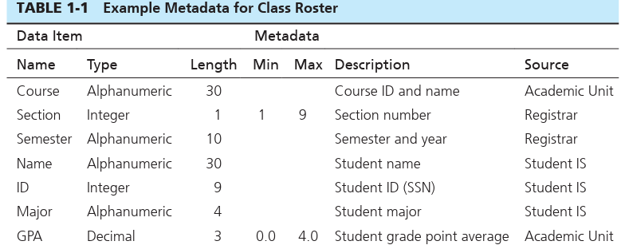

# Basic Concepts and Definitions-   It may be of any size and complexity.

-   Contains data, information, or both

 

Data: facts concerning objects and events that could be recorded and stored on a computer media.

-   Example: a salesperson storing customer name, address, and number.

    -   These are examples of [structured data]{.underline} whose most important data types are numeric, character, and dates.

-   Another form of data is called [unstructured data]{.underline}, or multimedia data.

    -   Some examples would be gps info, tweets, document, photos, sound, video, etc.

-   A more appropriate definition for data would be "a stored representation of objects and events that have meaning and importance in the user's environment."

 

Data vs information

-   Information: is data that has been processed in such a way that the knowledge of the person who uses the data is increased.

    -   {width="2.9375in" height="1.1666666666666667in"}

        -   This would be considered data but not information since we don't know what the numbers mean in context.

    -   {width="2.625in" height="1.78125in"}

        -   This would be considered information since you have context and an understanding of what the data means

    -   {width="2.78125in" height="1.2291666666666667in"}

        -   Graphical information

 

Metadata: are data that describes the properties or characteristics of the features/attributes and the context of that data.

-   Some examples of properties could be name, definition, length/size, and allowable values.

-   Metadata describing context could be source of data, where data is stored, ownership, and usage

-   "data about data"

-   {width="4.40625in" height="1.7604166666666667in"}

    -   Notice that metadata is simply information about the features in the database

-   To retrieve info about the metadata is about the same as retrieving info about the data.

-   Metadata is very important because it gives us context.

