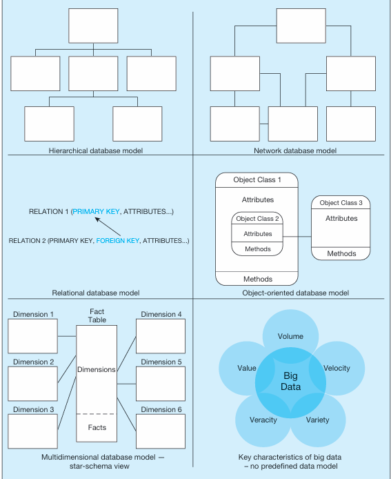

# EVOLUTION OF DATABASE SYSTEMS{width="4.208333333333333in" height="5.15625in"}

 

Current Database solutions:

-   Relational databases are still widely used and popular

-   With the vast amount of structured and unstructured data a company must manage new database solutions have emerged...

    -   Nonrelational database

        -   NoSql (not only SQL): used to address structured and unstructured data (like pictures and images) stored in potentially diff locations

            -   Examples are MongoDB and Apache Cassandra

            -   This search for nonrelational database technologies is fueled by the needs of social networking applications, such as blogs, wikis, and social networking sites (Facebook, Twitter, LinkedIn, and so forth)

-   One popular technology available in the cloud is databases. Databases, relational and nonrelational, can now be created, deployed, and managed through the use of technologies owned and managed by a service provider. You will examine issues surrounding cloud databases

>  
>
>  

Evolution of database tech

 

Database architectures

Shows a visual depiction of the organizing principle underlying each of the major database technologies.

 

-   For example, in the hierarchical model, files are organized in a top-down structure that resembles a tree or genealogy chart, whereas in the network model, each file can be associated with an arbitrary number of other files.

-   The relational model (the primary focus of this book) organizes data in the form of tables and relationships among them.

-   The object-oriented model is based on object classes and relationships among them.

-   An object class encapsulates attributes and methods. Object-relational databases are a hybrid between object-oriented and relational databases.

-   Multidimensional databases, which form the basis for data warehouses, allow us to view data in the form of cubes or a star schema.

-   The final element of the diagram illustrates the main characteristics of the big data approach to data management, intentionally leaving a specific modeling approach (there is no single data model for big data).

