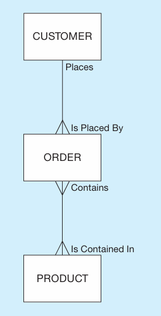
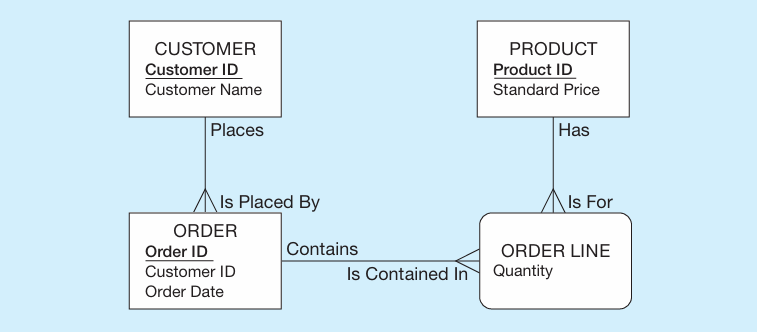
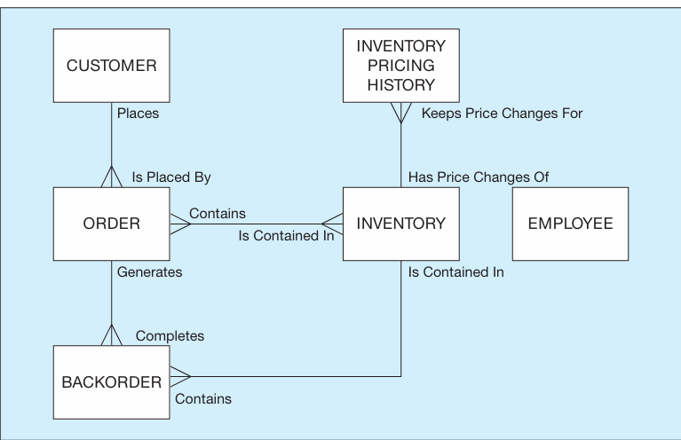
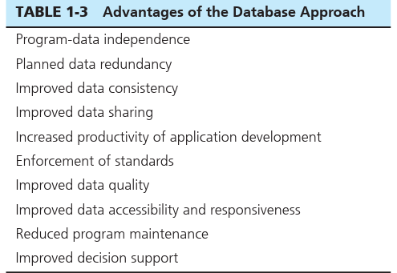
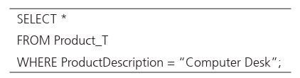
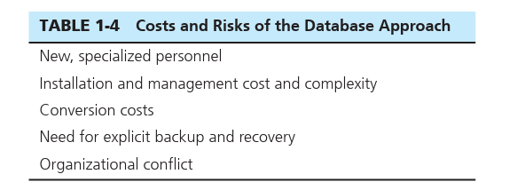

# THE DATABASE APPROACH -   Various GUI's exist that show this structure for end users (systems analysis, database designers) to easily visualize

-   A typical data model is made up of entities, relationships, and attributes.

 

*Entities*: These are like nouns in that it describes a person, place, object, event or concept.

-   Examples would be like Customers or Order.

-   An *attribute* would be something about the entity like customer name or order number

-   There can be many customers or orders and thus each one is referred to as an *instance*

 

Relationships:

-   Most relationships are 1:M (one to many) or M:N (many to many)

    -   {width="1.4479166666666667in" height="2.8541666666666665in"}

 

*Relational Databases*: establishes the relationship between entities by means of common fields included in a file called a *relation*.

-   Example

> {width="3.6770833333333335in" height="1.6145833333333333in"}

-   The relation is established here by including the customer ID in the order to establish the connection between the Customer and the order. Every Customer has a customer ID.

 

*Database Management System (DBMS)*: is a software system that enables the use of a database approach.

-   The main purpose of a DBMS is to provide a systematic method of creating, updating, storing, and retrieving the data stored in a database.

-   It enables end users and application programmers to share data, and it enables data to be shared among multiple applications rather than propagated and stored in new files for every new application

-   {width="4.15625in" height="2.6875in"}

 

Advantages of a database approach

{width="3.1666666666666665in" height="2.1770833333333335in"}

 

-   *PROGRAM-DATA INDEPENDENCE*: The separation of data descriptions from the application programs that use the data.

    -   Data descriptions are typically stored in a central location called the repository

    -   This property of database systems allows an organization's data to change and evolve (within limits) without changing the application programs that process the data.

 

-   PLANNED DATA REDUNDANCY

    -   A good database design will attempt to reduce the redundancy (as seen in file management systems) of files into a single logical structure.

    -   Sometimes having planned redundancy can help improve performance of the database.

-   IMPROVED DATA CONSISTENCY

    -   Reducing and controlling data redundancy can add more consistency to a database.

        -   For example, if a customers address is only stored once then there is no argument about what the customers address is.

            -   If you had the same customer in a diff file (duplicate) and you changed the address of one of them and the other did not get changed you could have some discrepancies about the address.

-   IMPROVED DATA SHARING

    -   A database is a shared corporate resource.

    -   Authorized internal and external users are granted permission to use the database, and each user (or group of users) is provided one or more user views into the database to facilitate this use.

        -   A user view is a logical description of some portion of the database that is required by a user to perform some task.

            -   For example, an employee working in human resources will need access to confidential employee data; a customer needs access to the product catalog available on Pine Valley's Web site.

            -   The views for these two will be very different]

>  

-   INCREASED PRODUCTIVITY OF APPLICATION DEVELOPMENT

    -   If you have a well-oiled database already in place with maintenance applications for the database and the data capture already in the database then it becomes much easier for the developer to start new applications without worrying about creating new file designs or low level implementation details.

    -   High level tools offered by the database allows for many different individuals to access the database and use it

    -   Up to 60% productivity increase

>  

-   ENFORCEMENT OF STANDARDS

    -   If you have a well oiled database then it should be true that you have a database administration function that is granted single point authority and responsibility for establishing and enforcing data standards.

        -   These will include, naming convention, data quality standards, and uniform procedures for accessing, updating, and protecting data.

        -   The data repository provides database administrators with a powerful set of tools for developing and enforcing these standards.

    -   One of the most common downfalls of databases are bad database administration function.

 

-   IMPROVED DATA QUALITY

    -   In the US, there has been a cost of 2 trillion dollars because of poor data

    -   Two ways in which a database helps us with data quality

        1.  DBMS puts in place *constraints* which are rules that cannot be broken by the user which maintains a standard for data being put in the database

            -   For example, a constraint could be put in place for an order to ensure that data is sent about who placed the order like userID

        2.  In a data warehouse you could clean or *scrub* your data to ensure that your data is well kept

            -   If you have ever been sent multiple of the same magazine it could be because the company sending you them has not scrubbed their data warehouse causing them to have bad info about the number of existing customers.

>  

-   IMPROVED DATA ACCESSIBILITY AND RESPONSIVENESS

    -   When you have a database, even novices or nonprogrammers can easily use the database because of some of the simplicities that a database offers.

        -   One of the ways a novice can access data from their user view is by using something called a query.

> {width="4.395833333333333in" height="1.1458333333333333in"}

-   Structured Query Language, or SQL is the language used in this query

>  

-   REDUCED PROGRAM MAINTENANCE

    -   An example of this was the "year 2000" problem where 2 digit years were extended to 4 digits in the webspace.

        -   In a file processing system, the data descriptions and the logic for accessing that data are built into each individual application which would result in changing each one to accommodate

        -   In a database, there is more independence between the data and the applications. This makes it so that you can make changes to either or without affecting the other side as much

>  

-   IMPROVED DECISION SUPPORT

    -   Some databases are designed expressly for decision support applications. For example, some databases are designed to support customer relationship management, whereas others are designed to support financial analysis or supply chain management.

 

-   Cautions about Database Benefits

>  

 

Cautions about Database Benefits

{width="5.020833333333333in" height="1.8125in"}

 

Although there is much to be gained from the database approach, there are also limitations that can negate some of these advantages of a database including limitations of older data models and database management systems although object oriented data and the relational model provides a better environment for these benefits. Another limiting factor is bad database organizational and implementation approaches.

 

These are some risks and costs of the database approach

 

-   NEW, SPECIALIZED PERSONNEL

    -   If you are a company trying to implement a database approach you will need to hire or train personnel to create and service the database

        -   This can come at a cost but it necessary to getting the benefits of the database

>  

-   INSTALLATION AND MANAGEMENT COST AND COMPLEXITY

    -   In a multi user database management system is a large and complex suite of software that requires installations, maintenance , upgrades, services, etc that must be kept up with to ensure that the database is running as it should which of course comes with a cost.

 

-   CONVERSION COSTS

    -   *Legacy system* is a term that is used to refer to an older system like the older file processing system/older database technology.

    -   The cost of converting these older systems to modern database technology---measured in terms of dollars, time, and organizational commitment---may often seem too costly to an organization.

        -   The use of data warehouses is one strategy for continuing to use older systems while at the same time exploiting modern database technology and techniques

 

-   NEED FOR EXPLICIT BACKUP AND RECOVERY

    -   A shared corporate database must be accurate and available at all times.

        -   This requires backups of the data at all times for security and data loss purposes, which comes at a cost

    -   A modern database management system normally automates many more of the backup and recovery tasks than a file system.

 

-   ORGANIZATIONAL CONFLICT

    -   Because there are so many organizations that depend on the database there are often arguments about data definitions, data formats and coding, rights to update shared data, and associated issues are frequent and often difficult to resolve.

        -   To resolve this you need a consensus on data definitions and ownership, as well as responsibility for accurate data maintenance.

    -   If strong top management support of and commitment to the database approach are lacking, end-user development of stand-alone databases is likely to proliferate. These databases do not follow the general database approach that we have described, and they are unlikely to provide the benefits described earlier.

    -   In the extreme, they may lead to a pattern of inferior decision making that threatens the well-being or existence of an organization.

>  

 

>  

 

 

Example

-   1:M

> A customer can place more than one order but an order is only associated with one customer

-   The crows feet at the end of the line signals MANY

<!-- -->

-   M:N

> An order can have multiple products and a product can be in multiple orders.

 

 

Notes about a proper database example

-   Notice that here we do not have duplicate files of the same data.

-   We can see that different services that need to use the database can access it and there is no need to have multiple services with their own database.

