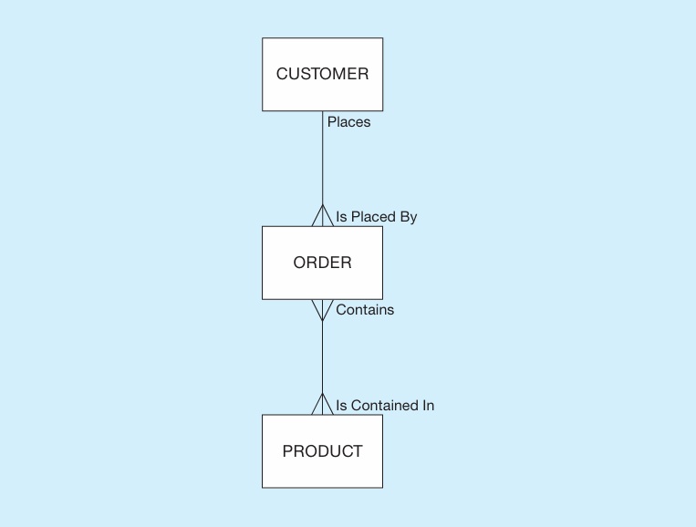
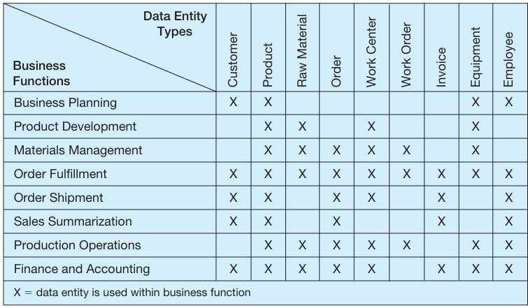
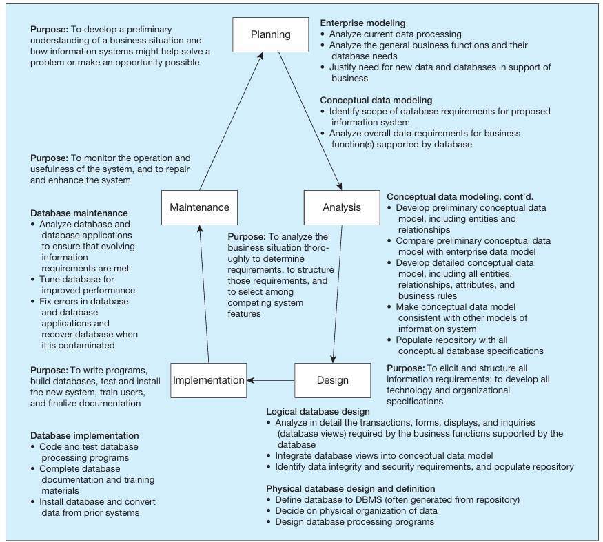
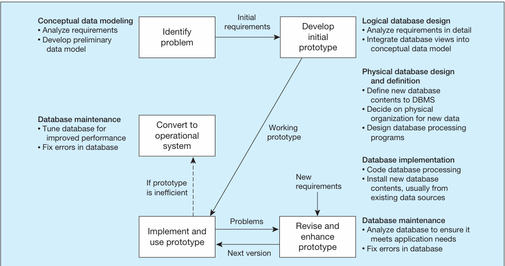
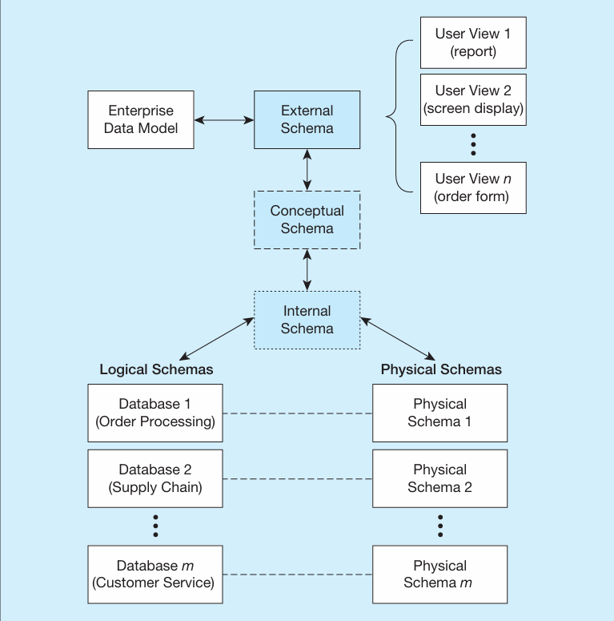
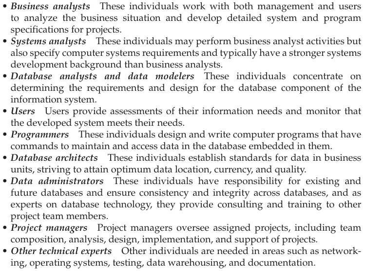

# THE DATABASE DEVELOPMENT PROCESS -   A particular database provides the data for one or more information systems whereas an enterprises data model, which could describe many databases, describes the scope of the data maintained by the organization.

-   In the enterprise data modeling you review the current systems, assess what the company needs in terms of data, get a high level understanding of the data, and build skeletons of 1 or more database dev projects.

-   Example of a high level enterprise data model figure

> {width="3.2395833333333335in" height="2.4583333333333335in"}

-   Not only would you have graphical figures in an enterprise data model but you would also have...

    -   *Business rules*: these are statements about how the company operates.

    -   Create matrixes that that look like this...

> Operations and functions of a company (Order fulfillment, Business Planning, Sales Summaration) x data (PRODUCT, USER, ORDER, etc)

-   {width="4.541666666666667in" height="2.6458333333333335in"}

<!-- -->

-   Top Down approach vs bottom up approach:

    -   Top Down:

> A top down approach often means developing new databases to meet strategic organizational goals such as improved customer support, better production or inventory management, etc.

-   Bottom Up:

> This approach usually means creating a base database that is the foundation of new databases requested by information system users who want improved data management in certain areas of the business.
>
>  

-   *System Development Life Cycle* (SDLC): This is the complete steps needed to specify, develop, maintain, and replace information systems.

    -   Steps:

> {width="6.15625in" height="5.541666666666667in"}

-   [Planning: Enterprise modeling]{.underline}

> This is where the people working on the creation of the database review existing databases, talk about the business organizations who the database will support, talk about the data that is necessary for the database models in question, talk about the needs of the company, and they talk about the existing data and the new proposed data to support the business organization.

-   [Planning: Conceptual data modeling]{.underline}

> Here the analysts develop a high level model for the proposed information system outlining the data (entities) and major relationships.

-   [Analysis: conceptual data modeling]{.underline}

> In this step the analyst defines the data, data attributes, rules to dictate the integrity of the data, business x data relationship, all categories of data are listed.

-   It is also during the Analysis phase that the conceptual data model is checked for consistency with other types of models developed to explain other dimensions of the target information system, such as processing steps, rules for handling data, and the timing of events.

-   The output of the conceptual modeling phase is a *conceptual schema*.

<!-- -->

-   [Design: logical database design]{.underline}

> There are two perspectives when it comes to logical database design:

-   First, the analyst takes the conceptual schema and turns it into a *logical schema*, which is the representation of a database for a particular data management technology.

    -   For example if relational data technology is going to be used then we take the conceptual data model and turn it into tables, columns rows, primary keys, foreign keys, and constraints.

-   Secondly, the analyst takes a look at the relationship between the data and the transactions, reports, displays, and inquiries supported by the database. This is essentially where the analyst considers who and what will be using the database and what view they should see.

    -   This step sometimes leads to redefining or adding data as needed after considering the end users

-   Lastly, the final step in logical database design is to transform the combined and reconciled data specifications into basic, or atomic, elements following well-established rules for well-structured data specifications.

    -   This known as *normalization*

> The result is a complete picture of the database without any reference to a particular database management system for managing these data. With a final logical database design in place, the analyst begins to specify the logic of the particular computer programs and queries needed to maintain and report the database contents.

-   [Design: physical database design and definition]{.underline}

> Here is the analyst will work in the DBMS to define where each information system being implemented will go in a computers secondary memory.

-   This is called physical schema

> They will decide on the systems file organization, physical records, and use of indexes, etc. To do this the analyst needs to decide on what programs will handle this. The goal is to create a database that will handle all data processing against it.

-   [Implementation: database implementation]{.underline}

    -   This is the step where the database designer will use a standard programming language like Java or C# or possibly something like SQL to write, test, and install the programs/scripts that access, create, or modify the database.

    -   Also, during implementation, the designer will finalize all database documentation, train users, and put procedures into place for the ongoing support of the information system (and database) users.

    -   The last step is to load data from existing information sources (files and databases from legacy applications plus new data now needed).

        -   Loading is often done by first unloading data from existing files and databases into a neutral format (such as binary or text files) and then loading these data into the new database.

    -   The data is now put into production for users to be able to retrieve data.

    -   Data should periodically be backed up and recovered in case of contamination or destruction.

-   [Maintenance: database maintenance]{.underline}

> In this step the designer deletes, adds, changes, or modifies the database to meet the changing environment of the business, correct errors, or improve performance.

-   Sometimes it might be necessary to rebuilt the entire database in case of contamination or faulty hardware.

Alternative Information systems dev approaches

-   The SDLC is a methodological approach do building an information system that is quite a lengthy process due to the many checks and balances.

-   The SDLC is often criticized for its lengthy process time and thus there are other alternatives to building an information system

    -   *Rapid Application Dev* (RAD) which follow an iterative process of rapidly repeating analysis, design, and implementation steps until they converge on the system the user wants.

        -   These RAD methods work best when most of the necessary database structures already exist and hence for systems that primarily retrieve data rather than for those that populate and revise databases.

        -   One of the most popular RAD methods is *prototyping*, which is an iterative process of systems development in which requirements are converted to a working system that is continually revised through close work between analysts and users.

> {width="7.854166666666667in" height="4.135416666666667in"}

-   This is a very fast paced systems dev process in which the analyst and users are working closely with each other to build out the system (i.e. user tells analysts what they need constantly)

-   During the development of the initial prototype, you simultaneously design the displays and reports the user wants while understanding any new database requirements and defining a database to be used by the prototype.

-   Database implementation and maintenance activities are repeated as new ver sions of the prototype are produced.

-   Often, security and integrity controls are minimal because the emphasis is on getting working prototype versions ready as quickly as possible.

-   Also, documentation tends to be delayed until the end of the project, and user training occurs from hands-on use.

-   Finally, after an accepted prototype is created, the developer and the user decide whether the final prototype and its database can be put into production as is.

-   With the increasing popularity of visual programming tools (such as Visual Basic, Java, or C#) that make it easy to modify the interface between user and system, prototyping is becoming the systems development methodology of choice to develop new applications internally.

-   Follows the *agile software development* manifesto:

> Individuals and interactions over processes and tools
>
> Working software over comprehensive documentation
>
> Customer collaboration over contract negotiation
>
> Responding to change over following a plan

 

Three-Schema Architecture for Database Development

-   The database dev process consists of several but related models of the databases developed on a systems dev project. Here is the summary of those which come from data models and the primary phase of the SDLC:

    -   Enterprise data model (information systems planning phase)

    -   External schema or user view (during analysis phase and logical design phase)

    -   Conceptual schema (analysis phase)

    -   Logic schema (logical design phase)

    -   Physical schema (physical design phase)

-   In 1978, an industry committee commonly known as ANSI/SPARC published an important document that described three-schema architecture---external, conceptual, and internal schemas---for describing the structure of data.

    -   It is important to keep in mind that all these schemas are just different ways of visualizing the structure of the same database by different stakeholders.

    <!-- -->

    -   External schema: This is the view (or views) of managers and other employees who are the database users.

    -   Conceptual schema: This schema combines the different external views into a single, coherent, and comprehensive definition of the enterprise's data.

        i.  The conceptual schema represents the view of the data architect or data administrator.

    -   Internal schema: an internal schema today really con sists of two separate schemas: a logical schema and a physical schema.

        i.  Logical schema is the representation of data for a type of data management tech.

        ii. Physical schema describes how data is to be represented and stored in memory using a particular DBMS like Oracle.

-   {width="4.322916666666667in" height="4.364583333333333in"}

>  
>
>  

Managing the people involved in a database development

-   An senior information systems analysts is assigned to be the manager/leader of the project

-   The team can consist of...

> {width="5.322916666666667in" height="3.7604166666666665in"}

 

Notes:

This is the complete SDLC steps and its cycles.

-   The circular nature of the steps implies that the cycles are iterative and they happen frequently

>  

