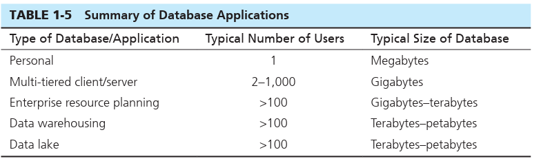

# THE RANGE OF DATABASE APPLICATIONS-   Known as ad hoc querying and requires an understanding of query language

-   The more common way is to interact with the data using application programs

    -   These come with a nice user friendly UI that allows the user to easily modify, delete, add, etc data.

    -   They can also display the data

    -   The machine that runs the user interface (and sometimes the business logic) is referred to as the *client*.

    -   The machine that runs the DBMS and contains the database is referred to as the *database server*.

 

In order to better understand the range of database applications, we divide them into three categories based on the location of the client (application) and the database software itself: personal, multi-tier, and enterprise databases.

-   [Personal Databases]{.underline}: These are designed to support one user

    -   They typically reside on laptops, personal computers, phones, tablets.

    -   They typically handle small amounts of data

    -   The bad thing about them is that they cannot be easily shared with other people

-   [Departmental Multi-Tiered Client/Server Databases]{.underline}: most modern applications that need to support a large number of users are built using the concept of multi-tiered architecture.

    -   They are designed to serve a department like accounting or marketing or a division (line of business)

    -   In a multi-tiered architecture, the user interface is accessible on the individual users' computers.

        -   This user interface may be either Web browser based or written using programming languages such as Visual Basic.NET, Visual C#, or Java.

            -   This has all the logic needed to do the transactions requested by the user

            -   This talks to the database server

    -   The most significant implication for database development from the use of multi-tiered client/server architectures is the ease of separating the development of the database and the modules that maintain the data from the information systems modules that focus on business logic and/or presentation logic.

    -   Separates the development of the database from the applications and such that focus on business logic/presentation

    -   {width="5.9375in" height="3.40625in"}

-   Enterprise Applications: application/database is one whose scope is the entire organization or enterprise (or, at least, many different departments).

    -   Note that an organization may have several enterprise databases, so such a database is not inclusive of all organizational data.

    -   They are typically impractical to medium - large companies because of performance, conformity in the metadata, and diverse needs to of different users.

    -   The evolution of enterprise databases has resulted in three major developments:

        -   1. Large-scale enterprise systems, such as enterprise resource planning and customer relationship management.

            -   These make up the backbone for virtually every modern organization because they form the foundation for the processes that control and execute basic business tasks.

            -   The focus of these applications is on capturing the data surrounding the "transactions," that is, the hundreds or millions (depending on the size of the organization and the nature of the business) of events that take place in an organization every day and define how a business is conducted.

                -   For example, when you registered for your database course, you engaged in a transaction that captured data about your registration.

            -   It is very typical these days that organizations use packaged systems offered by outside vendors for their transaction processing needs.

            -   Examples of these types of systems include enterprise resource planning (ERP), customer relationship management, supply chain management, human resource management, and payroll.

                -   ERP systems are software applications that provide the data necessary for the enterprise to examine and manage its activities.

                -   It essentially works with all the data in the enterprise to compile them into applications for diff departments

        -   2. Data warehousing implementations providing a centralized perspective on enterprise data.

            -   collect content from the various operational databases, including personal, work group, department, and ERP databases.

            -   Data warehouses provide users with the opportunity to work with historical data to identify patterns and trends and answers to strategic business questions.

        -   3. Most recently data lakes, which provide a less structured and less costly way to collect large amounts of heterogeneous data without a clear advance knowledge regarding their use.

            -   Introduced in the big data context

            -   In the same way as a data warehouse, it is an integrated repository of data from a variety of sources, but data lakes have several characteristics that differentiate them from traditional data warehouses.

            -   Follow a schema on read format

            -   Store everything even if they don't have a specific for what the data will be used for or needed

            -   Data lakes are by definition designed to be highly scal able, and they often are built on a technical foundation that uses low-cost commodity hardware (such as Hadoop).

    -   {width="8.166666666666666in" height="2.4375in"}

>  

 

 

>  

Multi-tiered client/server database architecture

