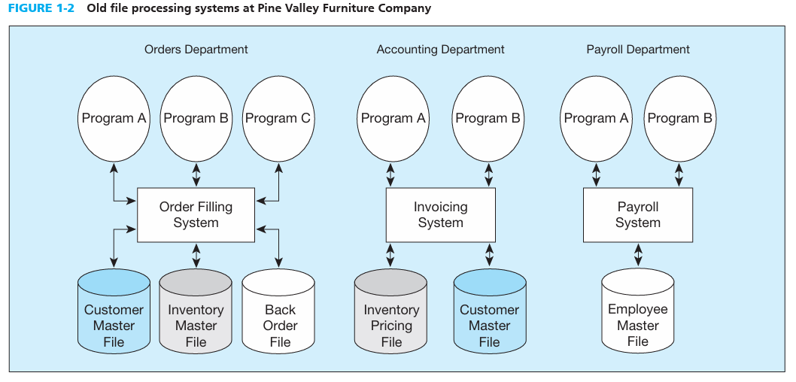
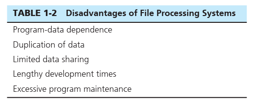

# TRADITIONAL FILE PROCESSING SYSTEMS -   They had a lot of shortcomings that were later addressed by modern databases

-   Understanding why file processing systems were bad gives us insight as to why databases are good and not fall into the same trap as file processing systems

 

Example:

-   {width="6.375in" height="3.0625in"}

    -   Notice that there is a duplication of files which are typical of file processing systems

 

File: is a collection of related records.

 

Disadvantages of traditional file processing systems:

{width="5.427083333333333in" height="2.1875in"}

 

-   Program data dependence:

> If you have two different systems who both have access and tap in to the same file and one of them makes a change to the customer address field length in the records in the file from 30 to 40 characters. The file descriptions in each program that is affected would have to be modified.

-   This would be bad because you would have to find and make the same change to the file that was affected in the other system as well which can be hard to do.

<!-- -->

-   Duplication of Data:

> Different systems who have the same file as each other with the same data.

-   This is bad because not only is it wasteful but the same exact files could potentially have different names for the same feature, they could have conflicting metadata, etc.

<!-- -->

-   Limited Data Sharing:

> When different departments in a company own certain files it becomes difficult for other departments to use that file if it becomes necessary to do so

-   This is bad because if lets say the accountant department only has access to the payroll file but it also wants to utilize data from the inventory file it must jump through hoops to access it.

<!-- -->

-   Lengthy dev times:

> With each new application, a team has to create a new file format, description, and access logic for each new program.

-   This is bad as it wastes time in this fast paced business world where data and time are important

<!-- -->

-   Excessive Program Maintenance:

> For all the reasons above it becomes way to heavy of an operation for a company to maintain a file processing system.

-   This is also true for companies who run their data using things like excel who will be prone to many of the disadvantages.

-   Many of these disadvantages can also be had in a modern database if say for instance a company creates a new database for each separate department leading to data duplication, limited data sharing, etc.

 

 

 

 

 

 

