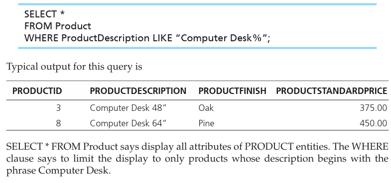

# E-R MODELING EXAMPLE: PINE VALLEY FURNITURE COMPANYSimple SQL Queries to do certain things based on this E-R Model:

{width="3.6354166666666665in" height="1.6979166666666667in"}

 

{width="3.71875in" height="1.1770833333333333in"}

 

{width="3.7604166666666665in" height="0.5104166666666666in"}

 

{width="3.8020833333333335in" height="0.8541666666666666in"}

{width="3.7708333333333335in" height="0.3229166666666667in"}

-   To read this it basically starts in the inner queries to the outer queries, so in this case we query first the search for a customerID with the name Value furniture and then count all the orders with that customerID.

Showing Product Information

 

Showing Product Line Information

 

Showing Customer Order Status:

This can be done by creating a user view as represented by OrdersForCustomers

Vs

<- This one which is without use view

 

<- the output for both versions

