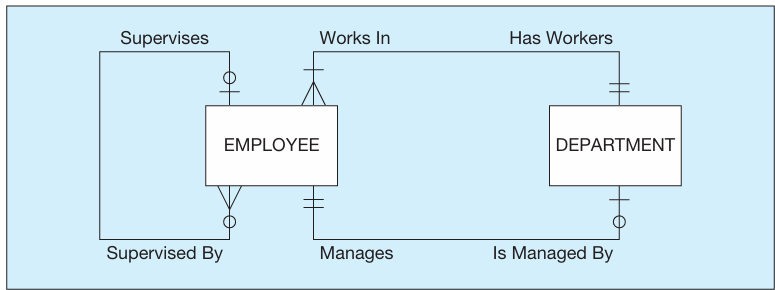

# MODELING RELATIONSHIPS-   An entity talks to another entity and vice versa (goes both ways)

-   Relationship names are always present tense verbs (completes, creates, etc)

    -   These are called [relationship type]{.underline}

    -   And we also have [relationship instance]{.underline} which is self explanatory

-   Relationships and their characteristics (degree and cardinality) represent business rules, and usually relationships represent the most complex business rules shown in an ERD.

-   To illustrate, consider the entity types EMPLOYEE and COURSE, where COURSE represents training courses that may be taken by employees. To track courses that have been completed by particular employees, you would define a relationship called Completes between the two entity types

    -   This would be considered a many to many relationship because an Employee can complete many courses and a course can be completed by many Employees

-   You can have to relationship verbs to represent each direction (bidirectional) of entity to entity relationship

-   Just like entities, relationships can have attributes too

> {width="3.9895833333333335in" height="1.03125in"}

-   If we have a relationship that has one or more attributes then it might suggest we need an [associative entity:]{.underline} is an entity type that associates one or more entity types and contains attributes that are peculiar to the relationship between those entity instances.

> {width="4.083333333333333in" height="0.7291666666666666in"}

-   Notice how it is rounded and not squared and how we replaced the verb with a noun and no relationship names

> {width="3.9895833333333335in" height="0.7083333333333334in"}

-   The relationship between the two entities are many to many, cannot be one to many

-   Has one or more attributes

**[Degree of a relationship]{.underline}**: the number of entity types that participate in that relationship.

There are three common relationship degrees:

-   [Unary]{.underline}: is a relationship between the instances of a single entity type.

> {width="4.3125in" height="0.8333333333333334in"}

-   There also exists another form of unary relationship called a [bill of material structure:]{.underline} used to show materials made out of materials as an example

<!-- -->

-   [Binary]{.underline}: is a relationship between the instances of two entity types and is the most common type of relationship encountered in data modeling.

> {width="4.375in" height="1.1458333333333333in"}

-   [Ternary]{.underline}: is a simultaneous relationship among the instances of three entity types.

> {width="4.395833333333333in" height="1.6979166666666667in"}

-   Notice that these are not three binary relationships, the reason for that is that each entity depends on the other to create the relationship.

    -   A vendor cannot simply supply a part and just decide that the shipping cost is is $8 without knowing what the warhouse they will be shipping to is

        -   The relationship is the supplies which can also be known as the noun SUPPLY SHEDULE

**Attributes or Entity?** When should you represent something as an attribute or give it its own entity?

{width="4.145833333333333in" height="1.2604166666666667in"}

 

{width="4.1875in" height="0.8125in"}

-   So, when should an attribute be linked to an entity type via a relationship?

    -   The answer is when the attribute is the identifier or some other characteristic of an entity type in the data model and multiple entity instances need to share these same attributes.

        -   Example: In this example, EMPLOYEE has a composite attribute of Department. Because Department is a concept of the business and multiple employees will share the same department data, department data could be represented (nonredundantly) in a DEPARTMENT entity type, with attributes for the data about departments that all other related entity instances need to know

 

**[Cardinality Constraints]{.underline}**: specifies the number of instances of entity B that can (or must) be associated with each instance of entity A.

{width="4.354166666666667in" height="0.8020833333333334in"}

-   Examples:

    -   EMPLOYEE Is Assigned To PROJECT (Figure 2-17b) Each PROJECT has at least one EMPLOYEE assigned to it. (Some projects have more than one.) Each EMPLOYEE may or (optionally) may not be assigned to any existing PROJECT (e.g., employee Pete) or may be assigned to one or more PROJECTs.

        -   {width="3.5208333333333335in" height="0.9895833333333334in"}

    -   PATIENT Has Recorded PATIENT HISTORY (Figure 2-17a) Each patient has one or more patient histories. (A PATIENT cannot exist unless there is an initial instance of PATIENT HISTORY.) Each instance of PATIENT HISTORY "belongs to" exactly one PATIENT.

        -   {width="3.71875in" height="0.8125in"}

-   Ternary relationship constraints

    -   {width="4.697916666666667in" height="1.5208333333333333in"}

        -   Unfortunately, you are not able to draw ternary relationships with many CASE tools; instead, you are forced to represent ternary relationships as three binaries (i.e., an associative entity with three binary relationships). If you are forced to draw three binary relationships, then do not draw the binary relationships with names and be sure that the cardinality next to the three strong entities is a mandatory one

**Modeling Time Dependent Data**

Sometimes we may need to keep track of when a data value that will change over time which is known as a [time stamp]{.underline}

-   An example:

> {width="3.8229166666666665in" height="1.09375in"}

-   "A time stamp may be associated with any data value that changes over time when we need to maintain a history of those data values."

-   If need be use a many to many relationship and not a 1:M relationship to represent time dependent

Modeling Multiple Relationships Between Entity Types

"There may be more than one relationship between the same entity types in a given organization."

{width="4.083333333333333in" height="1.5208333333333333in"}

 

Date completed would be an attribute of the Completes relationship. Other attributes might be added to this relationship if appropriate, such as Course Grade, Instructor, and Room Location.

 

This would be sllightly different in that we have an associative entity in place between two entities.

 

This is how you would draw an associative entity in Visio. Notice the dotted lined, Noun, no relationship name.

 

"An employee has one manager who manages many employees"

 

{width="3.1875in" height="1.34375in"}

Supplies relationship is replaced by associative entity

 

Here we see that prereqs can be represented inside of the course entity as an attribute or we can define a relationship between course and prereqs.

 

Here we can either create an attribute skill which has a bunch of skills with its own attributes or we can create two entities Possesses and SKILL.

 

This is missing one which I think is the solo I line across the long line which I think just means mandatory.

 

We have a composite attribute called price history under which a date and the price during that data are tracked for say a grocery market

