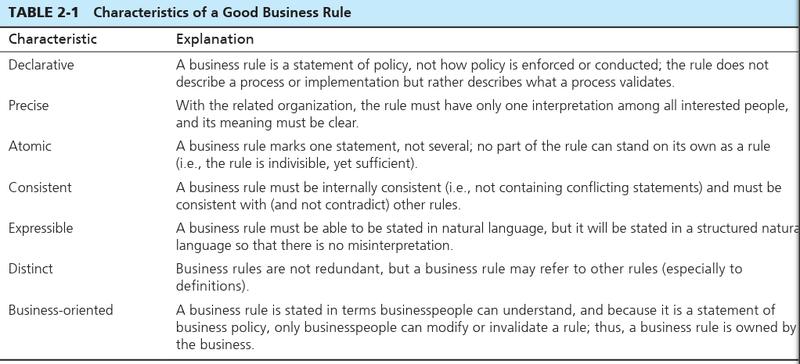

# MODELING THE RULES OF THE ORGANIZATION -   For example, the policy "every student in the university must have a faculty adviser" forces data (in a database) about each student to be associated with data about some student adviser.

Your job as a database analyst is to:

> • Identify and understand those rules that govern data.
>
> • Represent those rules so that they can be unambiguously understood by information systems developers and users.
>
> • Implement those rules in database technology.
>
>  

**Overview of Business Rules**

A business rule is "a statement that defines or constrains some aspect of the business.

-   It is intended to assert business structure or to control or influence the behavior of the business ... rules prevent, cause, or suggest things to happen"

-   Examples:

> • "A student may register for a section of a course only if he or she has successfully
>
> completed the prerequisites for that course."
>
> • "A preferred customer qualifies for a 10 percent discount, unless he has an over
>
> due account balance."

-   we are concerned with business rules that impact only an organization's databases

    -   For example, the rule "Friday is business casual dress day" may be an important policy statement, but it has no immediate impact on databases.

    -   the rule "A student may register for a section of a course only if he or she has successfully completed the prerequisites for that course" [is within]{.underline} our scope because it constrains the transactions that may be processed against the database

-   **What makes good business rules?**

> {width="4.59375in" height="2.09375in"}

-   Gathering business rules comes from, "asking questions about the who, what, when, where, why, and how of the organization", "interview notes from individual and group infor mation systems requirements collection sessions, organizational documents (e.g., personnel manuals, policies, contracts, marketing brochures, and technical instruc tions), and other sources".

    -   You gather them by looking at resources related to the organization and asking questions

-   Data names and Definitions

    -   [Data names]{.underline}:

        -   Should be related to the business (not technical), meaningful, unique, ...

    -   [Data Definitions]{.underline}: is considered a type of business rule; a definition is an explanation of a term or a fact

        -   A [term]{.underline} is a word or phrase that has a specific meaning for the business.

            -   Ex. Course, section, rental car, flight, customer

            -   Often used to form data names

        -   A [fact]{.underline} is an association between two or more terms.

            -   ""A course is a module of instruction in a particular subject area."

            -   "A customer may request a model of car from a rental branch on a particular date."

                -   We do not need to specify all the branches of facts in one fact like specifying that a customer cannot requests more than 1 car model at a time.

        -   Data definitions can be hard to define so be careful and precise about how you make them taking into account various different angles about the definition.

>  
>
>  
>
>  
>
>  

 

