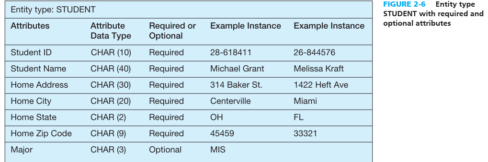

# MODLING ENTITIES AND ATTRIBUTES -   Example: entity type: EMPLOYEE, entity instance: would be two employees

-   "a true data entity will have many possible instances, each with a distinguishing characteristic, as well as one or more other descriptive pieces of data."'

 

**Strong vs Weak entity types**:

-   [Strong entity type]{.underline}: is one that exists independently of other entity types. (Some data modeling software, in fact, use the term independent entity.) Examples include STUDENT, EMPLOYEE, AUTOMOBILE, and COURSE.

-   *[Weak entity type]{.underline}*: is an entity type whose existence depends on some other entity type. (Some data modeling software, in fact, use the term dependent entity).

    -   The entity type on which the weak entity type depends is called the [identifying owner]{.underline} (or simply owner for short).

    -   Generally, on an E-R diagram, a weak entity type has an attribute that serves as a [partial identifier]{.underline}.

    -   During a later design stage, a full identifier will be formed for the weak entity by combining the partial identifier with the identifier of its owner or by representing the weak entity as a strong entity with a surrogate, nonintelligent identifier attribute and the partial identifier as a regular attribute of this entity.

    -   In an E-R model an [identifying relationship]{.underline} weak entity type to owner is shown by using double lines instead of singular lines b/w the two entities.

**Naming and defining entity types:**

> Naming:

-   Is a singular noun

-   Should be specific to the organisation

-   Should be consise

-   Short name

-   All the same entities should have the same name

> Defining:

-   Usually starts with "An X is..."

-   Statement about what the unique characteristics is

-   Make clear what entity instances are included and not included

    -   "A customer is a person or organization that has placed an order for a product from us or one that we have contacted to advertise or promote our products. A customer does not include persons or organizations that buy our products only through our customers, distributors, or agents."

-   includes a description of when an instance of the entity type is created and deleted.

    -   "A customer ceases to be a customer if it has not placed an order for more than three years."

-   Specify when an instance might change into an instance of another entity type

    -   "A bid is a legal offer by our organization to do work for a customer. A bid is created when an officer of our company signs the bid document; a bid becomes an instance of contract when we receive a copy of the bid signed by an officer of the customer."

-   Specify what history is to be kept about instances of the entity type

 

**[Attributes]{.underline}**: is a property or characteristic of an entity type that is of interest to the organization.

-   Some relationships also have attributes

-   In naming attributes, we use an initial capital letter followed by lowercase letters. If an attribute name consists of more than one word, we use a space between the words and we start each word with a capital letter.

-   In E-R diagrams, we represent an attribute by placing its name in the entity it describes

-   **REQUIRED VERSUS OPTIONAL ATTRIBUTES:**

    -   [required attribute]{.underline}: An attribute that must be present for each entity instance

    -   [Optional attribute]{.underline}: whereas an attribute that may not have a value

> {width="4.770833333333333in" height="1.59375in"}

-   **SIMPLE VERSUS COMPOSITE ATTRIBUTES:**

    -   [Composite attribute:]{.underline} is an attribute, such as Address, that has meaningful component parts, which are more detailed attributes.

        -   Example: address is made up of multiple things like city, postal code, state, etc which are themselves attributes

    -   [A simple (or atomic) attribute]{.underline}: is an attribute that cannot be broken down into smaller components that are meaningful for the organization.

        -   Example: for a vehicle entity: Vehicle ID, Color, and Weight are all simple attr. As they cannot be broken down

-   SINGLE-VALUED VERSUS MULTIVALUED ATTRIBUTES

    -   [Multivalued attribute]{.underline}: is an attribute that may take on more than one value for a given entity (or relationship) instance.

        -   For example, for the entity EMPLOYEE you might have an attribute called Skills which can be one or more things like c++, powerpoint, c#, agile dev., etc..

        -   Typically showcased by squiggly bracket around attribute name

    -   [Single valued attribute]{.underline}: an attribute that takes only one single value like First Name

-   **STORED VERSUS DERIVED ATTRIBUTES**

    -   [Derived attribute]{.underline}: is an attribute whose values can be calculated from related attribute values (plus possibly data not in the database, such as today's date, the current time, or a security code provided by a system user).

        -   Example, If users need to know how many years a person has been employed, that value can be calculated using Date Employed and today's date.

        -   It is essentially an attribute who depends on another piece of data to calculate itself

    -   Stored attribute: is an attribute that is simply received and required no extra calculations or other attributes to create itself, its simply stored in the database as is

-   **IDENTIFIER ATTRIBUTE**

    -   [Identifier]{.underline}: is an attribute (or combination of attributes) whose value distinguishes individual instances of an entity type.

        -   Ex. Student ID, Social Security Number

        -   Name would not be good since there could be potentially multiple people with the same name

    -   [composite identifier]{.underline}: is an identifier that con sists of a composite attribute.

        -   Ex. the entity FLIGHT with the composite identifier Flight ID. Flight ID in turn has component attributes Flight Number and Date.

            -   It is made up of two or more attributes who together give validity to the composite identifier

    -   There are protocols or things you should consider when picking an identifier attribute

>  
>
>  
>
>  

