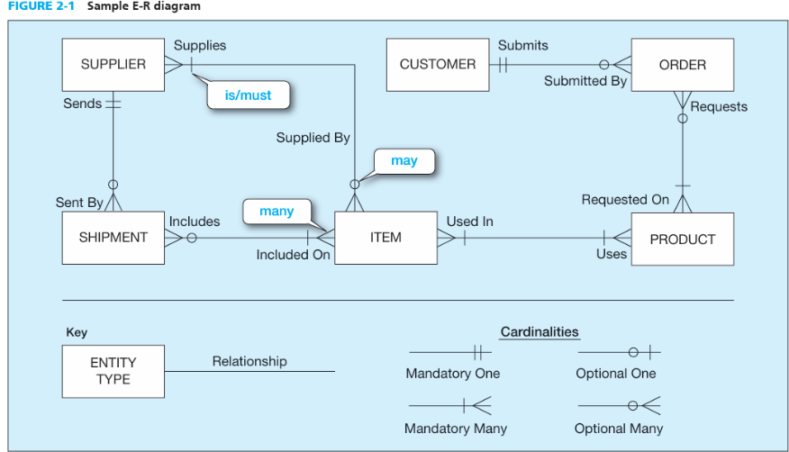
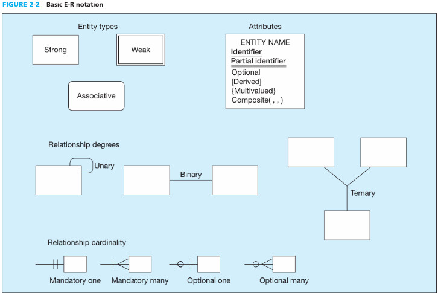

# THE E-R MODEL: AN OVERVIEW-   E-R model is normally expressed as an entity-relationship diagram which is a graphical representation of the E-R model.

-   Example:

> {width="3.9791666666666665in" height="2.28125in"}

 

E-R Model Notation

{width="3.3020833333333335in" height="2.2083333333333335in"}

 

[Entities]{.underline} = rectangles

[Relationships]{.underline} = lines connecting entities

[Cardinalities]{.underline}: how many entities of one kind relate to how many entities of another kind

> Examples:

-   A SUPPLIER may supply many ITEMs (by "may supply," we mean the supplier may not supply any items).

-   Each ITEM is supplied by any number of SUPPLIERs (by "is supplied," we mean that the item must be supplied by at least one supplier).

-   A CUSTOMER may submit any number of ORDERs. However, each ORDER must be submitted by exactly one CUSTOMER.

[Business Rules]{.underline}: There are actually two business rules for each relationship, one for each direction from one entity to the other:

> Example:

-   <entity> <minimum cardinality> <relationship> <maximum cardinality> <entity>

-   <CUSTOMER> <may> <Submit> <any number> <ORDER>

 

basic E-R notation

 

 

