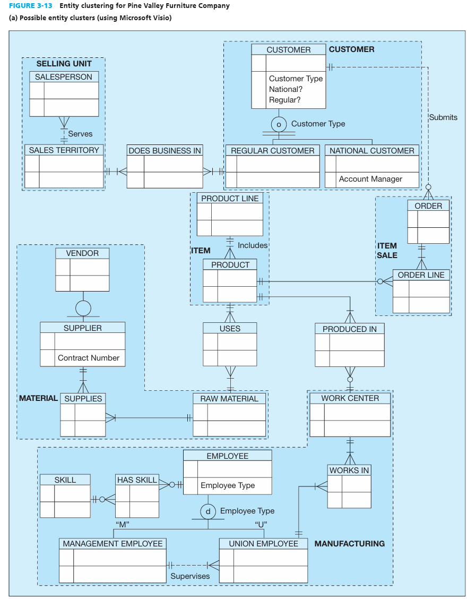
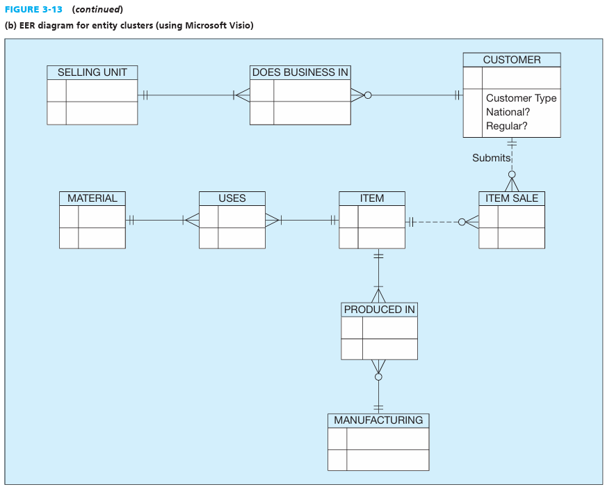

# ENTITY CLUSTERING Entity Clustering: is a set of one or more entity types and associated relationships grouped into a single abstract entity type.

-   Because an entity cluster behaves like an entity type, entity clusters and entity types can be further grouped to form a higher-level entity cluster.

-   Entity clustering is a hierarchical decomposition of a macro-level view of the data model into finer and finer views, eventually resulting in the full, detailed data model.

{width="4.03125in" height="5.166666666666667in"}

 

{width="4.166666666666667in" height="3.3541666666666665in"}

