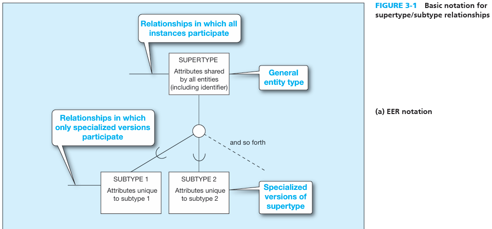
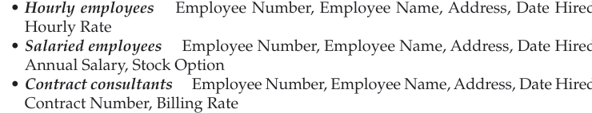
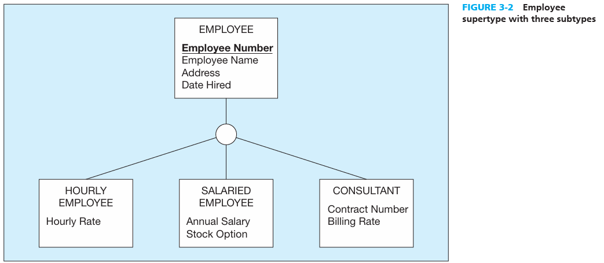
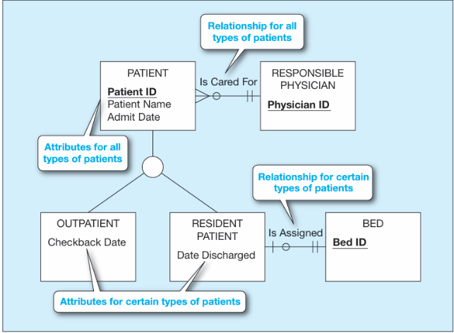
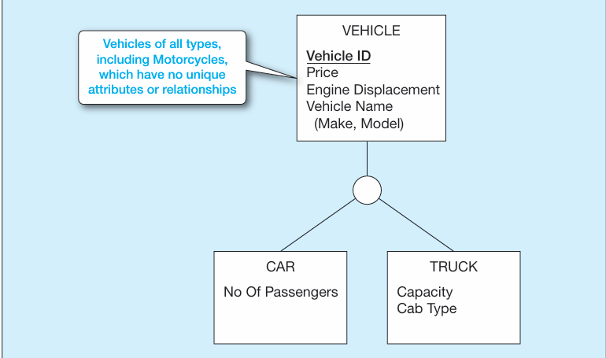
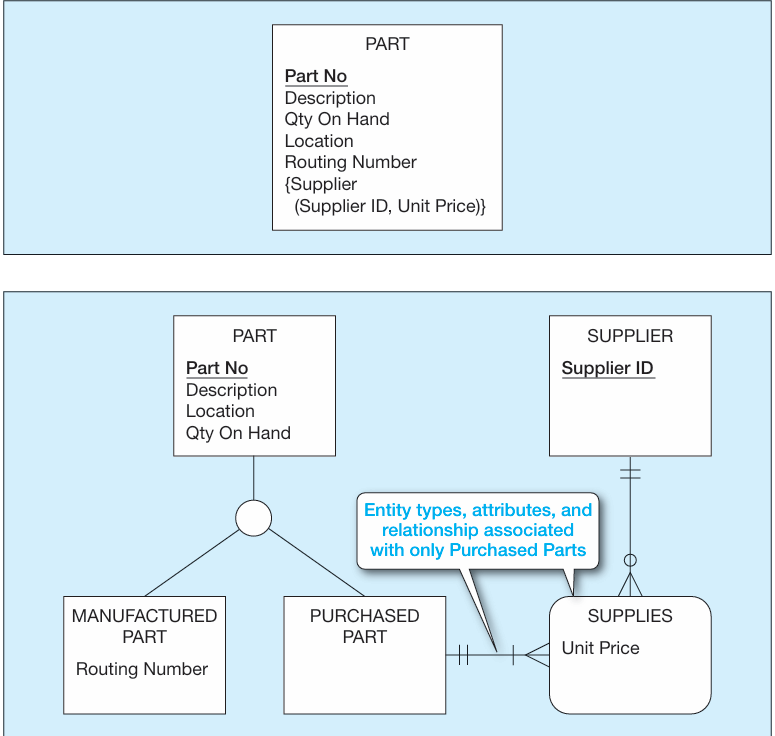

# REPRESENTING SUPERTYPES AND SUBTYPES**[Supertype]{.underline}**: is a generic entity type that has a relationship with one or more subtypes.

-   In this example, we refer to STUDENT as the supertype.

 

Basic Concepts and Notation

There are a few symbols and notations that come with subtypes and supertypes, this is an image of them:

{width="4.427083333333333in" height="2.0625in"}

 

**Example of a supertype and subtype relationship:**

Suppose you have EMPLOYEES with different roles, Hourly Employee, Salaried Employees, and Contract consultant

{width="3.875in" height="0.7395833333333334in"}

 

{width="3.8958333333333335in" height="1.6979166666666667in"}

 

**[ATTRIBUTE INHERITANCE]{.underline}:** is the property by which subtype entities inherit values of all attributes and instance of all relationships of the supertype.

-   In the example above, the fact the SALARIED EMPLOYEE is a subtype of EMPLOYEE means that it must posses the Employee Name attribute. More so,

-   Basic inheritance applies like in object oriented programming

 

**WHEN TO USE SUPERTYPE/SUBTYPE RELATIONSHIPS**

1.  There are attributes that apply to some (but not all) instances of an entity type.

2.  The instances of a subtype participate in a relationship unique to that subtype.

-   Meaning that there exists a relationship specific to a certain subtype that shouldnt exist for a single entity

{width="2.9166666666666665in" height="2.1458333333333335in"}

 

**Representing Specialization and Generalization**

"But in developing real-world data models, how can you recognize opportunities to exploit these relationships? There are two processes---generalization and specialization---that serve as mental models in developing supertype/subtype relationships."

-   [Generalization]{.underline}: is the process of defining a more general entity type from a set of more specialized entity types.

    -   This is a bottom up approach

    -   You have a set of things that are very similar and thus you define a supertype the generalize these things

    -   Example: CAR, TRUCK, MOTOCYCLE -> you come up with a supertype called VEHICLE

> {width="3.25in" height="1.9166666666666667in"}

-   [Specialization]{.underline}: is a top-down process, the direct reverse of generalization. We define an ENTITY and then from it we derive subtypes

> {width="3.65625in" height="3.46875in"}

 

 

 

The U shape on the relationship lines indicate the direction of the hierarchy

The big circle with lines coming from it indicate the supertype and the subtypes

 

Notice they share similar attributes but some are different

 

This is how you could structure them

 

Notice that there exists subtypes with certain relationships that don't occur with other subtypes or the supertype

 

Notice how motorcycle is not included this is because we come to the conclusion that MOTORCYCLE does not have a specific attribute for it.

 

We will discuss later how to deal with this

