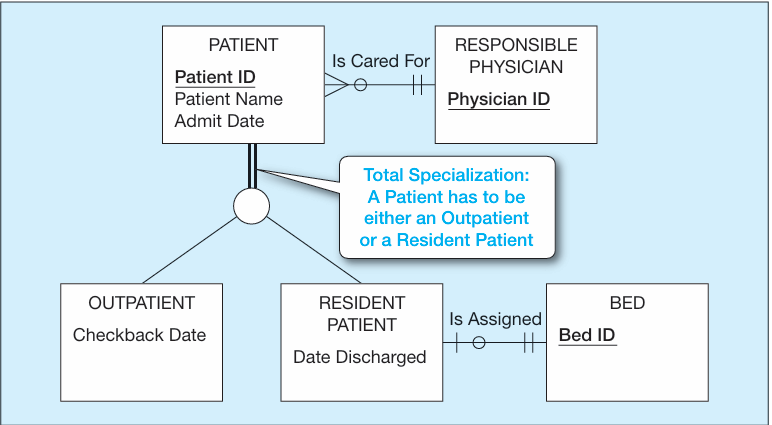
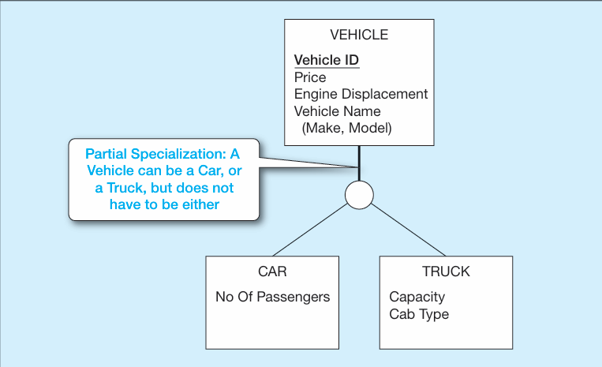
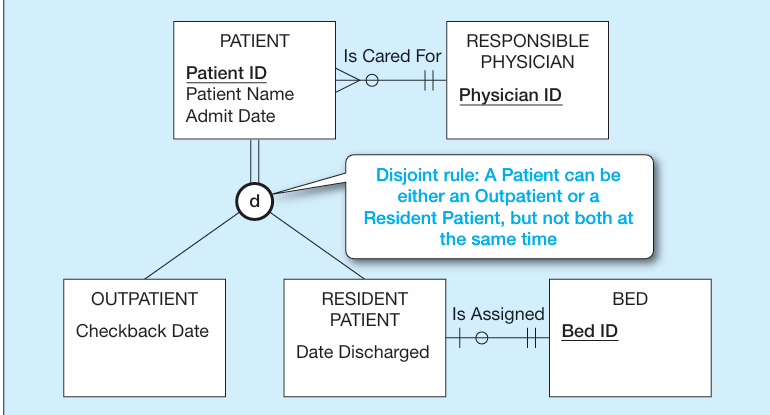
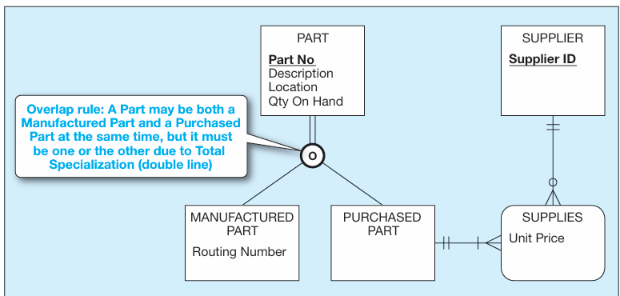
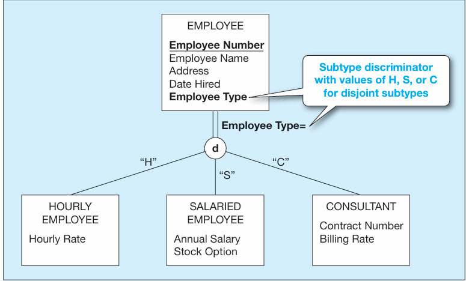
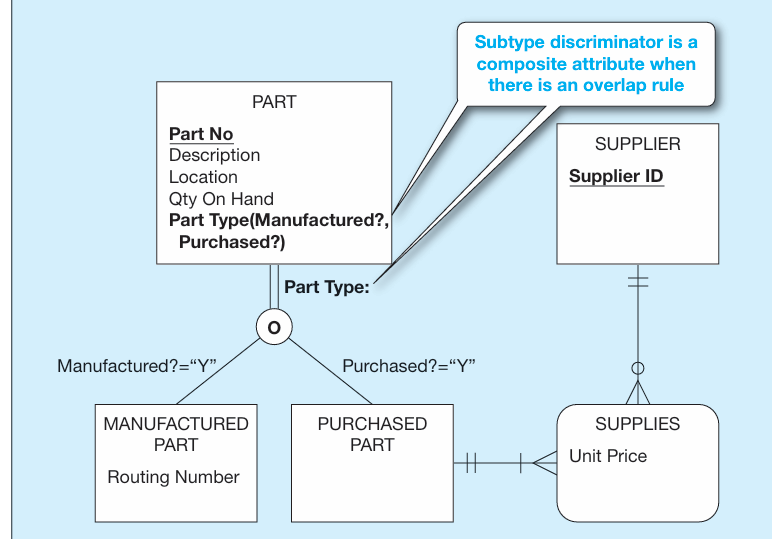
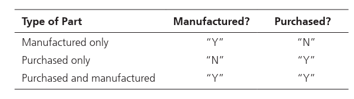

# SPECIFYING CONSTRAINTS IN SUPERTYPE/SUBTYPE RELATIONSHIPS**Specifying [Completeness Constraints]{.underline}:** addresses the question of whether an instance of a supertype must also be a member of at least one subtype.

-   **[total specialization rule]{.underline}**: specifies that each entity instance of the supertype must be a member of some sub type in the relationship.

    -   In an EER model this is indicated by double lines to the big circle

> {width="3.0104166666666665in" height="1.65625in"}

-   **[partial specialization rule]{.underline}**: specifies that an entity instance of the supertype is allowed not to belong to any subtype.

    -   In an EER model this is represented by a single line to the big circle

> {width="3.5625in" height="2.1770833333333335in"}
>
>  

**[Specifying Disjointness Constraints]{.underline}**: addresses whether an instance of a supertype may simultaneously be a member of two (or more) subtypes.

-   **[Disjoint rule:]{.underline}** specifies that if an entity instance (of the supertype) is a member of one subtype, it cannot simultaneously be a member of any other subtype.

    -   In EER model we use the d letter inside of the big circle to indicate disjoint rule

> {width="3.9375in" height="2.125in"}

-   **[Overlap rule:]{.underline}** specifies that an entity instance can simultaneously be a member of two (or more) subtypes.

    -   In EER model we use the letter o inside of the big circle to indicate the overlap rule

> {width="3.9895833333333335in" height="1.8958333333333333in"}

 

 

**[Defining Subtype Discriminators]{.underline}**: is an attribute of a supertype whose values determine the target subtype or subtypes.

-   This is essentially a key to tell you what the target subtype or subtypes are

-   This plays along with the idea of the disjointness contraints

-   **[DISJOINT SUBTYPES DESCRIMINATORS:]{.underline}**

> {width="3.6979166666666665in" height="2.2291666666666665in"}

-   **[OVERLAPPING SUBTYPES:]{.underline}**

> {width="3.7291666666666665in" height="2.6041666666666665in"}
>
> {width="3.7708333333333335in" height="1.0520833333333333in"}

Defining Supertype/Subtype Hierarchies

 

>  

In this example, every time a new instance of PATIENT is inserted into the super type, a corresponding instance is inserted into either OUTPATIENT or RESIDENT PATIENT.

 

Recall that in this example, motorcycle is a type of vehicle, but it is not represented as a subtype in the data model. Thus, if a vehicle is a car, it must appear as an instance of CAR, and if it is a truck, it must appear as an instance of TRUCK. However, if the vehicle is a motorcycle, it cannot appear as an instance of any subtype because it has no attributes or relationships other than those for the supertype of VEHICLE. This is an example of partial specialization

 

At any given time, a patient must be either an outpatient or a resident patient but cannot be both.

 

Recall from our discussion of this example that some parts are both manufactured and purchased. Thus, any part must be either a purchased part or a manufactured part, or it may simultaneously be both of these.

 

Note: in this example we are talking about whole units and not individual units of a whole unit i.e say ford comes out with specialized wrenches and your warehouse has them from both the manufacturer and from home depot we would say it is both manufactored and a purchased part but we wouldn't look deeper into each part to say what individual wrench has been manu. Or purchased .

 

We now add an attribute inside of the supertype entity that specifies to us what subtype the entity being created falls under since it is total specialization and disjoint it must fall under [one]{.underline} of the subtypes

 

We now add an attribute inside of the supertype which is a compound attribute that has essentially booleans that tell us what [subtypes]{.underline} the part falls under since it is total specialization we know it falls under one of them and since it is overlap we know it could be more than one so we have a compound attribute that tells us which is which

