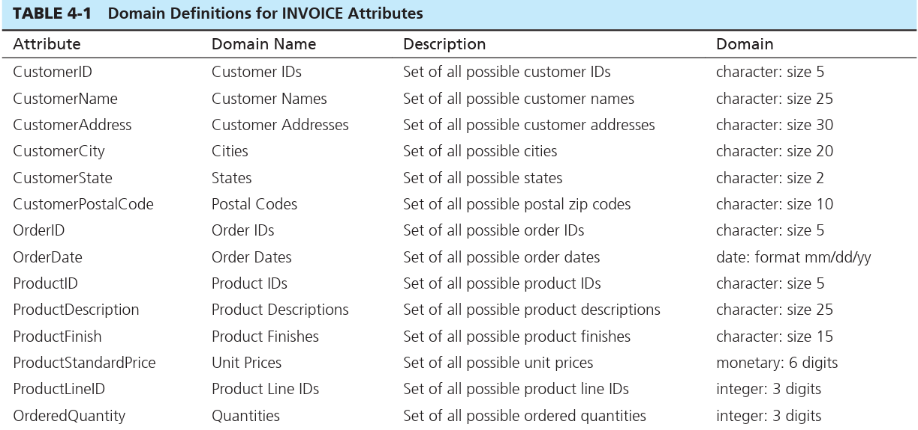
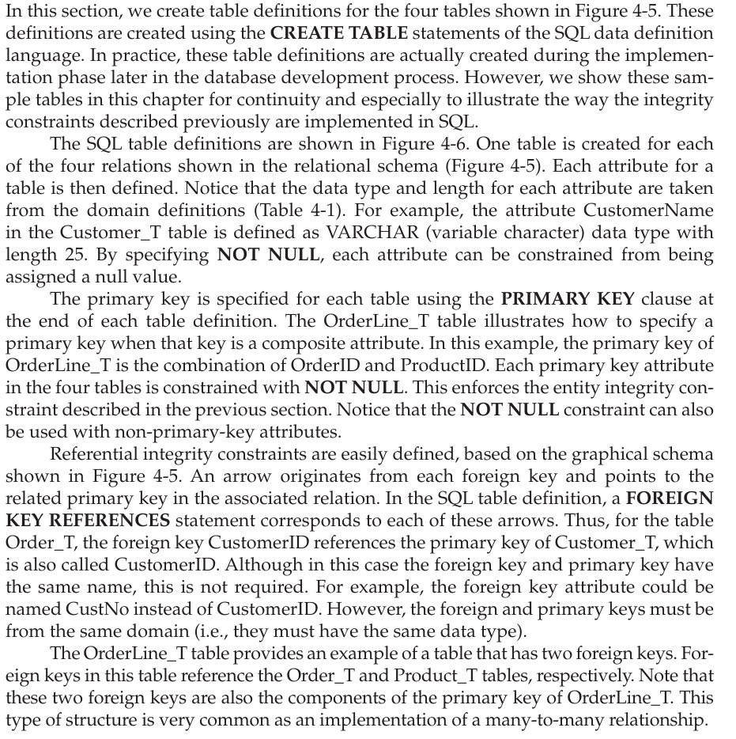
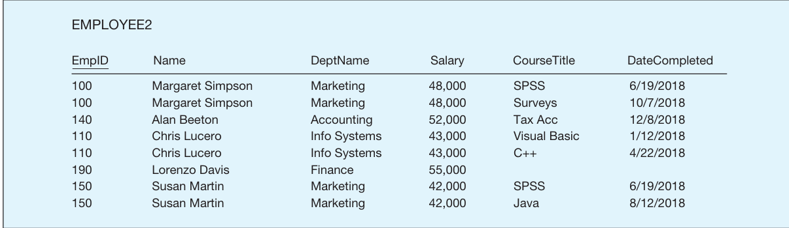
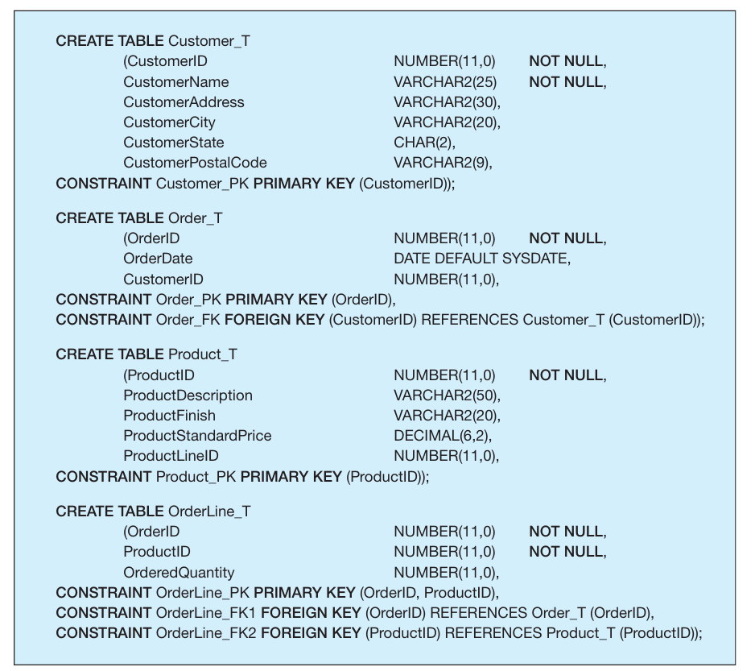

# INTEGRITY CONSTRAINTS:[Domain constraints]{.underline}: is the set of values that may be assigned to an attribute

-   It usually consists of domain name, meaning, data type, size, and allowable values or ranges.

-   Example

> {width="4.177083333333333in" height="1.9583333333333333in"}

[Entity integrity]{.underline}: is designed to ensure that every relation has a primary key and that the data values for that

primary key are all valid.

-   In particular, it guarantees that every primary key attribute is non-null.

    -   There are times when other attributes that are not the primary key can be null (absence of value)

[Referential integrity]{.underline}: is a rule that maintains consistency among the rows of two relations.

-   The rule states that if there is a foreign key in one relation, either each foreign key value must match a primary key value in another relation or the foreign key value must be null.

 

**Creating Relational Tables**

{width="4.708333333333333in" height="4.729166666666667in"}

 

**Well-Structured Relations:** contains minimal redundancy and allows users to insert, modify, and delete the rows in a table without errors or inconsistencies.

-   Avoid doing this like this:

> {width="5.270833333333333in" height="1.5208333333333333in"}

-   Redundancies in a table that result in errors or inconsistencies are called [anomalies]{.underline}. There are three types of anomalies:

    -   [Insertion anomaly]{.underline}: if a user has to enter data for some attribute that is not necessary like having an employee have to add a course title when it isnt necessary for an employee to have to have taken a course.

    -   [Deletion anomaly]{.underline}: when you delete a record which results in loss of data that shouldn't have been strictly tied with that record i.e it could have been its own record in another more specific table

        -   Suppose that the data for employee number 140 are deleted from the table. This will result in losing the information that this employee com pleted a course (Tax Acc) on 12/8/2018. In fact, it results in losing the information that this course had an offering that completed on that date.

    -   [Modification anomaly]{.underline}: when you have to update the record of multiple rows because they have the same ID.

    -   These are all indications that a table is not well structured

>  

Note:

-   Here is an example of creating a relational table using sql code.

>  

{width="3.8229166666666665in" height="3.3958333333333335in"}{width="1.7916666666666667in" height="0.3333333333333333in"}{width="0.9479166666666666in" height="0.34375in"}{width="0.625in" height="0.3020833333333333in"}

 

{width="0.125in" height="0.2916666666666667in"}

