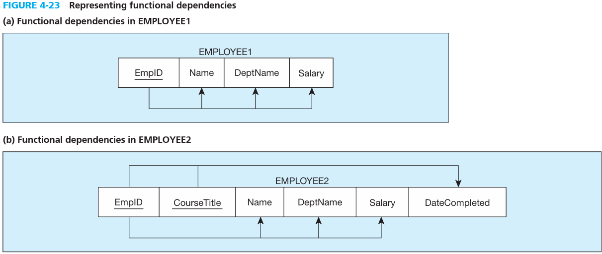

# INTRODUCTION TO NORMALIZATION-   When reverse-engineering older systems: Many of the tables and user views for older systems are redundant and subject to the anomalies we describe in this chapter.

 

[**Normalization**:]{.underline} is the process of successively reducing relations with anomalies to produce smaller, well-structured relations.

-   Some of the main goals of normalization:

    -   Minimize data redundancy, thereby avoiding anomalies and conserving storage space.

    -   Simplify the enforcement of referential integrity constraints.

    -   Make it easier to maintain data (insert, update, and delete).

    -   Provide a better design that is an improved representation of the real world and a stronger basis for future growth.

 

**Steps in Normalization**

1.  First normal form: Any multivalued attributes (also called repeating groups) have been removed, so there is a single value (possibly null) at the intersection of each row and column of the table

2.  Second normal form: Any partial functional dependencies have been removed (i.e., nonkey attributes are identified by the whole primary key).

3.  Third normal form: Any transitive dependencies have been removed (i.e., non key attributes are identified by only the primary key).

4.  Boyce-Codd normal form: Any remaining anomalies that result from functional dependencies have been removed (because there was more than one possible primary key for the same nonkeys).

5.  Fourth normal form: Any multivalued dependencies have been removed.

6.  Fifth normal form: Any remaining anomalies have been removed.

 

-   Steps 1-3 cover what is called the analysis of [functional dependencies]{.underline}: constraint between two attributes or two sets of attributes.

    -   For any relation R, attribute B is functionally dependent on attribute A, if for every valid instance of A, that value of A uniquely determines the value of B.

    -   The functional dependency of B on A is represented by an arrow, as follows: A → B

        -   if you know the value of A, there can be only one value for B.

    -   An attribute may be functionally dependent on a combination of two (or more) attributes rather than on a single attribute.

        -   EmpID, CourseTitle → DateCompleted where the "," stands for AND

            -   "The functional dependency in this statement implies that the date when a course is completed is determined by the identity of the employee and the title of the course. "

    -   Examples of functional dependencies:

        -   1. SSN → Name, Address, Birthdate A person's name, address, and birth date are functionally dependent on that person's Social Security number (in other words, there can be only one Name, one Address, and one Birthdate for each SSN).

        -   2. VIN → Make, Model, Color The make, model, and the original color of a vehicle are functionally dependent on the vehicle identification number (as above, there can be only one value of Make, Model, and Color associated with each VIN).

        -   3. ISBN → Title, FirstAuthorName, Publisher The title of a book, the name of the first author, and the publisher are functionally dependent on the book's interna tional standard book number (ISBN).

    -   [DETERMINANTS]{.underline}: The attribute on the left side of the arrow in a functional dependency is called a determinant.

        -   SSN, VIN, and ISBN are determinants

    -   [CANDIDATE KEYS]{.underline}: is an attribute, or combination of attributes, that uniquely identifies a row in a relation.

        -   1. Unique identification For every row, the value of the key must uniquely identify that row. This property implies that each nonkey attribute is functionally dependent on that key.

        -   2. Nonredundancy No attribute in the key can be deleted without destroying the property of unique identification.

        -   Also, a determinant must be a candidate key.

        -   The difference between candidate key and primary key is that the primary key is the chosen key to represent a record while there can be multiple candidate keys and candidate key(s) can be the primary key.

    -   {width="5.739583333333333in" height="2.4270833333333335in"}

    -   We can summarize the relationship between determinants and candidate keys as follows: A candidate key is always a determinant, whereas a determinant may or may not be a candidate key.

In figure a, EmpID is a canidate key but because it is also the only canidate key it is the primary key. It also represents all of the attributes which are functionally dependent on it.

 

In figure b, there are two candidate keys: EmpID and CourseTitle. EmpID functionally represents name, DeptName, and salary while CourseTitle and EmpID funct. Reps. Date completed. Thus we have two candidate keys. In this case EmpID and CourseTitle combined are the primary key

