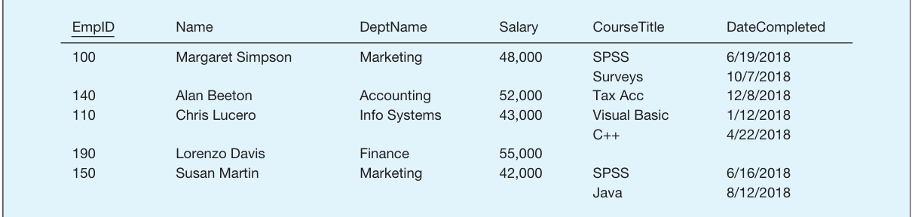
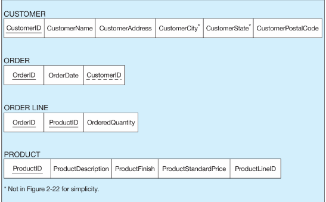
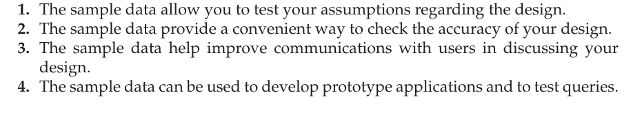
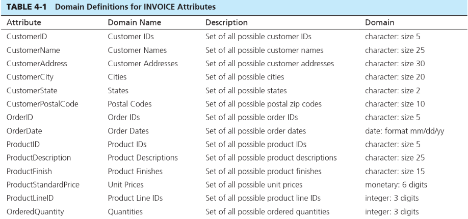

# THE RELATIONAL DATA MODEL -   [Data manipulation]{.underline}: powerful operations (using something like sql) are used to manipulate data stored in the relations

-   [Data integrity]{.underline}: The model includes mechanisms to specify business rules that maintain the integrity of the data when they are manipulated.

-   Relational data structure

    -   [Relation]{.underline}: is a named two dimensional table of data. Each relation consists of named columns and any number of rows.

        -   A named column is known as an [attribute]{.underline}

        -   Each row is a record that contains data for a single entity

        -   It is important to understand that a relation is the actual table framework and you can create instances of that table (populate it with data)

        -   One way to express the structure of some relation would be like this:

> EMPLOYEE1(EmpID, Name, DeptName, Salary)

-   Name of relation and in parenthesis the attributes

<!-- -->

-   Relational Keys

    -   Primary Key: is an attribute or a combo of attributes that uniquely identifies each row in a relation.

        -   One way to denote this is like, EMPLOYEE1([EmpID]{.underline}, Name, DeptName, Salary)

        -   Often called identifier

    -   Composite key: is a primary key with more than one attribute

        -   Example: the primary key for a relation DEPENDENT would likely consist of the combination EmpID and DependentName.

    -   Foreign key: is an attribute in a relation that serves as the primary key of another relation

        -   This is used to represent the relationship b/w two tables.

        -   Example:

> EMPLOYEE1([EmpID]{.underline}, Name, [DeptName]{.underline}, Salary) //foreign key is DeptName
>
> DEPARTMENT([DeptName]{.underline}, Location, Fax) //DeptName is a primary key of Department

-   In this example, DeptName in EMPLOYEE1 is a foreign key whose purpose serves as a way for to access some DEPARTMENT row/record whose ID's match to retrieve its data.

-   EMPLOYEE1 has a record in DEPARTMENT and it accesses it by using its foreign key which links up the primary key of some DEPARTMENT record

**PROPERTIES OF RELATIONS:**

-   These are the properties of relational tables that distinguish them from nonrelational tables:

    a.  Each relation (or table) in a database has a unique name

    b.  Every value put into an attribute's column must be single valued (atomic); no multivalued attributes are allowed.

        i.  For example,

> {width="5.239583333333333in" height="1.2395833333333333in"}

c.  Each row is unique, no two identical rows allowed

d.  Each attribute has a unique name

e.  The sequence of left to right in both columns and rows is insignificant

**Sample Database**

A relational database may consist of any number of relations (tables that are relational) and to describe them we would use either

-   [Short text statements]{.underline} like EMPLOYEE1([EmpID]{.underline}, Name, DeptName, Salary)

-   [Graphical representations]{.underline} like:

> {width="2.4895833333333335in" height="1.5416666666666667in"}

-   It is often wise to create an instance of your relational schema with sample data for four reasons:

> {width="4.65625in" height="0.8125in"}

**INTEGRITY CONSTRAINTS:** The relational data model includes several types of constraints, or rules limiting acceptable values and actions, whose purpose is to facilitate maintaining the accuracy and integrity of data in the database.

The three major types of constraints are...

[Domain constraints]{.underline}: is the set of values that may be assigned to an attribute

-   It usually consists of domain name, meaning, data type, size, and allowable values or ranges.

-   Example

> {width="4.177083333333333in" height="1.9583333333333333in"}

[Entity integrity]{.underline}: is designed to ensure that every relation has a primary key and that the data values for that

primary key are all valid.

-   In particular, it guarantees that every primary key attribute is non-null.

    -   There are times when other attributes that are not the primary key can be null (absence of value)

[Referential integrity]{.underline}: is a rule that maintains consistency among the rows of two relations.

-   The rule states that if there is a foreign key in one relation, either each foreign key value must match a primary key value in another relation or the foreign key value must be null.

 

We have mulitvalued attribute called CourseTitle and DateCompleted which would make our table nonrelational

 

Notes:

-   Notice that order line has a composite primary key and it also has foreign keys which also happen to be the composite keys. In this case, we only show the composite keys by underlining them solid

 

