# TRANSFORMING EER DIAGRAMS INTO RELATIONS**Review:**

> 1. [Regular entities]{.underline} are entities that have an independent existence and generally represent real-world objects, such as persons and products. Regular entity types are represented by rectangles with a single line.

-   Regular run of the mill entities like customer, employee, etc..

> 2. [Weak entities]{.underline} are entities that cannot exist except with an identifying relationship with an owner (regular) entity type. Weak entities are identified by a rectangle with a double line.

-   Would be something like a dependent of an EMPLOYEE

> 3. [Associative entities]{.underline} (also called gerunds) are formed from many-to-many relationships between other entity types. Associative entities are represented by a rectangle with rounded corners.

-   Would be something that is derived from a mulivalued attribute like say skill for EMPLOYEE

 

**Step 1: Map Regular Entities**

-   Make each regular entity into a relation table

-   The name of relation should be the same as the entity

-   Make sure it has a unique id attribute (primary key)

-   Composite Attributes

    -   When your regular entity has a composite value they will turn into simple attribute components in the relation table

        -   Note that when I say entity Im referring to the EER diagram represention and I am talking in reference to that diagram and when I say relation table I am referring to the relational tables we are now creating

-   Multivalued attributes

    -   When a regular entity contains a multivalued attribute (like say EMPLOYEE {skill}) you will create a new table for it (skill) and do the whole foreign key mapping as well as maybe a composite key to make up the primary key

    -   Remember that the DBMS that you are using limits your choices on how you wanna go about tackling multivalued attributes, some will let you house them in the same relation as an attribute and some will make you create a new relation table for them

-   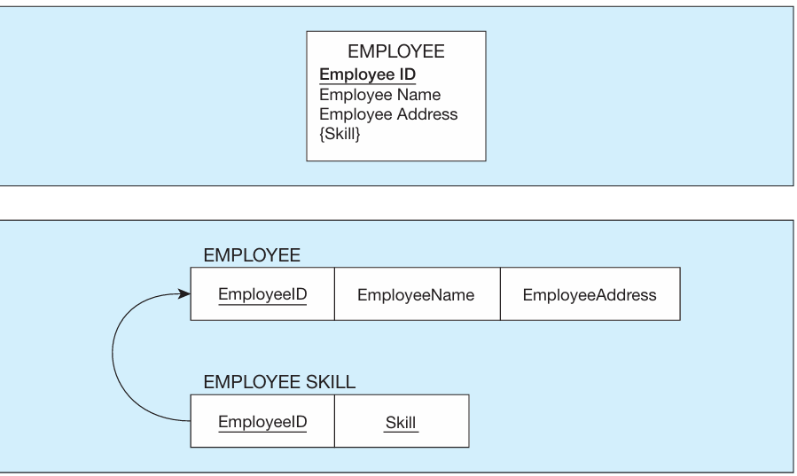{width="4.15625in" height="2.4791666666666665in"}

>  

**Step 2: Map Weak Entities**

Recall that a weak entity type does not have an independent existence but exists only through an identifying relationship with another entity type called the owner.

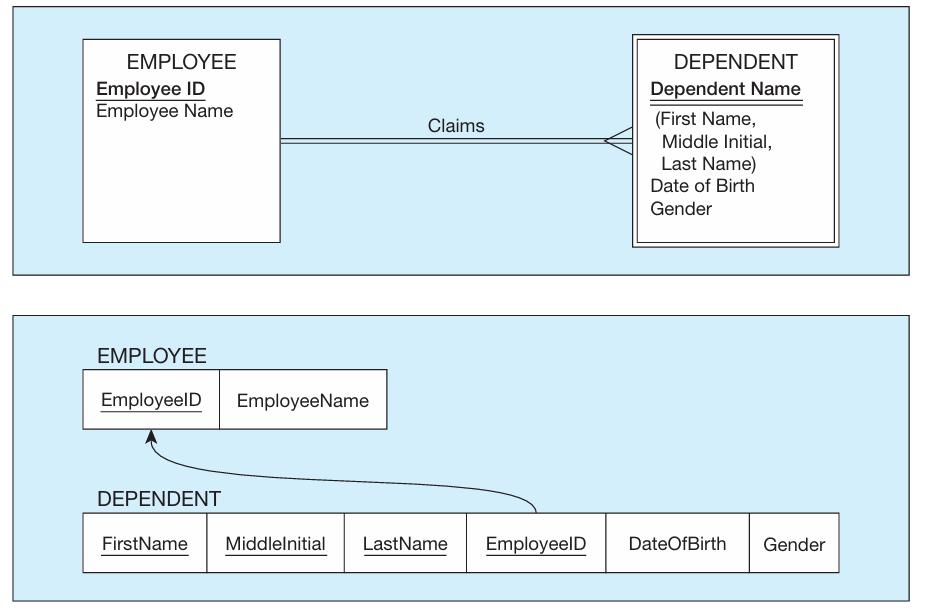{width="4.614583333333333in" height="3.0520833333333335in"}

-   Here we can make the case for a [surrogate key:]{.underline} A serial number or other system assigned primary key for a relation.

    -   In this example, we could create a new attribute in DEPENDENT called DependentID instead of using a bunch of composite attributes

        -   Notice that this solution will ensure unique identification for each dependent (even for those of George Foreman!).

    -   There are certain situations where a surrogate key is needed and you can look it up if need be

 

**Step 3: Map Binary Relationships**

The procedure for representing relationships depends on both the degree of the relationships (unary, binary, or ternary) and the cardinalities of the relationships.

 

MAP BINARY ONE-TO-MANY RELATIONSHIPS:

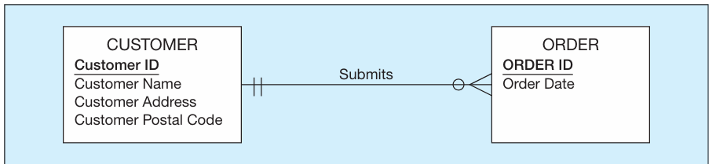{width="6.541666666666667in" height="1.5in"}

 

MAP BINARY MANY-TO-MANY RELATIONSHIPS

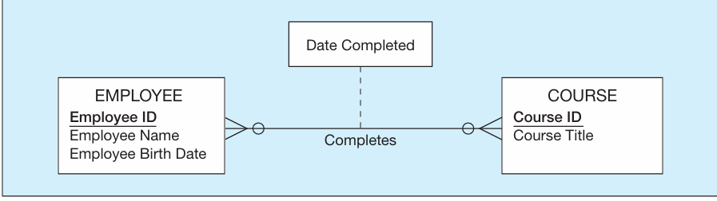{width="6.625in" height="1.8541666666666667in"}

 

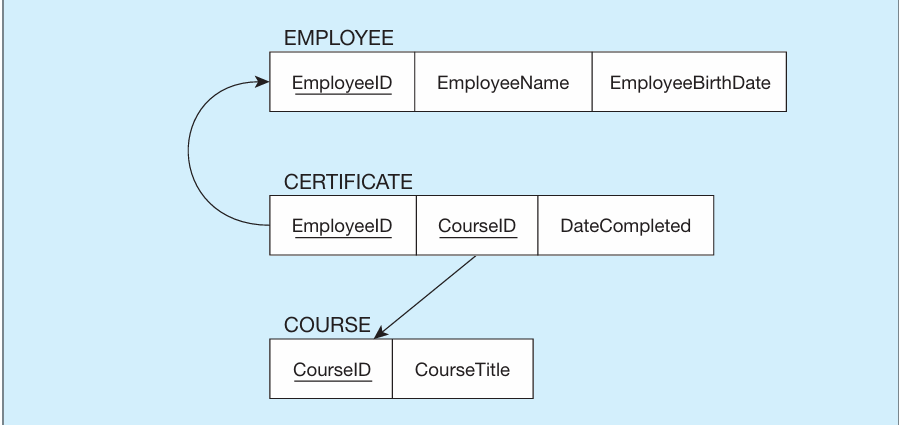{width="6.604166666666667in" height="3.125in"}

 

MAP BINARY ONE-TO-ONE RELATIONSHIPS

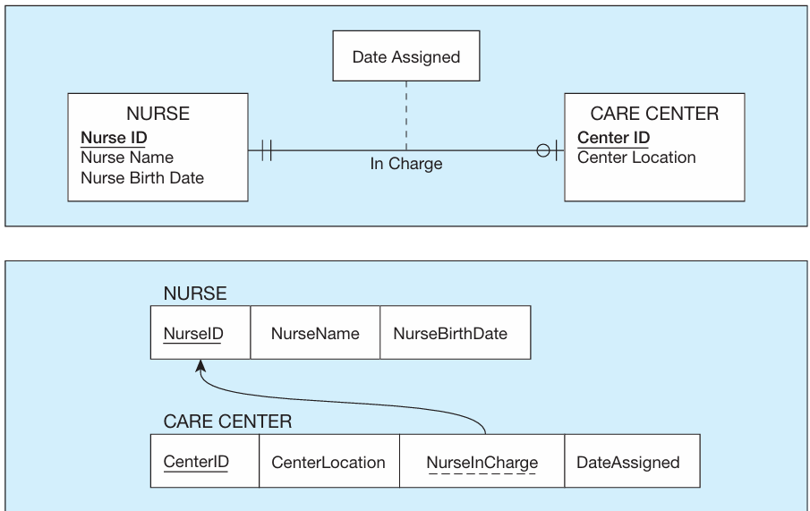{width="6.635416666666667in" height="4.177083333333333in"}

 

 

**Step 4: Map Associative Entities**

Mapping the associative entity involves essentially the same steps as mapping an M:N relationship, as described in Step 3.

 

-   The first step is to create three relations: one for each of the two participating entity types and a third for the associative entity

-   The second step then depends on whether on the E-R diagram an identifier was assigned to the associative entity

    -   Identifier not assigned: the default primary key will be a composite key of two primary key attributes from the two other relations

    -   Identifier Assigned:

        -   This happens if the identifier is unique in some way or if the composite attributes could have duplicates when combining to make primary key

            -   If duplicate composite keys are possible than a surrogate key is needed

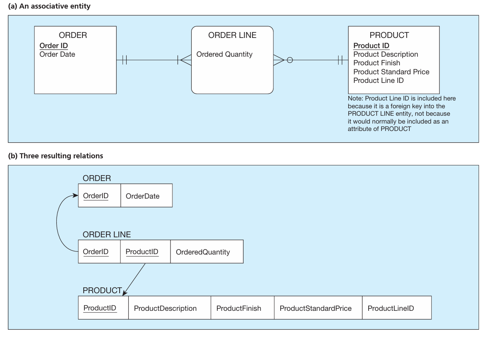{width="5.15625in" height="3.5416666666666665in"}

 

**Step 5: Map Unary Relationships**

we defined a unary relationship as a relationship between the instances of a single entity type. Unary relationships are also called recursive relationships. The two most important cases of unary relationships are one-to-many and many-to-many relationships.

-   Do step 1

-   UNARY ONE-TO-MANY RELATIONSHIPS

    -   Next, a foreign key attribute is added to the same relation; this attribute references the primary key values in the same relation.

        -   recursive foreign key.

    -   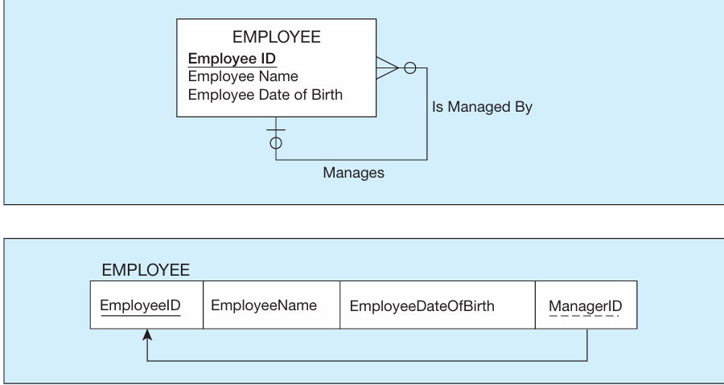{width="5.739583333333333in" height="3.0520833333333335in"}

-   UNARY MANY-TO-MANY RELATIONSHIPS

    -   With this type of relationship, two relations are created: one to represent the entity type in the relationship and an associative rela tion to represent the M:N relationship itself.

    -   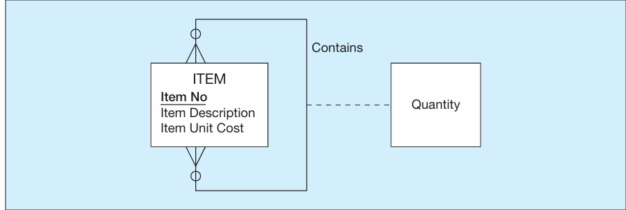{width="4.375in" height="1.46875in"}

>  
>
> 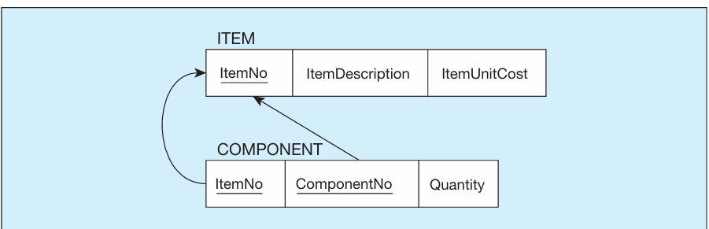{width="4.395833333333333in" height="1.4166666666666667in"}

 

-   **Step 6: Map Ternary (and n-ary) Relationships**

> is a relationship among three entity types.

-   we recommended that you convert a ternary relationship to an associative entity to represent participation constraints more accurately.

-   To map an associative entity type that links three regular entity types, you create a new associative relation.

-   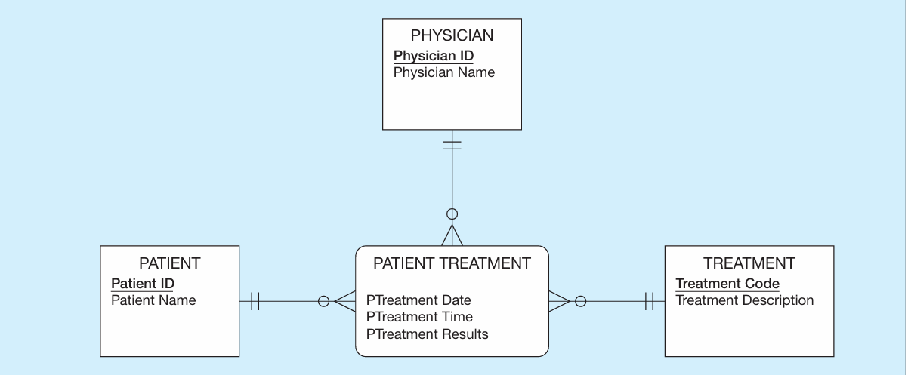{width="4.760416666666667in" height="1.9583333333333333in"}

-   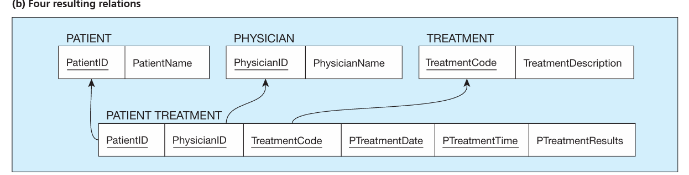{width="4.729166666666667in" height="1.1979166666666667in"}

>  

-   **Step 7: Map Supertype/Subtype Relationships**

    -   1. Create a separate relation for the supertype and for each of its subtypes.

    -   2. Assign to the relation created for the supertype the attributes that are common to all members of the supertype, including the primary key. 3. Assign to the relation for each subtype the primary key of the supertype and only those attributes that are unique to that subtype.

    -   4. Assign one (or more) attributes of the supertype to function as the subtype dis criminator. (The role of the subtype discriminator was discussed in Chapter 3.)

    -   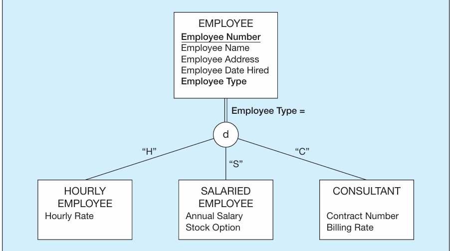{width="5.635416666666667in" height="3.1354166666666665in"}

 

**SUMMARY**

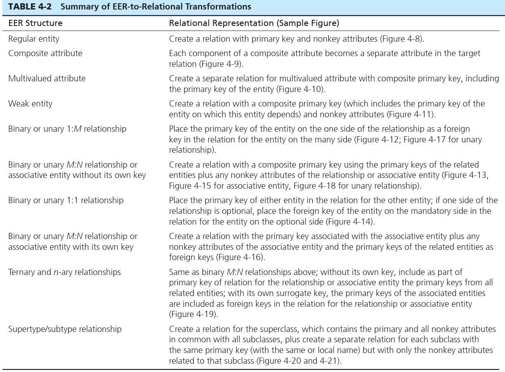{width="8.8125in" height="6.479166666666667in"}

 

Notice the naming difference between a multivalued attribute vs a weak entity relation

 

Notice the difference in naming between the two relation tables here and in the mulitivalued one above. DEPENDENT isnt named EMPLOYEE DEPENDENT its just named DEPENDENT

 

Notice that DEPENDENT has many composite keys that make up its primary key

 

 

 

"The primary key migrates to the many side."

 

"Suppose that there is a binary many to-many (M:N) relationship between two entity types, A and B. For such a relationship, create a new relation, C. Include as foreign key attributes in C the primary key for each of the two participating entity types. These attributes together become the primary key of C. Any nonkey attributes that are associated with the M:N relationship are included with the relation C."

 

 

Notice how we create a new relation table called certificate. The relationship would read something like An employee exists who has a certificate for some course.

 

Also note it is wise to create a surrogate key for CERTIFICATE instead of having a composite key

 

"The process of mapping such a relationship to relations requires two steps. First, two relations are created, one for each of the participating entity types. Second, the primary key of one of the relations is included as a foreign key in the other relation."

"In a 1:1 relationship, the association in one direction is nearly always an optional one, whereas the association in the other direction is a mandatory one. "

 

In this example a care center must be assigned a nurse but a nurse does not necessarily have to be assigned a care center

-   This means if you tried to look up a specific nurse if in care center you might not find the nurse if they arent assigned a care center

 

 

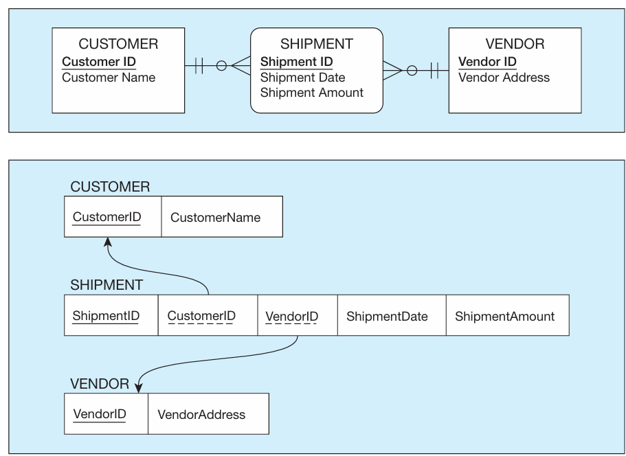{width="4.833333333333333in" height="3.5208333333333335in"}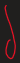{width="0.20833333333333334in" height="0.65625in"}{width="0.11458333333333333in" height="0.11458333333333333in"}{width="0.20833333333333334in" height="0.3854166666666667in"}{width="0.3020833333333333in" height="0.5833333333333334in"}{width="0.3125in" height="0.3958333333333333in"}{width="0.3229166666666667in" height="0.4583333333333333in"}{width="0.23958333333333334in" height="0.4583333333333333in"}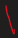{width="0.1875in" height="0.3958333333333333in"}{width="0.34375in" height="0.3229166666666667in"}{width="0.125in" height="0.4166666666666667in"}{width="0.3645833333333333in" height="0.13541666666666666in"}{width="0.19791666666666666in" height="0.2916666666666667in"}{width="0.20833333333333334in" height="0.2916666666666667in"}{width="0.65625in" height="0.15625in"}{width="0.14583333333333334in" height="0.5520833333333334in"}{width="0.125in" height="0.125in"}{width="0.28125in" height="0.3229166666666667in"}{width="0.3333333333333333in" height="0.3020833333333333in"}{width="0.19791666666666666in" height="0.46875in"}{width="0.2916666666666667in" height="0.2604166666666667in"}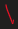{width="0.1875in" height="0.3020833333333333in"}{width="0.19791666666666666in" height="0.3020833333333333in"}{width="0.3125in" height="0.2916666666666667in"}

 

"shows a unary one-to-many relationship named Manages that associates each employee of an organization with another employee who is his or her manager. Each employee may have one manager; a given employee may manage zero to many employees."

 

"The relationship (called Contains) is M:N because a given item can contain numerous component items, and, conversely, an item can be used as a component in numerous other items."

 

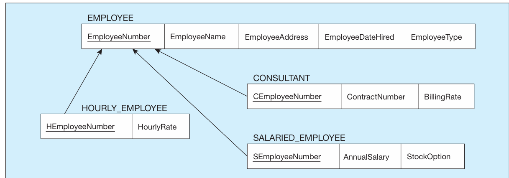{width="5.041666666666667in" height="1.7604166666666667in"}

