# DEFINING A DATABASE IN SQL-   The basic syntax for creating a database is:

> {width="4.677083333333333in" height="0.3229166666666667in"}

-   The database will be owned by the authorized user, although it is possible for other specified users to work with the database or even to transfer ownership of the database.

-   Physical storage of the database is dependent on both the hardware and the software environment and is usually the concern of the system administrator.

 

Several SQL DDL CREATE commands are included in SQL:2016

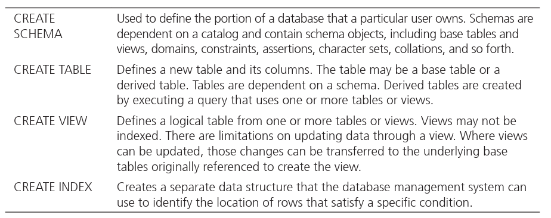{width="6.302083333333333in" height="2.4895833333333335in"}

-   These create commands don't set things in stone they can be reversed (deleted) or changed

    -   You can reverse by using the DROP command

        -   Thus, DROP TABLE tablename will destroy a table, including its definition, contents, and any constraints, views, or indexes associated with it.

        -   DROP SCHEMA or DROP VIEW will also destroy the named schema or view.

    -   You can change a table by using the ALTER command

        -   ALTER TABLE command can be used to change the definition of an existing base table by adding, dropping, or changing a column or by dropping a constraint.

    -   These are other create commands

> 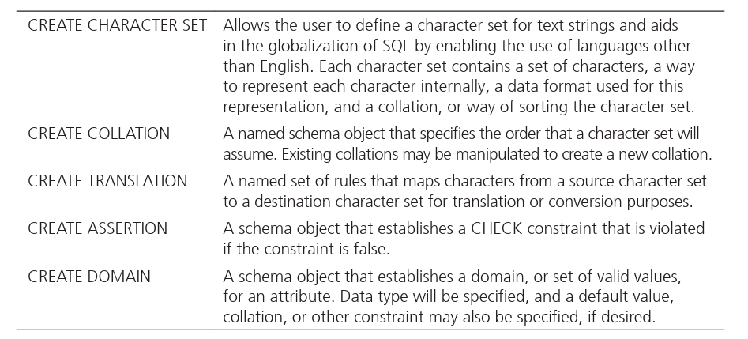{width="5.510416666666667in" height="2.4895833333333335in"}
>
>  

**Creating Tables**

-   Here is the general syntax for creating a table (DDL language)

> 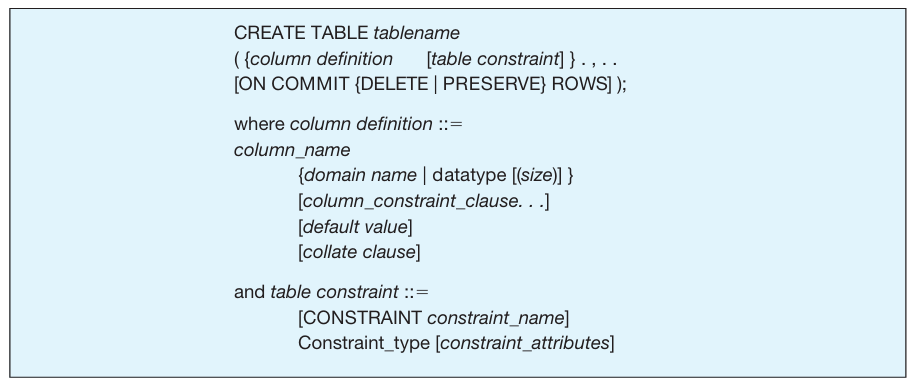{width="5.25in" height="2.2395833333333335in"}

-   Note that in Oracle sqldeveloper, there is a GUI for creating a table which will generate this code for us. What we are referring to here is code itself.

<!-- -->

-   When preparing to create a table, here is a guideline...

-   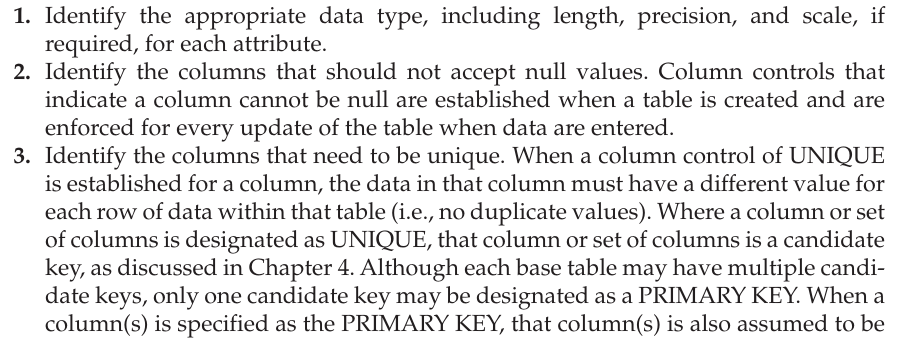{width="5.302083333333333in" height="2.0625in"}

>  
>
> 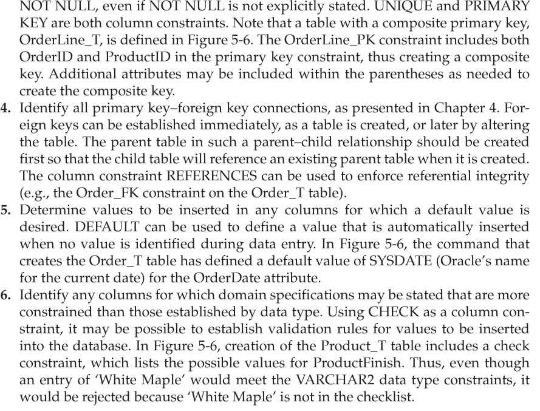{width="5.302083333333333in" height="4.041666666666667in"}
>
>  
>
> 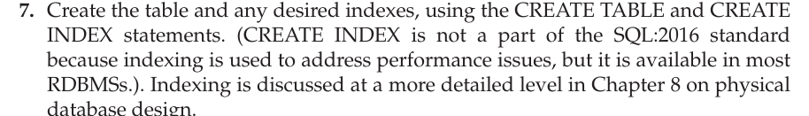{width="5.3125in" height="0.7604166666666666in"}

-   Make sure that all constraints, primary key, foreign key, etc are all named properly because it will ensure that you can easily identify these things

<!-- -->

-   Oracle, MySQL, and some other RDBMSs have an interesting "dummy" table that is automatically defined with each database---the Dual table. The Dual table is used to run an SQL command against a system variable.

> 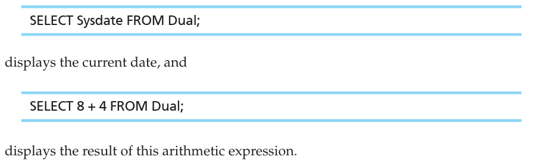{width="5.489583333333333in" height="1.65625in"}

 

**Creating Data Integrity Controls**

[Referential integrity]{.underline}: a value in the matching column on the many side must correspond to a value in the primary key for some row in the table on the one side or be NULL.

-   basically if there isnt a primary key for the foreign key value trying to be added then it wont add it

    -   This is called the SQL REFERENCES clause

 

Suppose we have the scenario where we have a 1:M relationship. The 1 side will have a primary key which will be referenced by the M side using foreign key. What will happen if we have a record in the 1 side whose primary key is referenced in the M side with a foreign key?

-   If a CustomerID value is changed (UPDATE), the connection between that customer and orders placed by that customer will be ruined.

> Solutions:

-   ON UPDATE RESTRICT

    -   This problem could be handled by asserting that primary key values cannot be changed once they are established.

    -   Then any updates that would delete or change a primary key value will be rejected unless no foreign key references that value in any child table

-   ON UPDATE CASCADE

    -   Another solution is to pass the change through to the child table(s)

    -   Then, if a customer ID number is changed, that change will flow through (cascade) to the child table, Order_T, and the customer's ID will also be updated in the Order_T table.

-   ON UPDATE SET NULL

    -   A third solution is to allow the update on Customer_T but to change the involved CustomerID value in the Order_T table to NULL

    -   In this case, using the SET NULL option would result in losing the connection between the order and the customer, which is not a desired effect.

-   What option makes sense?

    -   The most flexible option to use would be the CASCADE option.

<!-- -->

-   What if a customer record was deleted and in turn a CustomerID was deleted?

> Solutions:

-   ON DELETE RESTRICT

    -   the customer record could not be deleted unless there were no orders from that customer in the Order_T table.

-   ON DELETE CASCADE

    -   removing the customer would remove all associated order records from Order_T.

-   ON DELETE SET NULL

    -   the order records for that customer would be set to null before the customer's record was deleted.

-   ON DELETE SET DEFAULT

    -   the order records for that customer would be set to a default value before the customer's record was deleted.

-   What option makes sense?

    -   ON DELETE RESTRICT would probably make the most sense.

 

**Changing Table Definitions Using ALTER**

ALTER TABLE is a way to change or modify a table.

-   You can do things like changing base table definitions, add new columns, existing columns can be altered, table contraints can be added or dropped.

    -   If columns are to be altered you can include keywords such as ADD, DROP, or ALTER and allow the column's name, data type, length, and constraints to be changed.

    -   When the new column is created, it is added to all of the instances in the table, and a value of NULL would be the most reasonable.

-   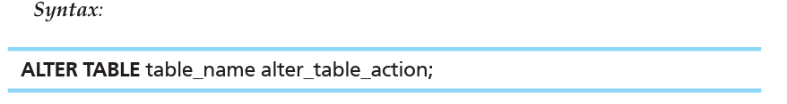{width="5.291666666666667in" height="0.6979166666666666in"}

>  

-   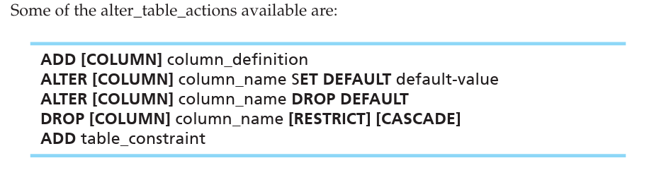{width="5.604166666666667in" height="1.5in"}

<!-- -->

-   Example

> 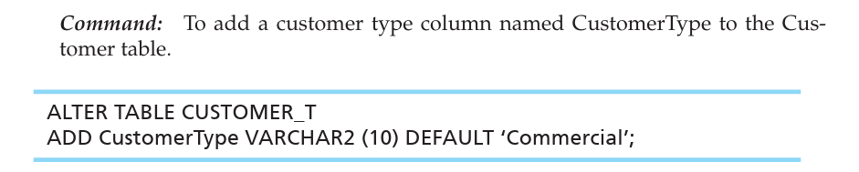{width="5.927083333333333in" height="1.1875in"}

-   The ALTER command is invaluable for adapting a database to inevitable modi fications due to changing requirements, prototyping, evolutionary development, and mistakes.

 

**Removing Tables**

To remove a table from a database, the owner of the table may use the DROP TABLE command.

-   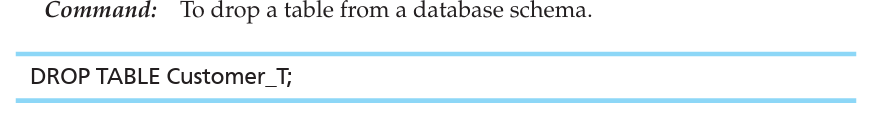{width="5.71875in" height="0.7708333333333334in"}

    -   This command will drop the table and save any pending changes to the data base.

    -   To drop a table, you must either own the table or have been granted the DROP ANY TABLE system privilege.

    -   Dropping a table will also cause associated indexes and privileges granted to be dropped.

-   The DROP TABLE command can be qualified by the key words RESTRICT or CASCADE.

    -   If RESTRICT is specified, the command will fail, and the table will not be dropped if there are any dependent objects, such as views or constraints, that currently reference the table.

    -   If CASCADE is specified, all dependent objects will (views, constraints, etc) also be dropped as the table is dropped.

-   Many RDBMSs allow users to retain the table's structure but remove all of the data that have been entered in the table with its TRUNCATE TABLE command.

 

