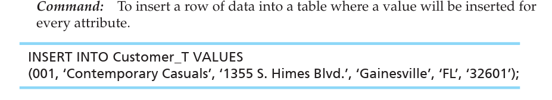
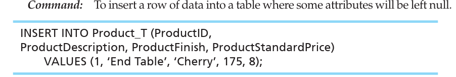
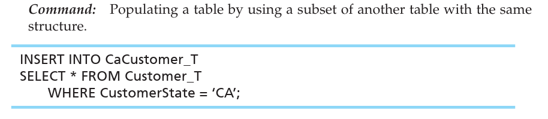
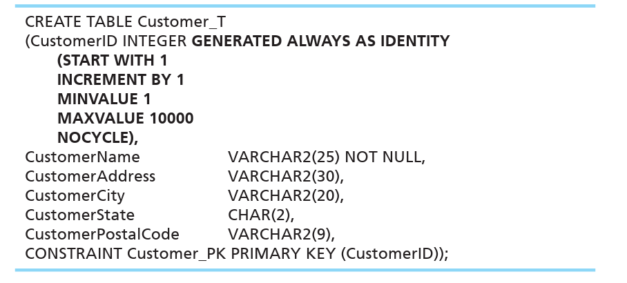
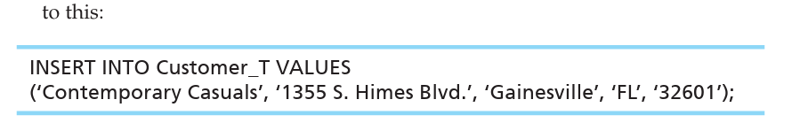
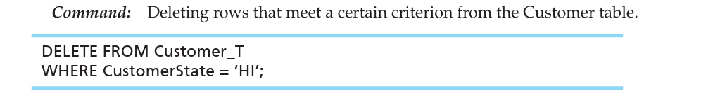
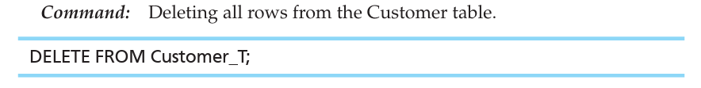
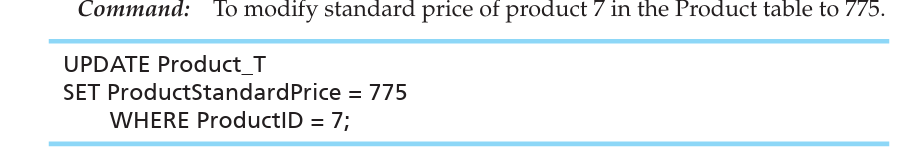
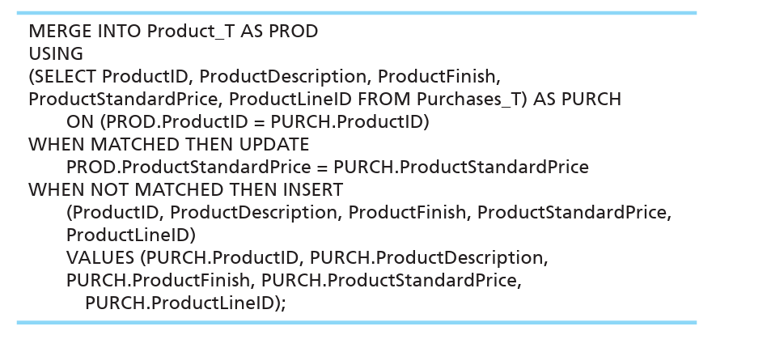

# INSERTING, UPDATING, AND DELETING DATAThe SQL command that is used to populate data in to those tables is the INSERT command

 

Example

When entering a value for every column in the table, you can use a command such as the following, which was used to add the first row of data to the Customer_T table for Pine Valley Furniture Company.

-   {width="5.114583333333333in" height="0.9270833333333334in"}

    -   Notice that the data values must be ordered in the same order as the columns in the table

 

When data will not be entered into every column in the table, either enter the value NULL for the empty fields or specify those columns to which data are to be added.

-   Example: For example, the following statement was used to insert one row of data into the Product_T table because there was no product line ID for the end table.

> {width="5.0625in" height="0.84375in"}

-   Here, too, the data values must be in the same order as the columns have been specified in the INSERT command.

-   If we wanted to specify and enter NULL for the attributes that would be NULL we would do something like..

> INSERT INTO Product_T VALUES (1,NULL, 'End Table', '1355.S Himes Blvd', NULL, NULL, NULL, 32601);

 

-   In general, the INSERT command..

    -   places a new row in a table based on values supplied in the statement

    -   copies one or more rows derived from other database data into a table

    -   extracts data from one table and inserts them into another

        -   Example: If you want to populate a table, CaCustomer_T, that has the same structure as CUSTOMER_T, with only Pine Valley's California customers, you could use the following INSERT command.

> {width="5.135416666666667in" height="1.1145833333333333in"}
>
>  

-   In many cases, we want to generate a unique primary identifier or primary key every time a row is added to a table.

    -   To do this we can use some sort of generator that can generate unique identifiers for things like primary keys

        -   We can have a table definition like this:

> {width="5.5625in" height="2.5104166666666665in"}

-   Only one column can be an identity column in a table.

-   When a new customer is added, the CustomerID value will be assigned implicitly if the vendor has implemented identity columns.

<!-- -->

-   Our new command that adds data to Customer_T would be

> {width="4.322916666666667in" height="0.7395833333333334in"}

-   The primary key value, 001, does not need to be entered, and the syntax to accomplish the automatic sequencing has been simplified

-   In other words, we do not need to specify the CustomerID, it is generated for us based on the table definition

**Deleting Database Contents (DELETE command)**

Rows can be deleted from a database individually or in groups.

-   Example:

> Suppose Pine Valley Furniture decides that it will no longer deal with customers located in Hawaii. Customer_T rows for customers with addresses in Hawaii could all be eliminated using..
>
> {width="5.052083333333333in" height="0.6979166666666666in"}

-   If we wanted to delete all the rows in a table we would use..

> {width="4.989583333333333in" height="0.625in"}

-   This form of the command should be used very carefully!

<!-- -->

-   We should also be careful when deleting rows who have ties with other tables/relations

    -   For example, if we delete a Customer_T row, as in the previous query, before deleting associated Order_T rows, we will have a referential integrity violation, and the DELETE command will not execute.

        -   Note: Including the ON DELETE clause with a column definition can mitigate such a problem. Refer to the "Creating Data Integrity Controls" section in this chapter if you've forgotten about the ON clause.

        -   always execute a SELECT command first to display the records that would be deleted and visually verify that only the desired rows are included

 

**Updating Database Contents**

To update data in SQL, we must inform the DBMS which relation, columns, and rows are involved.

-   Example: lets say an incorrect price is entered for the dining table in the Product_T table, the following SQL UPDATE statement would establish the correction.

> {width="5.520833333333333in" height="1.0in"}

-   The SET command can also change a value to NULL; the syntax is SET columname = NULL if we wanted to

-   As with DELETE, the WHERE clause in an UPDATE command may contain a subquery, but the table being updated may not be referenced in the subquery.

<!-- -->

-   MERGE command is another command which combines UPDATE and INSERT into one command.

    -   It may be the case that we want to INSERT new rows into some table but in the data that we want to insert there is also data that already exists but it has one difference or change which we can just UPDATE instead of adding a new row

    -   Example: A Purchases_T table, for example, might include rows with data about new products and rows that just changed the standard price of some existing products.

        -   In another table called Product_T, we want to use INSERT and UPDATE to handle adding the new products but also update the existing products whose standard price got changed.

        -   We can use MERGE to do this which has two branches WHEN MATCHED THEN UPDATE and WHEN NOT MATCHED THEN INSERT

> {width="4.958333333333333in" height="2.2708333333333335in"}
>
>  

 

