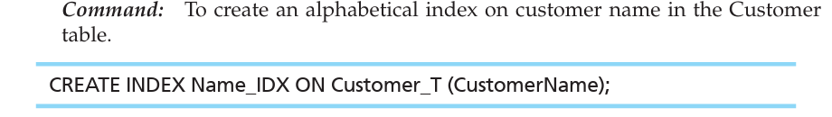

# INTERNAL SCHEMA DEFINITION IN RDBMSs-   Here are some techniques used for tuning the operational performance of the DBMS internal data model:

    -   Choosing to index primary and/or secondary keys to increase the speed of row selection, table joining, and row ordering.

    -   Selecting file organizations for base tables that match the type of processing activity on those tables (e.g., keeping a table physically sorted by a frequently used reporting sort key).

    -   Selecting file organizations for indexes, which are also tables, appropriate to the way the indexes are used and allocating extra space for an index file so that an index can grow without having to be reorganized.

    -   Clustering data so that related rows of frequently joined tables are stored close together in secondary storage to minimize retrieval time.

    -   Maintaining statistics about tables and their indexes so that the DBMS can find the most efficient ways to perform various database operations.

 

-   Not all of these techniques are available in all SQL systems. Indexing and clustering are typically available, however, so we discuss these in the following sections.

 

Creating Indexes

Indexes are created in most RDBMSs to provide rapid random and sequential access to base-table data.

-   Essentially indexes are offsets of a table in which we can use these indexes to lookup things about the table in some filtered or reorganized way.

-   Note that although users do not directly refer to indexes when writing any SQL command, the DBMS recognizes which existing indexes would improve query performance.

-   Indexes can usually be created for both primary and secondary keys and both single and concatenated (multiple-column) keys.

-   For example, an alphabetical index on CustomerName in the Customer_T table in Oracle is created here..

> {width="5.072916666666667in" height="0.7083333333333334in"}

-   RDBMs usually support several different types of indexes, each of which assists in different kinds of key word searches.

    -   For example, in MySQL you can create the following index types: unique (appropriate for primary keys), nonunique (secondary keys), fulltext (used for full-text searches)

-   Indexes can be created or dropped at any time.

-   If data already exist in the key column(s), index population will automatically occur for the existing data.

-   If an index is defined as UNIQUE (using the syntax CREATE UNIQUE INDEX . . .) and the existing data violate this condition, the index creation will fail.

-   Once an index is created, it will be updated as data are entered, updated, or deleted.

-   When we no longer need tables, views, or indexes, we use the associated DROP statements. For example, the Name_IDX index from the previous example is dropped here

> {width="5.4375in" height="0.7395833333333334in"}

-   Use caution when deciding to create a new index

    -   Can cause noticeable delays in data retrieval and other efficiently/performance issues if not used correctly

    -   Oracle includes an explain plan tool that can be used to look at the order in which an SQL statement will be processed and at the indexes that will be used. The output also includes a cost estimate that can be compared with estimates from running the statement with different indexes to deter mine which is most efficient.

