# PROCESSING SINGLE TABLESBe careful when writing SELECT queries, here are some ways to ensure that your queries are doing what they are intended to do...

-   Before running queries against a large production database, always test them carefully on a small test set of data to be sure that they are returning the correct results.

-   In addition to checking the query results manually, it is often possible to parse queries into smaller parts, examine the results of these simpler queries, and then recombine them.

    -   This will ensure that they act together in the expected way.

 

**Clauses of the SELECT Statement**

Most SQL data retrieval statements include the following three clauses:

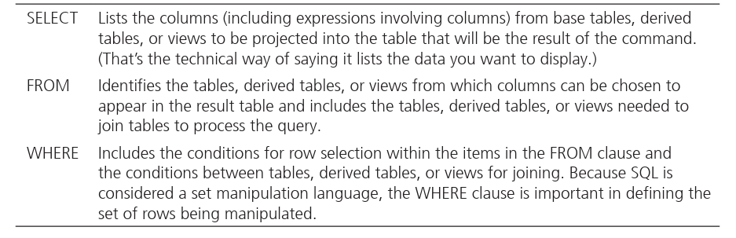{width="6.041666666666667in" height="1.9479166666666667in"}

-   The first two clauses are required, and the third is necessary when only certain table rows are to be retrieved or multiple tables are to be joined.

-   Example:

> 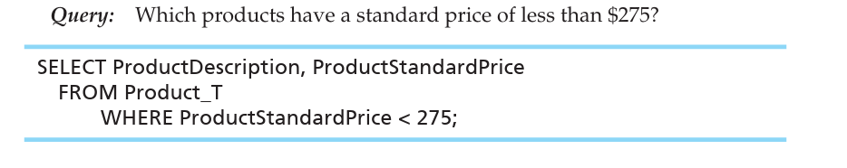{width="4.833333333333333in" height="0.9583333333333334in"}
>
>  
>
> 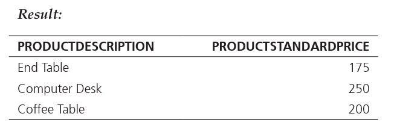{width="3.28125in" height="1.0520833333333333in"}

-   Every SELECT statement returns a result table (a set of rows) when it executes.

    -   So, SQL is consistent---tables in, tables out of every query.

    -   This becomes important with more complex queries because we can use the result of one query (a table) as part of another query (e.g., we can include a SELECT statement as one of the elements in the FROM clause, creating a derived table, which we illustrate later in this chapter).

-   Two special key words can be used along with the list of columns to display: DISTINCT and *.

    -   If the user does not wish to see duplicate rows in the result, SELECT DISTINCT may be used.

        -   In the preceding example, if the other computer desk carried by Pine Valley Furniture also had a cost of $250, the results of the query would have had duplicate rows. SELECT DISTINCT ProductDescription would display a result table without the duplicate rows.

    -   SELECT *, where * is used as a wildcard to indicate all columns, displays all columns from all the items in the FROM clause.

-   If there is any ambiguity in an SQL command, you must indicate exactly from which table, derived table, or view the requested data are to come.

    -   For example, in Figure 5-3 CustomerID is a column in both Customer_T and Order_T. When you own the database being used (i.e., the user created the tables) and you want CustomerID to come from Customer_T, specify it by asking for Customer_T.CustomerID. If you want CustomerID to come from Order_T, then ask for Order_T.CustomerID.

    -   When you are allowed to use data created by someone else, you must also specify the owner of the table by adding the owner's user ID. Now a request to SELECT the CustomerID from Customer_T may look like this: .Customer_T.CustomerID.

-   establish aliases for data names that will then be used for the rest of the query

    -   they are widely implemented and aid in readability and simplicity in query construction.

    -   Example:

> 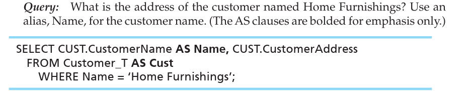{width="5.020833333333333in" height="0.9583333333333334in"}
>
>  
>
> 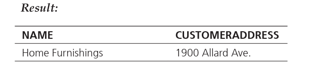{width="3.53125in" height="0.7604166666666666in"}

-   Notice that we alias CUST.CustomerName as NAME and then use it below

-   Notice that the column header prints as Name rather than CustomerName and that the table alias may be used in the SELECT clause even though it is not defined until the FROM clause.

    -   Using an alias is a good way to make column headings more readable.

<!-- -->

-   Many RDBMSs have other proprietary SQL clauses to improve the display of data.

    -   For example, Oracle has the COLUMN clause of the SELECT statement, which can be used to change the text for the column heading, change alignment of the column heading, reformat the column value, or control wrapping of data in a column, among other properties.

-   When you use the SELECT clause to pick out the columns for a result table, the columns can be rearranged so that they will be ordered differently in the result table than in the original table.

    -   In fact, they will be displayed in the same order as they are included in the SELECT statement.

    -   Example

> 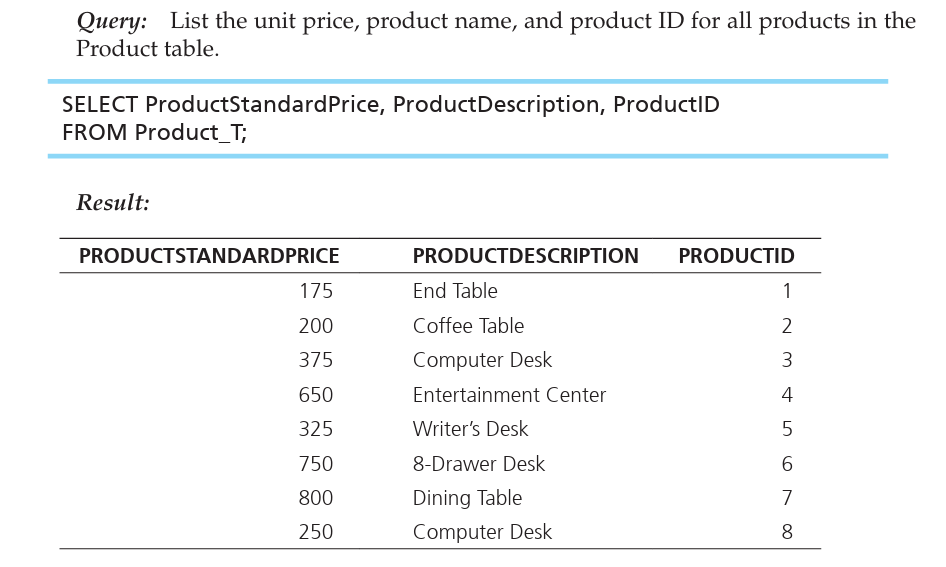{width="4.6875in" height="2.8125in"}

 

**Using Expressions**

Basically you can do mathematical expressions on applicable attributes in a table

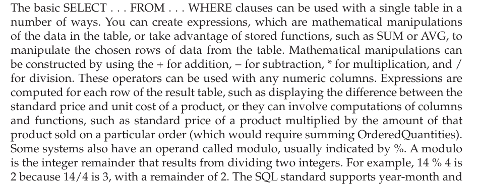{width="5.25in" height="2.0729166666666665in"}

 

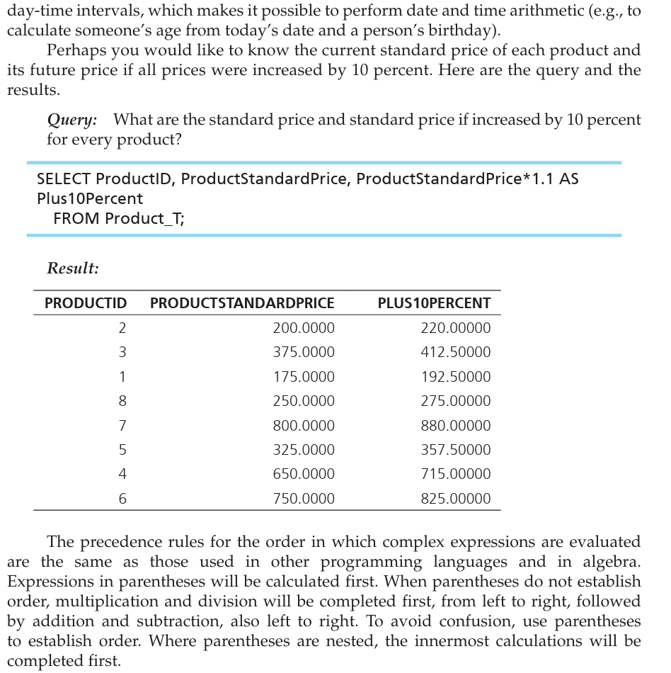{width="4.989583333333333in" height="5.0in"}

 

**Using Functions**

Standard SQL has a wide variety of mathematical, string and date manipulation, and other functions.

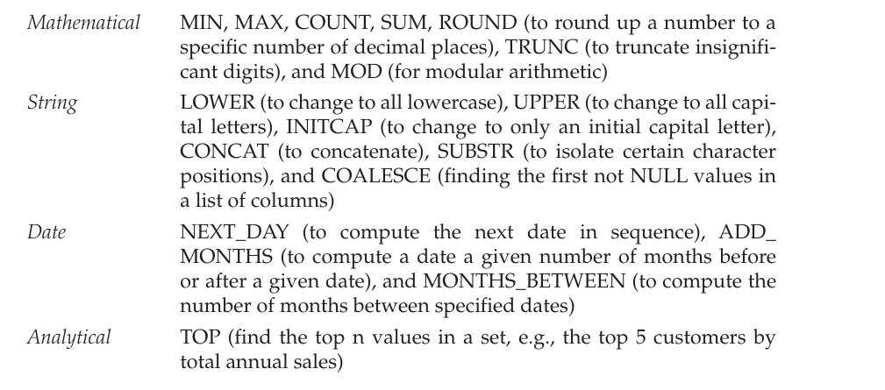{width="6.0in" height="2.6458333333333335in"}

-   Example: Perhaps you want to know the average standard price of all inventory items. To get the overall average value, use the AVG stored function. We can name the resulting expression with an alias, AveragePrice.

> 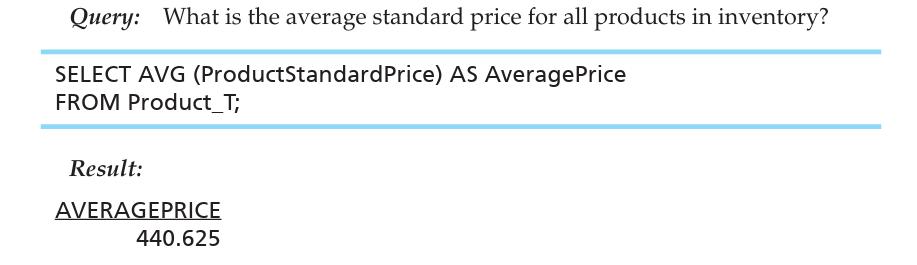{width="4.739583333333333in" height="1.3645833333333333in"}

-   Stored functions include, ANY, AVG, COUNT, EVERY, GROUPING, MAX, MIN, SOME, and SUM. SQL:2008 added LN, EXP, POWER, SQRT, FLOOR, CEILING, and WIDTH_BUCKET.

    -   COUNT, MIN, MAX, SUM, and AVG of specified columns in the column list of a SELECT command may be used to specify that the resulting answer table is to contain aggregated data instead of row-level data.

        -   This means we are only getting one thing returned rather than eevery row returned since these functions use up all the rows to return 1 thing back

        -   Example:

> 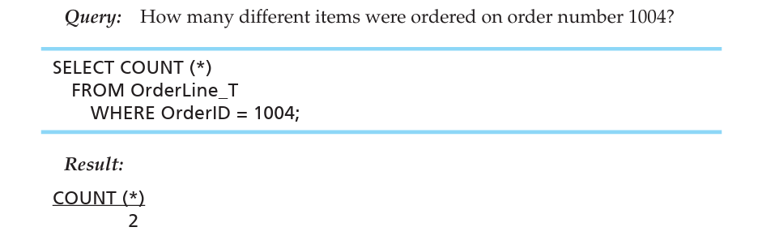{width="4.802083333333333in" height="1.4791666666666667in"}

-   The difference between COUNT(*) and COUNT is that COUNT(*) counts all rows selected by a query, regardless of if the row has a null value. Whereas COUNT tallies only rows that contain values.

<!-- -->

-   Example of an error:

> 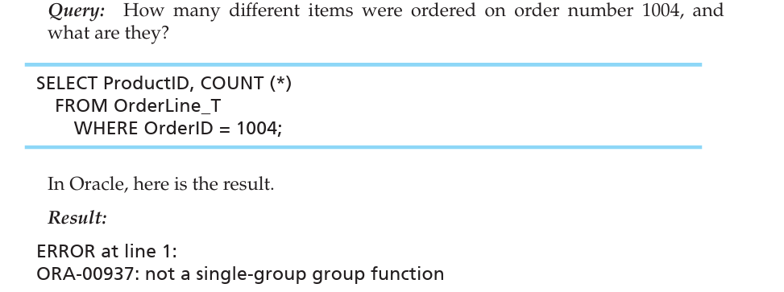{width="4.666666666666667in" height="1.7395833333333333in"}

-   We get an error here because we are trying to print out both the productID and a count(*) but that isnt possible

    -   To do this we would have to build two queries.

    -   In most implementations, SQL cannot return both a row value and a set value (creating one value out of many); users must run two separate queries, one that returns row information and one that returns set information.

<!-- -->

-   Example of another error: A similar issue arises if we try to find the difference between the standard price of each product and the overall average standard price (which we calculated above). You might think the query would be:

> {width="6.03125in" height="0.6041666666666666in"}

-   However, again we have mixed a column value with an aggregate (AVG(ProductStandardPrice)), which will cause an error.

-   A correct way would be to..

> 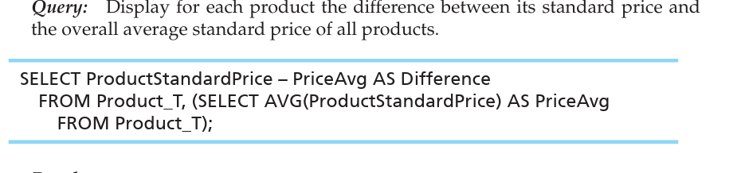{width="4.59375in" height="1.0729166666666667in"}
>
>  
>
> 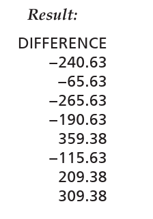{width="1.0208333333333333in" height="1.4583333333333333in"}

-   A query inside of a query, notice also that the inside determines what we can use on the outside

<!-- -->

-   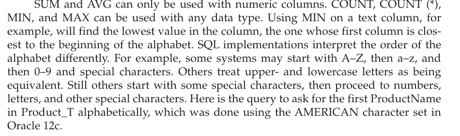{width="4.916666666666667in" height="1.4583333333333333in"}

    -   More about other functions

    -   Example:

> 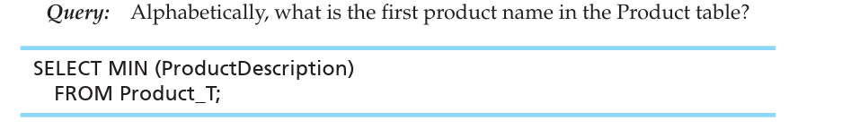{width="4.666666666666667in" height="0.7604166666666666in"}
>
>  
>
> 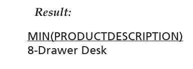{width="2.03125in" height="0.7291666666666666in"}

-   The result demonstrates that numbers are sorted before letters in this character set.

**Using Wildcards**

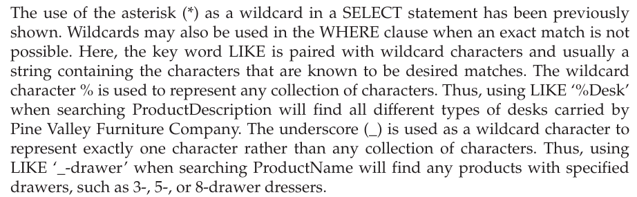{width="5.166666666666667in" height="1.59375in"}

 

 

**Using Comparison Operators**

-   These are all the comparison operators in sql:

> 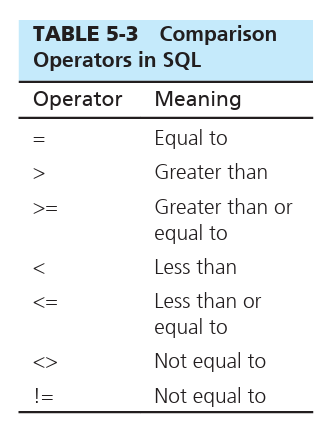{width="2.0208333333333335in" height="2.6666666666666665in"}

-   Example:

> 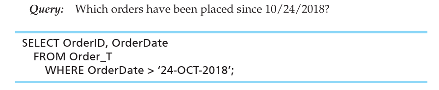{width="5.59375in" height="1.15625in"}
>
>  
>
> 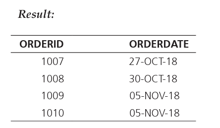{width="2.28125in" height="1.3229166666666667in"}

-   We are doing this on a Date type

<!-- -->

-   Example:

> 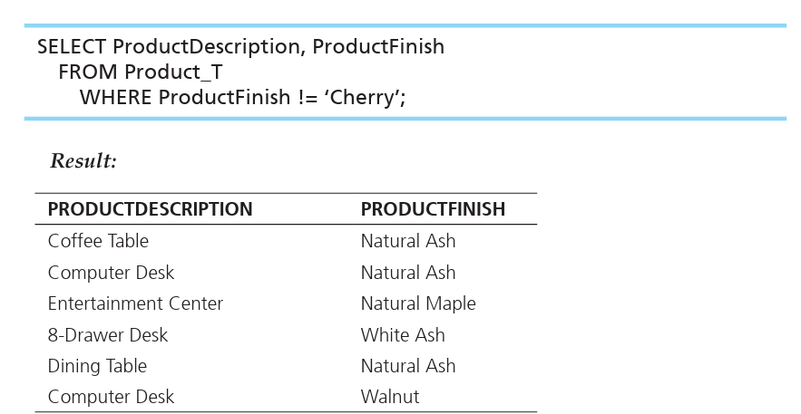{width="3.6145833333333335in" height="1.8645833333333333in"}

 

**Using Null Values**

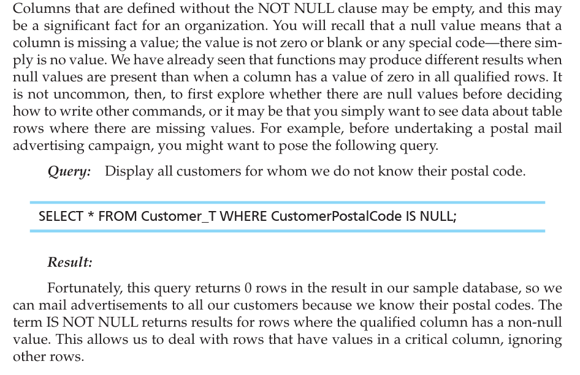{width="4.760416666666667in" height="3.0833333333333335in"}

 

**Using Boolean Operators**

Some complex questions can be answered by adjusting the WHERE clause further. The Boolean or logical operators AND, OR, and NOT can be used to good purpose:

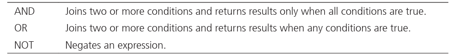{width="8.635416666666666in" height="1.0416666666666667in"}

-   If multiple Boolean operators are used in an SQL statement, NOT is evaluated first, then AND, then OR.

-   Example:

> 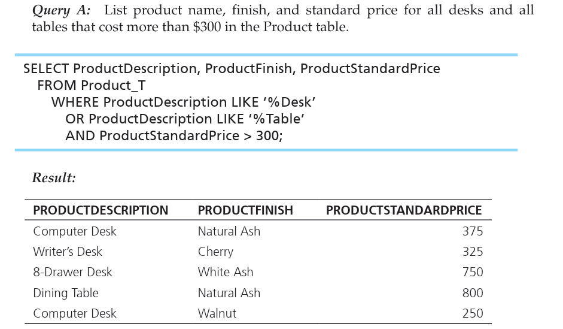{width="4.302083333333333in" height="2.5in"}

-   Notice that only the tables are being filtered by the ProductStandardPrice > 300.

-   With this query (illustrated in Figure 5-8), the AND will be processed first, returning all tables with a standard price greater than $300. Then the part of the query before the OR is processed, returning all desks, regardless of cost. Finally the results of the two parts of the query are combined (OR), with the final result of all desks along with all tables with standard price greater than $300.

-   If we had wanted to return only desks and tables costing more than $300, we should have put parentheses after the WHERE and before the AND..

> 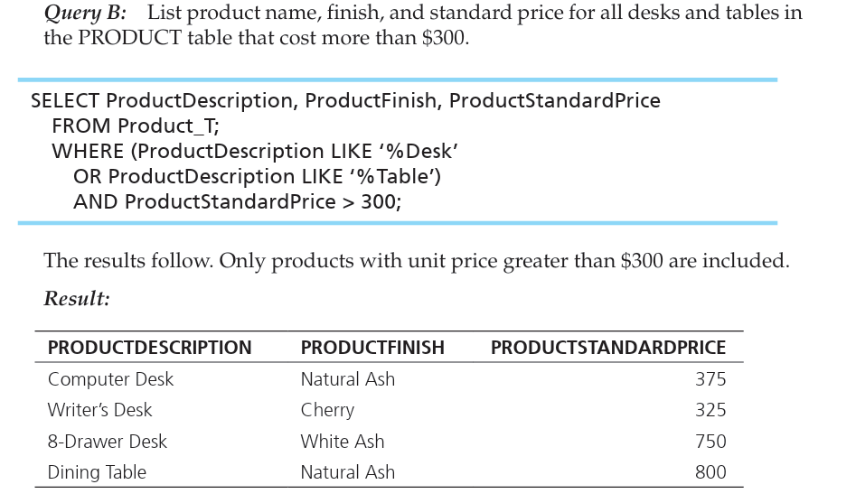{width="4.833333333333333in" height="2.84375in"}

-   The parenthesis helps sql understand that the things being OR'd are together and then we AND those things by ProductStandardPrice > 300

<!-- -->

-   This example illustrates why SQL is considered a set-oriented, not a record-oriented, language. (C, Java, and Cobol are examples of record-oriented languages because they must process one record, or row, of a table at a time.)

 

**Using Ranges for Qualification**

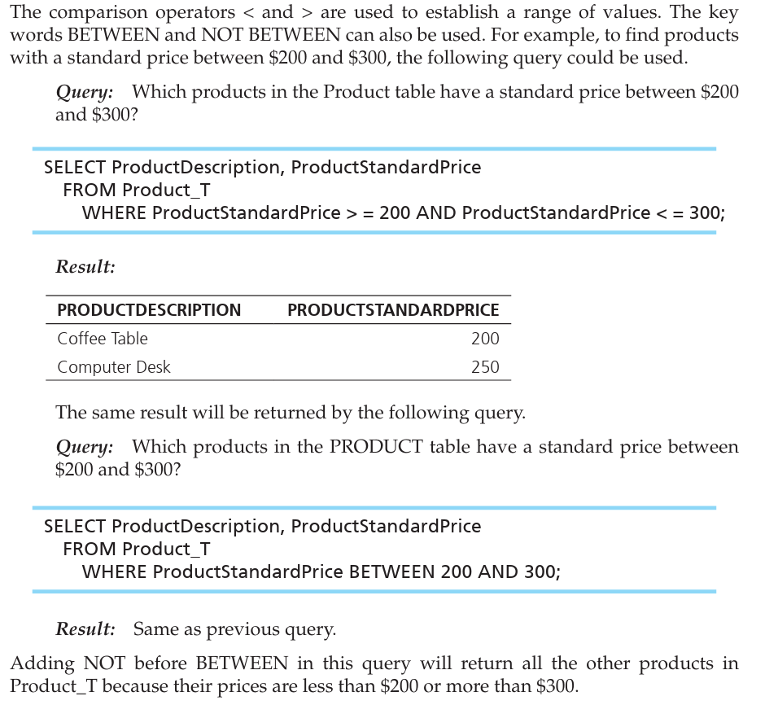{width="5.21875in" height="4.71875in"}

 

**Using Distinct Values**

Sometimes when returning rows that don't include the primary key(rows that are not the primary key since every primary key is different thus no duplicates ever), duplicate rows will be returned.

-   Example of a query that has many duplicates:

> 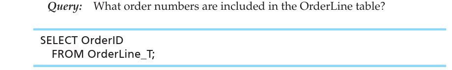{width="4.65625in" height="0.71875in"}
>
>  
>
> 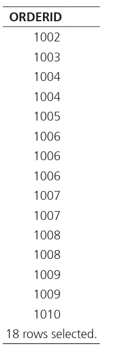{width="0.8958333333333334in" height="2.625in"}

-   Do we really need the redundant OrderIDs in this result? If we add the key word DISTINCT, then only 1 occurrence of each OrderID will be returned, 1 for each of the 10 orders represented in the table.

    -   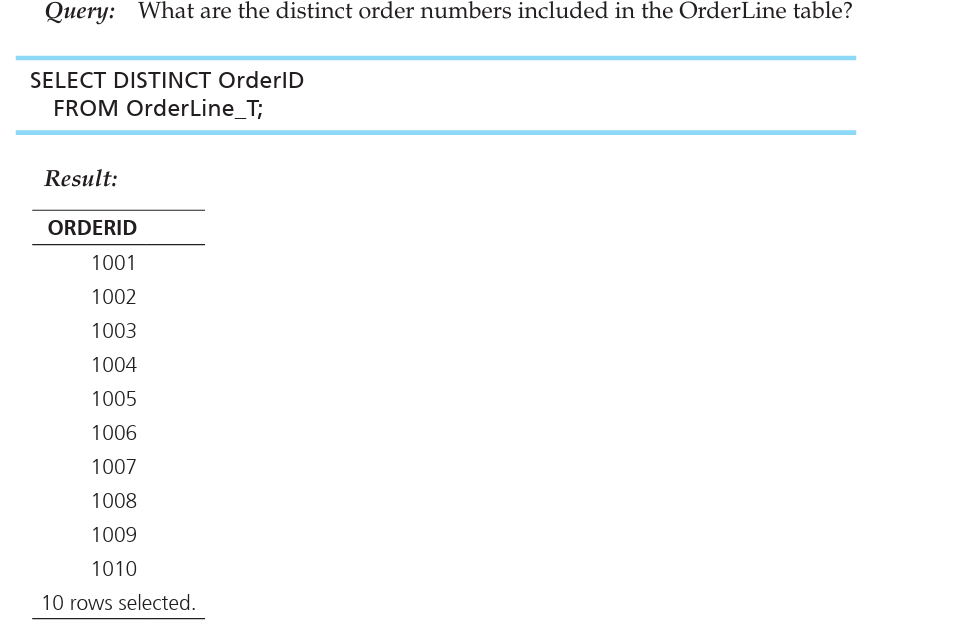{width="4.21875in" height="2.75in"}

        -   Here we note that the keyword DISTINCT makes it so that every record with that ORDERID is only shown once

<!-- -->

-   DISTINCT and its counterpart, ALL, can be used only once in a SELECT statement. It comes after SELECT and before any columns or expressions are listed.

    -   The DISTINCT keyword vs ALL keyword

        -   ALL keyword returns all the record including duplicates

-   If a SELECT statement projects more than one column, only rows that are identical for every column will be eliminated.

    -   That is say we query based on two attributes and we want only distinct records. How will the query distinguish duplicates.

    -   Example: Thus, if the previous statement also includes OrderedQuantity (another attribute), 14 rows are returned (now more rows are returned) because there are now only 4 duplicate rows rather than 8 (we have less duplicates since OrderedQuantity is also in play now).

        -   For example, both items ordered on OrderID 1004 were for 2 items, so the second pairing of 1004 and 2 will be eliminated.

            -   The OrderID 1004 had two records with OrderedQuantity of 2 thus we only keep one of those records

            -   For clarity, we could also have 1 record with OrderID 1004 with OrderedQuantity of 1 which in this query would also be included even though it's the same ID the quanity is different thus its still different based on our query

            -   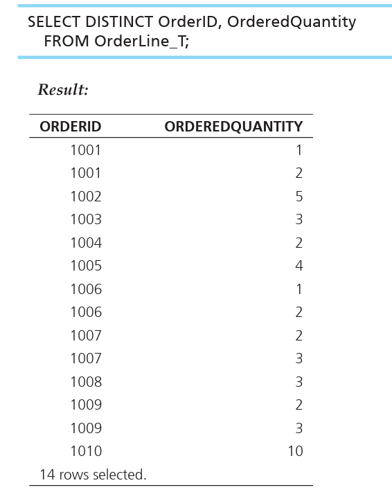{width="2.3958333333333335in" height="3.0104166666666665in"}

 

**Using IN and NOT IN with Lists**

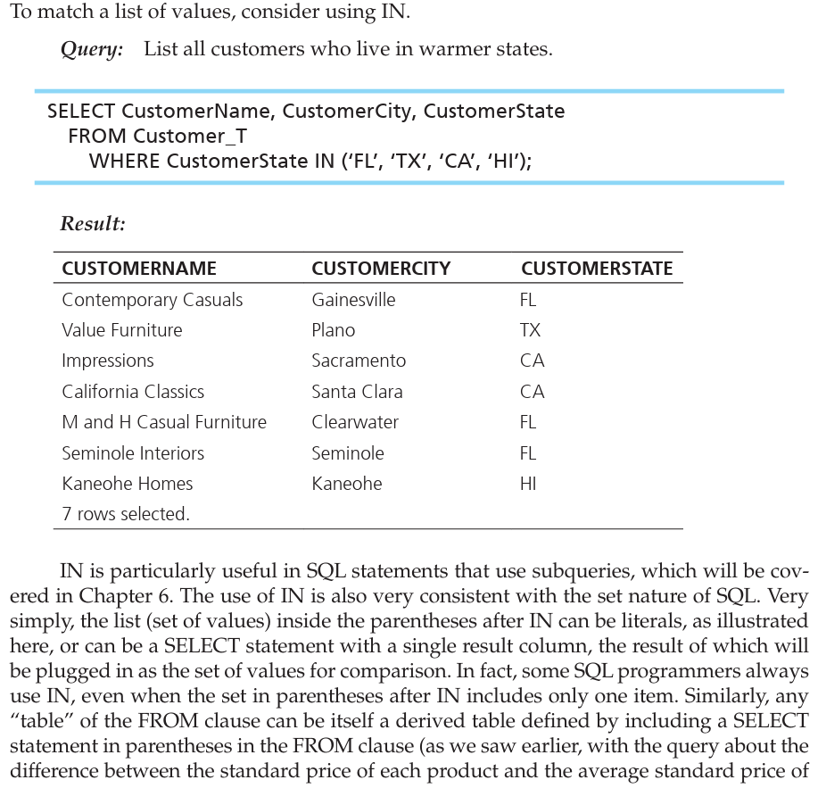{width="4.6875in" height="4.46875in"}

 

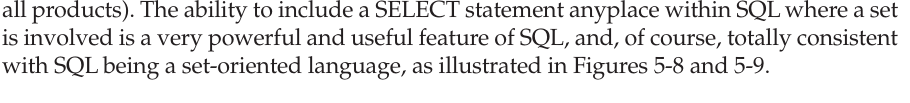{width="4.739583333333333in" height="0.53125in"}

 

