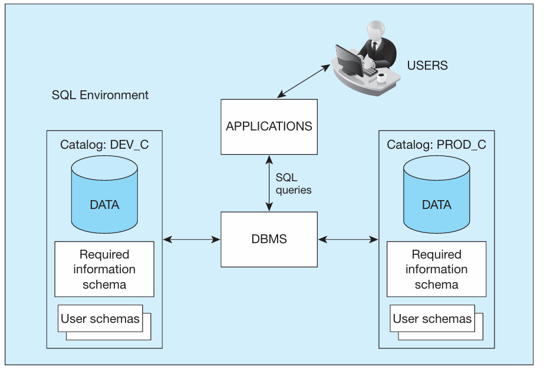
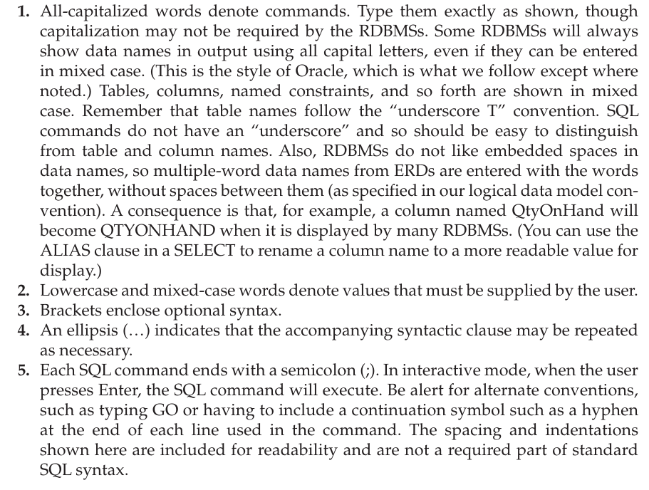

# THE SQL ENVIRONMENT> All the info about size, color, description, etc are stored in a database.
>
> The information that has been retrieved comes from a sql query but the command doesn't come from an sql command but rather the prewritten program (written in e.g. python, java, or PHP) with embedded SQL commands
>
>  

An SQL-based relational database application involves a user interface, a set of tables in the database, and a relational database management system (RDBMS) with an SQL capability

-   Within the RDBMS, SQL will be used to create the tables, translate user requests, maintain the data dictionary and system catalog, update and maintain the tables, establish security, and carry out backup and recovery procedures.

    -   [relational DBMS (RDBMS)]{.underline} is a data management system that implements a relational data model, one where data are stored in a collection of tables and the data relationships are represented by common values, not links.

 

Here is a simplified schematic of an SQL environment, consistent with the SQL:2016 standard.

{width="3.65625in" height="2.5in"}

-   As depicted, an SQL environment includes an instance of an SQL database management system along with the databases accessible by that DBMS and the users and applications that may use that DBMS to access the databases.

-   Each database is contained in a [catalog]{.underline}: which describes any object that is a part of the database, regardless of which user created that object.

    -   As you can see in figure 5-1, we have two catalogs DEV_C and PROD_C

        -   It is common for a company to keep two versions of the same database

        -   PROD_C is the production version where real time business data is stored; tightly controlled and maintained

        -   DEV_C is where the database is being built and continues to serve as the development tool for enhancing and maintaining before applying to the production database; not as controlled or monitored

        -   Each database will have named schemas: is a collection of related objects, including but not limited to base tables and views, domains, constraints, character sets, triggers, and roles.

            -   Basically a glossary for the database

        -   Each catalog must also contain an information schema, which contains descriptions of all schemas in the catalog, tables, views, attributes, privileges, constraints, and domains, along with other information relevant to the database.

        -   The information contained in the catalog is maintained by the DBMS as a result of the SQL commands issued by the users and can be rebuilt without conscious action by the user.

**SQL Commands**

-   SQL commands can be classified into three types:

    -   DDL (Data Definition Language): These commands are used to create, alter, and drop tables, views, and indexes.

        -   In a production database, the ability to use DDL commands will generally be restricted to one or more database administrators in order to protect the database structure from unexpected and unapproved changes

        -   In development or student databases, DDL privileges will be granted to more users.

    -   DML (Data Manipulation Language): These commands are used for updating, inserting, modifying, and querying the data in the database.

        -   They may be issued interactively so that a result is returned immediately following the execution of the statement, or they may be included within programs written in a procedural program ming language, such as C, Java, Python, or COBOL, or with a GUI tool (e.g., Oracle's SQL Developer, SQL Assistant with Teradata, or MySQL Query Browser).

        -   Embedding SQL commands may provide the programmer with more control over timing of report generation, interface appearance, error handling, and database security

        -   Example: SQL SELECT

> {width="5.083333333333333in" height="0.9791666666666666in"}
>
>  

-   DCL (Data Control Language): commands help a database administrator (DBA) control the database

    -   They include commands to grant or revoke privileges to access the database or particular objects within the database and to store or remove transactions that would affect the database.

 

**SQL Data Types**:

-   Each DBMS has a defined list of data types that it can handle. All contain numeric, string, and date/time-type variables. Some also contain graphic data types, spatial data types, or image data types, which greatly increase the flexibility of data manipulation.

-   When a table is created, the data type for each attribute must be specified.

-   When selecting the data type of an attribute, take into account the fact that the datatype will define what you can do to such an attribute

    -   A unit price will need to be stored in a numeric format because mathematical manipulations, such as multiplying unit price by the number of units ordered, are expected.

    -   A phone number may be stored as string data, especially if foreign phone numbers are going to be included in the data set

        -   Even though a phone number contains only digits, no mathematical operations, such as adding or multiplying phone numbers, make sense with a phone number.

        -   Because character data will process more quickly, numeric data should be stored as character data if no arithmetic calculations are expected.

    -   Selecting a date field rather than a string field will allow the developer to take advantage of date/time interval calculation functions that cannot be applied to a character field.

 

-   SQL syntax and naming conventions

    -   Each table name follows a naming standard that places an underscore and the letter T (for table) at the end of each table name

        -   Such as Order_T or Product_T

    -   This is the notation we will use to illustrate SQL commands:

> {width="5.520833333333333in" height="4.166666666666667in"}
>
>  

 

 

 

figure 5-1

