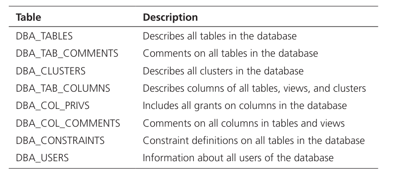
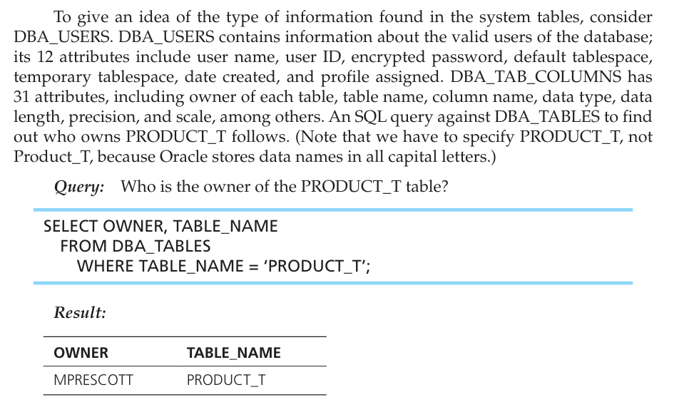

# DATA DICTIONARY FACILITIES Becoming familiar with the systems tables for any RDBMS being used will provide valuable information, whether you are a user or a database administrator.

 

Because the information is stored in tables, it can be accessed by using SQL SELECT statements that can generate reports about system usage, user privileges, constraints, and so on.

 

Also, the RDBMS will provide special SQL (proprietary) commands, such as SHOW, HELP, or DESCRIBE, to display pre defined contents of the data dictionary, including the DDL that created database objects.

 

Further, a user who understands the systems-table structure can extend existing tables or build other tables to enhance built-in features (e.g., to include data on who is respon sible for data integrity).

 

Each RDBMS keeps various internal tables for these definitions. In Oracle 12c, there are more than 500 data dictionary views for DBAs to use

-   Those view names begin with USER (anyone authorized to use the database) or ALL (any user) rather than DBA.

>  

Here is a short list of some of the tables (accessible to DBAs) that keep information about tables, clusters, columns, and security. There are also tables related to storage, objects, indexes, locks, auditing, exports, and distributed environments.

-   {width="6.0in" height="2.6145833333333335in"}

 

Example:

{width="5.229166666666667in" height="3.0416666666666665in"}

