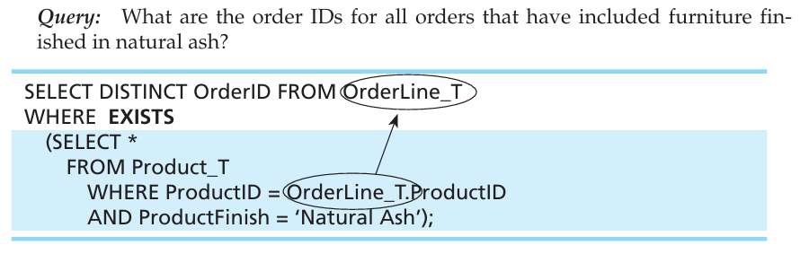
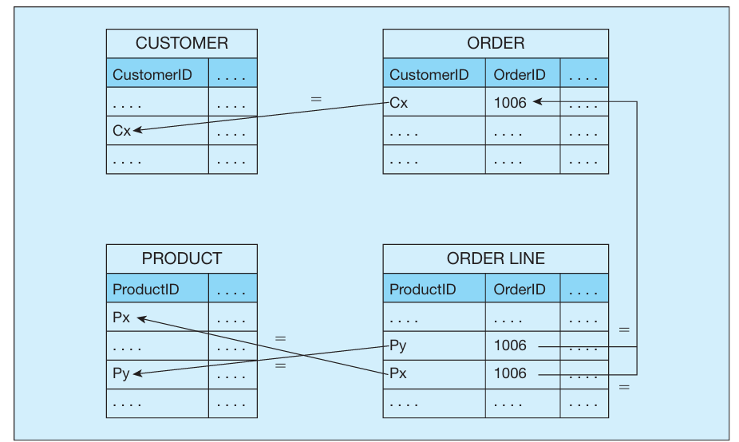

# PROCESSING MULTIPLE TABLES -   You can use these columns to establish a link between two tables by finding common values in the columns.

 

In SQL, the WHERE clause of the SELECT command is also used for multiple-table operations.

-   The most frequently used relational operation, which brings together data from two or more related tables into one resultant table, is called a **join**

    -   In either case, two tables may be joined when each contains a column that shares a common domain with the other.

    -   As mentioned previously, a primary key from one table and a foreign key that references the table with the primary key will share a common domain and are frequently used to establish a join.

    -   In special cases, joins will be established using columns that share a common domain but not the primary key--foreign key relationship, and that also works (e.g., you might join customers and salespersons based on common postal codes, for which there is no relationship in the data model for the database).

    -   The result of a join operation is a single table.

    -   No matter what form of join you are using, there should be one ON or WHERE specification for each pair of tables being joined.

        -   Thus, if two tables are to be combined, one ON or WHERE condition would be necessary, but if three tables (A, B, and C) are to be combined, then two ON or WHERE conditions would be necessary since you would have A-B and B-C pairs

Types of joins

-   Equi-Join: With an equi-join, the joining condition is based on equality between values in the common columns.

    -   For example, if you want to know data about customers who have placed orders, you will find that information in two tables, Customer_T and Order_T.

        -   {width="2.8645833333333335in" height="2.3854166666666665in"}

>  

-   {width="4.15625in" height="1.3229166666666667in"}

>  

-   {width="4.197916666666667in" height="0.7291666666666666in"}

 

-   Natural Join: is the same as an equi-join, except that it is performed over matching columns, and one of the duplicate columns is eliminated in the result table.

    -   The natural join is the most commonly used form of join operation.

    -   {width="4.677083333333333in" height="0.9270833333333334in"}

<!-- -->

-   Outer Join: Rows that do not have matching values in common columns are also included in the result table.

    -   Example: In joining two tables, you often find that a row in one table does not have a matching row in the other table. For example, several CustomerID numbers do not appear in the Order_T table. This could be because a customer hasn't placed an order yet. We may want to obtain the information about all the customers even those who havent placed an order yet

        -   {width="5.104166666666667in" height="1.25in"}

>  
>
> {width="3.1145833333333335in" height="3.1145833333333335in"}

-   We have several outer joins:

    -   Left outer join: the table name to the left is the table we get ALL the data from

    -   Right outer join: the table name to the right is the table we get ALL the data from

    -   Full outer join: all the tables get their data included

-   Also, the result table from an outer join may indicate NULL (or a symbol, such as ??) as the values for columns in the second table where no match was achieved. If those columns could have NULL as a data value, you cannot know whether the row returned is a matched row or an unmatched row unless you run another query that checks for null values in the base table or view. Also, a column that is defined as NOT NULL may be assigned a NULL value in the result table of an OUTER JOIN.

-   Another example using right outer join

    -   {width="6.520833333333333in" height="1.53125in"}

<!-- -->

-   Self Join: There are times when a join requires matching rows in a table with other rows in that same table---that is, joining a table with itself.

    -   This is often done with unary relationships

    -   Example, in the Employee table an employee can have a column called Supervisor which will hold the EmployeeID of another employee, this relationship is imple mented by placing in the EmployeeSupervisor column the EmployeeID (foreign key) of the employee's supervisor, another employee.

        -   {width="5.15625in" height="1.8020833333333333in"}

>  

-   {width="3.9270833333333335in" height="2.4166666666666665in"}

 

-   There are other queries you can do with unary relations such as

    -   For example, which employees have a salary greater than the salary of their manager (baseball players making more money than their manager)

    -   is anyone married to his or her manager

-   As with any other join, it is not necessary that a self-join be based on a foreign key and a specified unary relationship.

    -   For example, when a salesperson is scheduled to visit a particular customer, she might want to know all the other customers who are in the same postal code as the customer she is scheduled to visit.

 

 

 

Sample Join Involving Four Tables

-   Here is a sample join query that involves a four-table join. This query produces a result table that includes the information needed to create an invoice for order number 1006. We want the customer information, the order and order line information, and the product information, so we will need to join four tables.

-   {width="4.552083333333333in" height="3.2083333333333335in"}

>  

-   {width="4.854166666666667in" height="1.9583333333333333in"}

>  

-   {width="5.958333333333333in" height="1.7291666666666667in"}

 

Subqueries: which involves placing an inner query (SELECT . . . FROM . . . WHERE) within a WHERE or HAVING clause of another (outer) query.

-   This is another approach to joining two tables

-   The inner query provides a set of one or more values for the search condition of the outer query.

-   What is the difference between join and subquery?

    -   Sometimes, either the joining or the subquery technique can be used to accomplish the same result, and different people will have different preferences about which tech nique to use.

    -   Other times, only a join or only a subquery will work.

    -   The joining technique is useful when data from several relations are to be retrieved and displayed and the relationships are not necessarily nested

    -   the subquery technique allows you to display data from only the tables mentioned in the outer query

    -   Example of join vs subquery:

        -   {width="4.697916666666667in" height="1.3229166666666667in"}

>  

-   {width="4.71875in" height="1.59375in"}

    -   Notice that the subquery, shaded in blue and enclosed in parentheses, follows the form learned for constructing SQL queries and could stand on its own as an independent query.

    -   To be safe, you can---and probably should---use the IN operator rather than = when writing subqueries.

    -   The value for OrderID does not appear in the query result; it is used as the selection criterion in the inner query. To include data from the subquery in the result, use the join technique because data from a subquery cannot be included in the final results.

    -   As noted previously, we know in advance that the preceding subquery will return at most one value, the CustomerID associated with OrderID 1008. The result will be empty if an order with that ID does not exist.

        -   (It is advisable to check that your query will work if a subquery returns zero, one, or many values.)

> Using the IN keyword

-   {width="5.15625in" height="1.3020833333333333in"}

    -   This query produces the following result. As required, the subquery select list con tains only the one attribute, CustomerID, needed in the WHERE clause of the outer query. Distinct is used in the subquery because we do not care how many orders a cus tomer has placed, as long as they have placed an order. For each customer identified in the Order_T table, that customer's name has been returned from Customer_T.

    -   {width="1.6145833333333333in" height="2.2291666666666665in"}

    -   The qualifiers NOT, ANY, and ALL may be used in front of IN or with logical operators such as = , >, and

        -   {width="5.822916666666667in" height="1.0729166666666667in"}

>  
>
> {width="5.8125in" height="1.125in"}
>
>  

-   The inner query returned a list (set) of all customers who had ordered computer desks. The outer query listed the names of those customers who were not in the list returned by the inner query

>  

-   Using Exist and not Exist

    -   EXISTS will take a value of true if the subquery returns an intermediate result table that contains one or more rows (i.e., a nonempty set) and false if no rows are returned (i.e., an empty set). NOT EXISTS will take a value of true if no rows are returned and false if one or more rows are returned.

    -   IN vs EXIST

        -   You use EXISTS (NOT EXISTS) when your only interest is whether the subquery returns a nonempty (empty) set (i.e., you don't care what is in the set, just whether it is empty), and you use IN (NOT IN) when you need to know what values are (are not) in the set.

    -   {width="5.09375in" height="1.59375in"}

>  
>
> {width="1.3645833333333333in" height="2.21875in"}

 

-   Correlated Subqueries: use the result of the outer query to determine the processing of the inner query.

    -   In this case, the inner query must be computed for each outer row

        -   Meaning we will look at each row in the outer query almost like a for loop

    -   The EXISTS subquery example in the prior section had this characteristic, in which the inner query was executed for each OrderLine_T row, and each time it was executed, the inner query was for a different ProductID value---the one from the OrderLine_T row in the outer query.

    -   {width="5.302083333333333in" height="1.3333333333333333in"}

>  
>
> {width="3.2395833333333335in" height="0.5729166666666666in"}
>
>  
>
>  
>
>  
>
>  
>
>  
>
>  
>
>  
>
>  
>
>  

Using Derived Tables

-   Subqueries are not limited to inclusion in the WHERE clause. They may also be used in the FROM clause to create a temporary derived table (or set) that is used in the query.

-   Creating a derived table that has an aggregate value in it, such as MAX, AVG, or MIN, allows the aggregate to be used in the WHERE clause.

-   {width="4.229166666666667in" height="2.2395833333333335in"}

>  

Combining Queries:

-   Sometimes, no matter how clever you are, you can't get all the rows you want into the single answer table using one SELECT statement.

-   The UNION clause is used to combine the output (i.e., union the set of rows) from multiple queries together into a single result table.

-   To use the UNION clause, each query involved must output the same number of columns, and they must be UNION compatible. This means that the output from each query for each column should be of compatible data types.

    -   When performing a union where output for a column will merge two different data types, it is safest to use the CAST command to control the data type conversion yourself.

    -   {width="4.84375in" height="0.3958333333333333in"}

-   The following query determines the customer(s) who has in a given line item pur chased the largest quantity of any Pine Valley product and the customer(s) who has in a given line item purchased the smallest quantity and returns the results in one table.

    -   {width="4.875in" height="3.09375in"}

>  
>
> {width="4.875in" height="1.1979166666666667in"}
>
>  

-   Now that you remember the union set operation from discrete mathematics, you may also remember that there are other set operations---intersect (to find the elements in common between two sets) and minus (to find the elements in one set that are not in another set). These operations---INTERSECT and MINUS---are also available in SQL, and they are used just as UNION was above to manipulate the result sets created by two SELECT statements.

 

Conditional Expressions: Establishing IF-THEN-ELSE logical processing within an SQL statement can now be accomplished by using the CASE key word in a statement.

-   CASE could be used in constructing a query that asks, "What products are included in Product Line 1?"

    -   {width="4.875in" height="1.3645833333333333in"}

>  
>
> {width="1.6354166666666667in" height="1.6979166666666667in"}
>
>  

-   "It's possible to use CASE expressions this way as retrieval substitutes, but the more common applications are (a) to make up for SQL's lack of an enumerated , (b) to perform complicated if/then calcu lations, (c) for translation, and (d) to avoid exceptions.

 

More Complicated SQL Queries

-   {width="4.458333333333333in" height="3.3020833333333335in"}

>  

-   {width="5.354166666666667in" height="3.0833333333333335in"}

Note:

-   Notice that we don't get rows where a customer did not place an order.

-   We explictly tell sql the name of the table followed by customerID since mulitple tables have this column

-   Here we are using the WHERE clause to achieve an equi-join

 

Note:

-   This is also an equi-join but we use solely the FROM clause paired with a few keywords to achieve it using INNERJOIN and ON

 

Note:

-   This is also an equi-join but we use solely the FROM clause paired with a few keywords to achieve it using INNERJOIN and USING, where USING is used if both tables have the same name for a column

 

Note:

-   The syntax LEFT OUTER JOIN was selected because the Customer_T table was named first, and it is the table from which we want all rows returned, regardless of whether there is a matching order in the Order_T table.

-   As you can see we used a left outer join which obtained all the rows from Customer including those who did and did not order.

-   If we had requested a right outer join we would get data from all the orders which would by the nature of the database we set up where the orders table is dictated by the customer table we should get all the orders back with each one having its customerid so it is essesntially just checking the referential integrity

>  

 

Essetially just referential integrity checking since all orders must have a customerid and this will obtain all the orders which by the nature of the way we have our database setup will have a customerid associated with it.

 

Note:

-   The select clause is only for telling sql what columns you want to get from and the names of the output

-   Since we are essentially tapping into the same table twice we need to give each table and alias such as E and M

>  

 

What essentiallly happens in this query is that sql sees the tables as two different tables and so that is a reason we must specify with the alilas E and M the tables

 

We also see that yea we have essentially a recursive key in the EmployeeSuperviosr column pointing to another employee who is their supervisor.

 

{width="5.364583333333333in" height="3.2083333333333335in"}{width="4.385416666666667in" height="1.2395833333333333in"}

 

Result

 

A join example

 

A subquery example

 

Using the IN keyword

 

{width="1.5520833333333333in" height="2.2708333333333335in"}

 

The subquery is different from the subqueries that you have seen before because it will include a reference to a column in a table specified in the outer query. The subquery is executed for each order line in the outer query. The subquery checks for each order line to see if the finish for the product on that order line is natural ash (indicated by the arrow added to the query above).

-   Essentially since this is a subquery the inner query shouldn't really need to depend on the outer query but in this case we do since the outer query tells us what columns we must check

 

The purpose of the subquery is to test whether any rows fit the conditions, not to return values from particular columns for comparison purposes in the outer query. The columns that will be displayed are determined strictly by the outer query.

 

The logic of this SQL statement is that the subquery will be executed once for each product to be sure that no other product has a higher standard price.

 

Notice that we are comparing rows in a table to themselves and that we are able to do this by giving the table two aliases, PA and PB;

 

How it works:

When the subquery is executed, it will return a set of values, which are the standard prices of every product except the one being considered in the outer query (product 1, for the first time it is executed). Then the outer query will check to see if the standard price for the product being considered is greater than all of the standard prices returned by the subquery. If it is, it will be returned as the result of the query. If not, the next standard price value in the outer query will be considered, and the inner query will return a list of all the standard prices for the other products. The list returned by the inner query changes as each product in the outer query changes;

 

So, why did this query require a derived table rather than, say, a subquery? The reason is we want to display both the standard price and the average standard price for each of the selected products.

 

to show both standard price and the average standard price in each displayed row, we have to get both values into the "outer" query, as is done in the query above.

 

This is all one outer query no inner queries are present here

 

Notes:

-   Notice that an expression Quantity has been created in which the strings 'Smallest Quantity' and 'Largest Quantity' have been inserted for readability.

    -   The result has a qauntity column which either has smallest quantity or largest quantity and it was just created for readability purposes.

-   Two queries doing virtually the same thing on the same table where one is finding the largest and the other is finding the smallest number of items purchases by some customer and displaying it

 

In this example, the query displays the product description for each product in the specified product line and a special text, '####,' for all other products, thus displaying a sense of the relative proportion of products in the specified product line.

