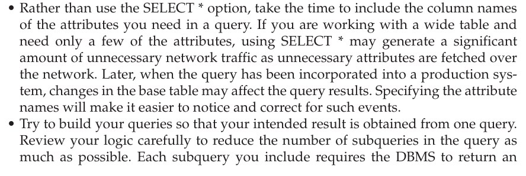

# TIPS FOR DEVELOPING QUERIESThings that could go wrong:

As a novice query writer, you might find it easy to write a query that runs without error. Congratulations, but the results may not be exactly what you intended. Sometimes it will be obvious to you that there is a problem, especially if you forget to define the links between tables with a WHERE clause and get a Cartesian join of all possible combinations of records. Other times, your query will appear to be correct, but close inspection using a test set of data may reveal that your query returns 24 rows when it should return 25. Sometimes it will return duplicates you don't want or just a few of the records you want, and sometimes it won't run because you are trying to group data that can't be grouped. Watch carefully for these types of errors before you turn in your final product.

 

Tips for better results when querying:

{width="5.354166666666667in" height="3.9166666666666665in"}

 

 

Tips for more efficient queries:

{width="5.708333333333333in" height="1.9166666666666667in"}

 

{width="5.697916666666667in" height="1.4270833333333333in"}

 

Finals tips:

{width="6.145833333333333in" height="7.25in"}

 

{width="6.166666666666667in" height="7.020833333333333in"}

 

