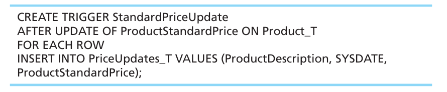
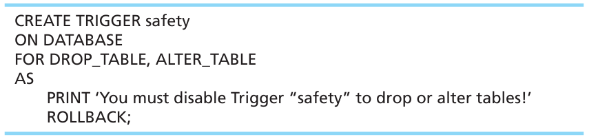
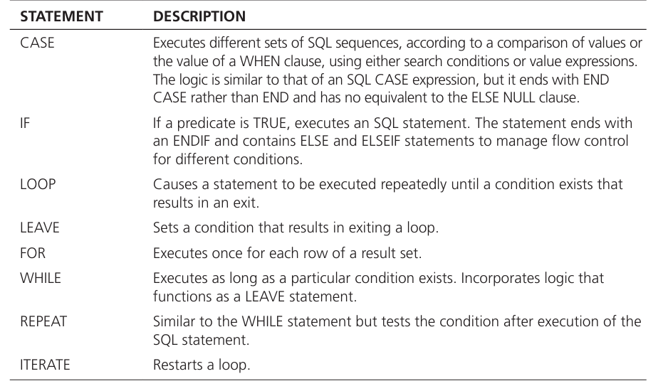
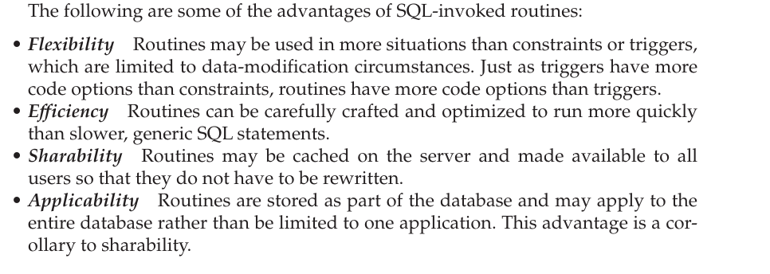
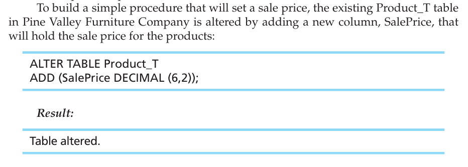
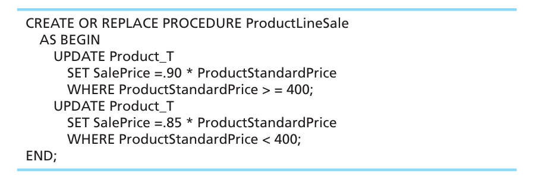
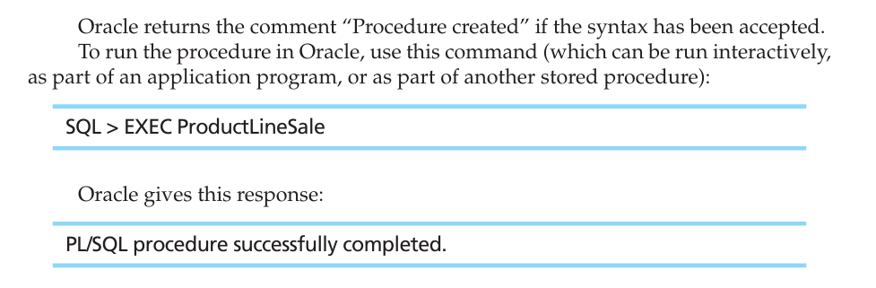

# TRIGGERS AND ROUTINES Triggers: A named set of SQL statements that are considered (triggered) when a data modification (i.e., INSERT, UPDATE, DELETE) occurs or if certain data definitions are encountered. If a condition stated within a trigger is met, then a prescribed action is taken.

-   Triggers can also cascade, causing other triggers to fire.

-   Triggers can be used to ensure referential integrity, enforce business rules, create audit trails, replicate tables, or activate a procedure

-   Triggers are used when you need to perform, under specified conditions, a certain action as the result of some database event (e.g., the execution of a DML statement such as INSERT, UPDATE, or DELETE or the DDL statement ALTER TABLE).

-   A trigger has three parts: event, condition, and action.

-   Example:

> Consider the following example from Pine Valley Furniture Company: Perhaps the manager in charge of maintaining inventory needs to know (the action of being informed) when an inventory item's standard price is updated in the Product_T table (the event). After creating a new table, PriceUpdates_T, a trigger can be written that enters each product when it is updated, the date that the change was made, and the new standard price that was entered. The trigger is named StandardPriceUpdate, and the code for this trigger follows:
>
> {width="5.822916666666667in" height="1.1979166666666667in"}

-   In this trigger, the event is an update of ProductStandardPrice, the condition is FOR EACH ROW (i.e., not just certain rows), and the action after the event is to insert the specified values in the PriceUpdates_T table, which stores a log of when (SYSDATE) the change occurred and important information about changes made to the ProductStandardPrice of any row in the table.

-   In the case just shown, the trigger should insert the new standard price information into PriceUpdate_T after Product_T has been updated.

<!-- -->

-   Triggers may occur either before, after, or instead of the statement that aroused the trigger is executed.

    -   An "instead of" trigger is not the same as a before trigger but executes instead of the intended transaction, which does not occur if the "instead of" trigger fires.

-   DML triggers may occur on INSERT, UPDATE, or DELETE commands.

    -   And they may fire each time a row is affected, or they may fire only once per statement, regardless of the number of rows affected.

-   DDL triggers are useful in database administration and may be used to regu late database operations and perform auditing functions.

    -   They fire in response to DDL events such as CREATE, ALTER, DROP, GRANT, DENY, and REVOKE.

    -   Example:

> {width="5.989583333333333in" height="1.3854166666666667in"}

 

Routines: In contrast to triggers, which are automatically run when a specified event occurs, routines must be explicitly called, just as the built-in functions (such as MIN and MAX) are called.

-   The routines have been developed to address shortcomings of SQL as an application development language---originally, SQL was only a data retrieval and manipulation language. Therefore, SQL is still typically used in conjunction with computationally more complete languages, such as traditional 3G languages (e.g., Java, C#, or C) or scripting languages (e.g., PHP or Python), to create business applications, procedures, or functions.

-   The extensions that make SQL computationally complete include flow control capabilities, such as IF-THEN, FOR, WHILE statements, and loops, which are contained in a package of extensions to the essential SQL specifications.

-   Routines or in other words user made sql functions are stored as persistent stored modules because they are essentially object or pieces of code that are not dropped unless you explicitly drop them thus they can be used over and over again.

-   SQL/PSM includes several SQL control statements:

> {width="5.375in" height="3.15625in"}

-   A function returns one value and has only input parameters. You have already seen the many built-in functions included in SQL, including the newest functions listed in Table 6-1. 

-   A procedure may have input parameters, output parameters, and parameters that are both input and output parameters.

-   {width="6.072916666666667in" height="2.15625in"}

-   Example of a routine:

    -   {width="4.208333333333333in" height="1.5in"}

    -   We will now make this sql code into a routine:

> {width="5.614583333333333in" height="1.8958333333333333in"}
>
>  

-   {width="5.53125in" height="1.8125in"}

This is a simple sql code

 

The procedure scans all rows of the Product_T table. Products with a ProductStandardPrice of $400 or higher are discounted 10 percent, and products with a ProductStandardPrice of less than $400 are discounted 15 percent.

