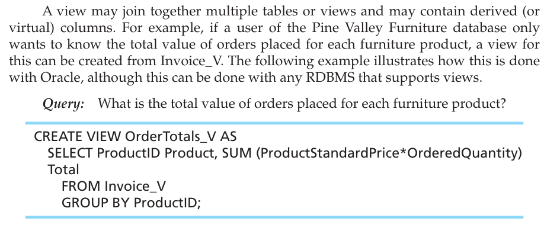

# USING AND DEFINING VIEWSThe often-stated purpose of a view is to simplify query commands, but a view may also improve data security and significantly enhance programming consistency and productivity for a database.

 

 

Essentially what a view helps us with is putting sql queries that will often be used to create certain outputted tables of data from base tables into containers that we can constantly call upon instead of writing large sql queries with multiple tables each time'

 

A view, Invoice_V, is defined by specifying an SQL query (SELECT . . . FROM . . . WHERE) that has the view as its result.

-   {width="8.25in" height="2.9791666666666665in"}

    -   The SELECT clause specifies, or projects, what data elements (columns) are to be included in the view table. The FROM clause lists the tables and views involved in the view development. The WHERE clause specifies the names of the common columns used to join Customer_T to Order_T to OrderLine_T to Product_T.

-   You can see the power of such a view when building a query to generate an invoice for order number 1004. Rather than specify the joining of four tables, you can have the query include all relevant data elements from the view table, Invoice_V.

    -   {width="7.614583333333333in" height="1.8020833333333333in"}

 

Pros and cons of views:

{width="6.770833333333333in" height="2.7395833333333335in"}

 

Another example of the usage of a view:

{width="6.322916666666667in" height="2.6458333333333335in"}

 

 

Views offer security too:

-   Views can also help establish security. Tables and columns that are not included will not be obvious to the user of the view. Restricting access to a view with GRANT and REVOKE statements adds another layer of security. For example, granting some users access rights to aggregated data, such as averages, in a view but denying them access to detailed base table data will not allow them to display the base table data.

 

You can also update (using the commands INSERT, DELETE, UPDATE) a base table from a view as long as it is completely clear what data from the base table must change.

-   If the view definition includes the WITH CHECK OPTION clause, attempts to insert data through the view will be rejected when the data values do not meet the specifications of WITH CHECK OPTION.

    -   Specifically, when the CREATE VIEW statement contains any of the following situations, that view may not be used to update the data:

        -   {width="9.09375in" height="1.6875in"}

    -   Example:

        -   Let's create a view named ExpensiveStuff_V, which lists all furniture products that have a StandardPrice over $300. That view will include ProductID 5, a writer's desk, which has a unit price of $325.

        -   If you update data using Expensive_Stuff_V and reduce the unit price of the writer's desk to $295, then the writer's desk will no longer appear in the ExpensiveStuff_V virtual table because its unit price is now less than $300.

        -   In Oracle, if you want to track all merchandise with an original price over $300, include a WITH CHECK OPTION clause after the SELECT clause in the CREATE VIEW command.

        -   WITH CHECK OPTION will cause UPDATE or INSERT statements on that view to be rejected when those statements would cause updated or inserted rows to be removed from the view.

            -   This option can be used only with updateable views.

        -   Here is the CREATE VIEW statement for ExpensiveStuff_V.

            -   {width="7.229166666666667in" height="2.0208333333333335in"}

>  

-   {width="5.458333333333333in" height="1.25in"}

 

 

 

 

 

So far we have called everything views but really they are called dynamic views which are a little different from materialized views:

{width="10.0in" height="3.34375in"}

 

Note:

-   Very easy to write a query which would otherwise require large amounts of code writing

 

Oracle gives the following error message: ERROR at line 1: ORA-01402: view WITH CHECK OPTION where-clause violation

 

-   But if you wanted to increase the price to say 350 it would allow it since it doesn't violate the condition

