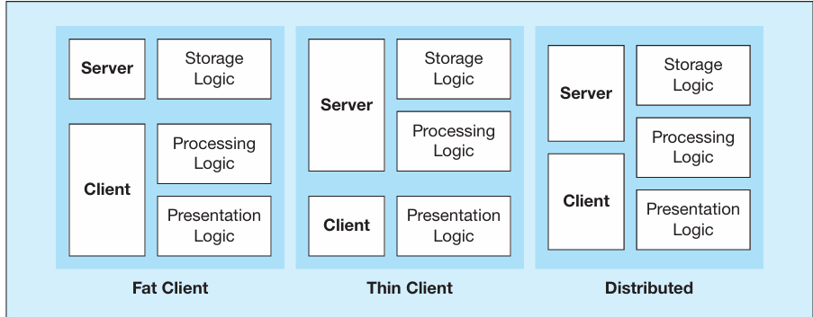
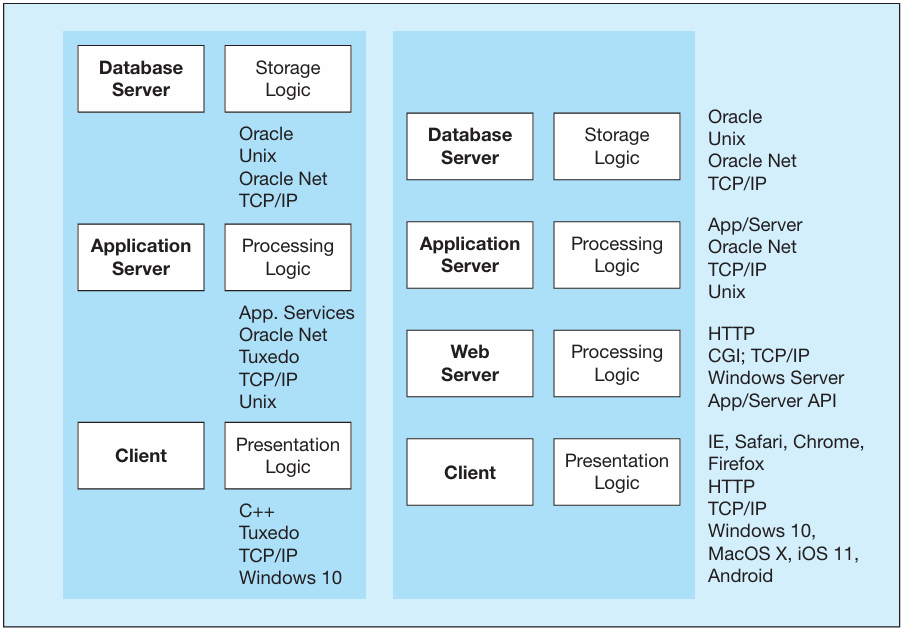
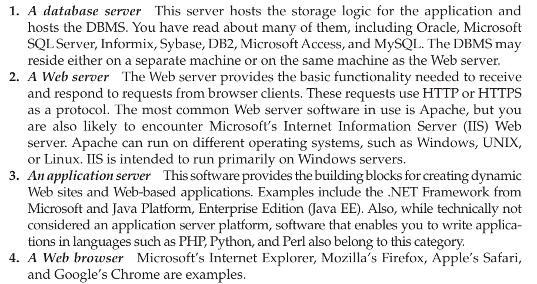
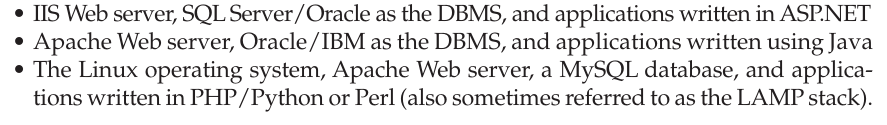
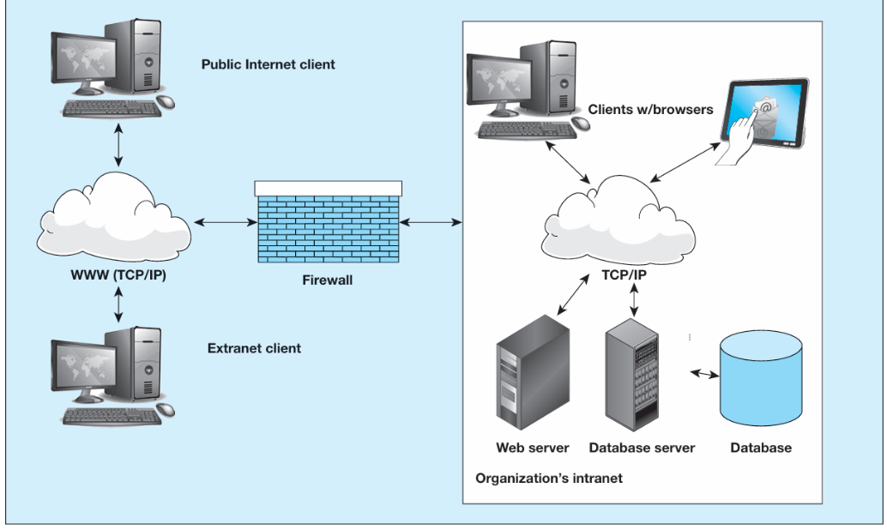
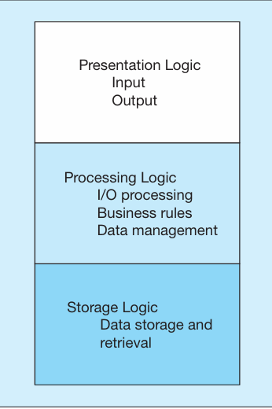
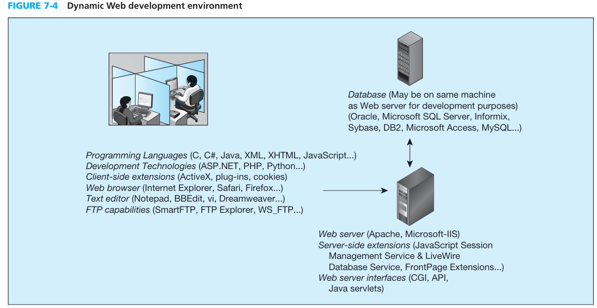

# CLIENT/SERVER ARCHITECTURES-   [presentation logic]{.underline}: This component is responsible for formatting and presenting data on the user's screen or other output device and for managing user input from a keyboard or other input device (such as your phone or tablet's screen).

        -   Presentation logic (think Web browser) resides on the client and is the mechanism with which the user interacts with the system.

    -   [processing logic]{.underline}: This handles data processing logic, business rules logic, and data management logic.

        -   Data processing logic includes such activities as data validation and identification of processing errors.

        -   Business rules that have not been implemented at the database management system (DBMS) level may be coded in the processing component.

        -   Processing logic resides on both the client and servers.

    -   [storage logic]{.underline}: the component responsible for data storage and retrieval from the physical storage devices associated with the application.

        -   Storage logic usually resides on the database server, close to the physical location of the data.

        -   Activities of a DBMS occur in the storage logic component.

            -   DFor example, data integrity control activities, such as constraint checking, are typically placed there.

            -   Triggers, which will always fire when appropriate conditions are met, are associated with insert, modify, update, and delete commands, and they are also placed on the database server, as are stored procedures.

-   Client/server architectures are normally categorized into three types: two-, three-, or n-tier architectures, depending on the placement of the three types of application logic (the three logics above).

    -   No single optimal client/server architecture is the best solution for all business problems.

    -   Figure 7-2a depicts three commonly found configurations of two-tier systems based on the placement of the processing logic.

        -   {width="3.8958333333333335in" height="1.5208333333333333in"}

>  

-   {width="4.385416666666667in" height="3.0520833333333335in"}

>  

-   Figure 7-2 shows the various components of a typical Web application. Four key components must be used together to create a Web application site:

> {width="5.1875in" height="2.7395833333333335in"}

-   As you can see, a bewildering collection of tools are available to use for Web application development.

> However, the following are the most common combinations you will encounter:

-   {width="6.208333333333333in" height="0.875in"}

>  

-   {width="4.697916666666667in" height="2.8125in"}

{width="2.2708333333333335in" height="3.4166666666666665in"}

 

Two tier system environment options.

In the [fat client]{.underline}, the application processing occurs entirely on the client, whereas in the [thin client]{.underline}, this processing occurs primarily on the server. In the [distributed]{.underline} example, application processing is partitioned between the client and the server.

 

n-tier client server environments

 

These types of architectures are most prevalent in Web-based systems.

 

a typical client in a Web enabled client/server environment will be a thin client, using a browser or a smart phone app for its presentation logic.

 

The middle tiers are typically coded in a portable language, such as C#, Java, or Python/PHP.

 

{width="5.479166666666667in" height="2.8229166666666665in"}

