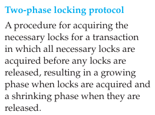

# CONTROLLING CONCURRENT ACCESS-   There are two basic approaches to concurrency control: a pessimistic approach (involving locking) and an optimistic approach (involving versioning).

-   If users are only reading data, no data integrity problems will be encountered because no changes will be made in the database.

-   However, if one or more users are updating data, then potential problems with maintaining data integrity arise.

-   When more than one transaction is being processed against a database at the same time, the transactions are considered to be concurrent.

-   The actions that must be taken to ensure that data integrity is maintained are called currency control actions.

 

**The Problem of Lost Updates**

-   The most common problem encountered when multiple users attempt to update a database without adequate concurrency control is [lost updates]{.underline}.

-   Example:

> John and Marsha have a joint checking account, and both want to withdraw some cash at the same time, each using an ATM terminal in a different location. Figure 7-20 shows the sequence of events that might occur in the absence of a concurrency control mechanism. John's transaction reads the account balance (which is $1,000), and he proceeds to withdraw $200. Before the transaction writes the new account balance ($800), Marsha's transaction reads the account balance (which is still $1,000). She then withdraws $300, leaving a balance of $700. Her transaction then writes this account balance, which replaces the one written by John's transaction. The effect of John's update has been lost due to interference between the transactions, and the bank is unhappy.

-   Another similar type of problem that may occur when concurrency control is not established is the [inconsistent read problem]{.underline}.

    -   This problem occurs when one user reads data that have been partially updated by another user. The read will be incorrect and is sometimes referred to as a dirty read or an unrepeatable read.

 

**Serializability**

-   Concurrent transactions need to be processed in isolation so that they do not interfere with each other.

    -   If one transaction were entirely processed before another transaction, no interference would occur.

-   Procedures that process transactions so that the outcome is the same as this are called serializable.

    -   Processing transactions using a serializable schedule will give the same results as if the transactions had been processed one after the other.

-   Schedules are designed so that transactions that will not interfere with each other can still be run in parallel.

    -   For example, transactions that request data from different tables in a database will not conflict with each other and can be run concurrently without causing data integrity problems.

-   Serializability is achieved by different means, but locking mechanisms are the most common type of concurrency control mechanism.

    -   With locking, any data that are retrieved by a user for updating must be locked, or denied to other users, until the update is complete or aborted.

    -   Locking data is much like checking a book out of the library; it is unavailable to others until the borrower returns it.

 

**Locking Mechanisms**

-   {width="4.989583333333333in" height="1.2083333333333333in"}

-   LOCKING LEVEL

    -   is the extent of the data base resource that is included with each lock.

    -   {width="5.697916666666667in" height="0.6354166666666666in"}

>  
>
> {width="5.729166666666667in" height="2.6041666666666665in"}
>
>  

-   TYPES OF LOCKS

    -   So far, we have discussed only locks that prevent all access to locked items. But in reality, there are two types of locks:

        -   {width="5.947916666666667in" height="1.0729166666666667in"}

>  

-   {width="5.9375in" height="0.9791666666666666in"}

>  

-   {width="4.09375in" height="2.7604166666666665in"}

 

-   DEADLOCK: an impasse that results when two or more transactions have locked a common resource and each must wait for the other to unlock that resource.

    -   Example: Figure 7-22 shows a simple example of deadlock. John's transaction is waiting for Marsha's transaction to remove the read lock from the account record and vice versa. Neither person can withdraw money from the account even though the balance is more than adequate.

        -   The image directly above this is the example being referenced

<!-- -->

-   MANAGING DEADLOCK

    -   There are two basic ways to resolve deadlocks: deadlock prevention and deadlock resolution.

        -   When [deadlock prevention]{.underline} is employed, user programs must lock all records they will require at the beginning of a transaction rather than one at a time.

            -   {width="2.3854166666666665in" height="1.7708333333333333in"}

            -   A good option but can often lead to issues still because we wont really know always in advance how many locks we are going to need

        -   [deadlock resolution]{.underline} mechanisms work as follows: The DBMS maintains a matrix of resource usage, which, at a given instant, indicates what subjects (users) are using what objects (resources).

            -   By scanning this matrix, the computer can detect deadlocks as they occur. The DBMS then resolves the deadlocks by "backing out" one of the deadlocked transactions. Any changes made by that transaction up to the time of deadlock are removed, and the transaction is restarted when the required resources become available.

 

**Versioning**: With versioning, there is no form of locking. Each transaction is restricted to a view of the database as of the time that transaction started, and when a transaction modifies a record, the DBMS creates a new record version instead of overwriting the old record.

-   Locking mechanism rebuttal:

> Locking, as described here, is often referred to as a pessimistic concurrency control mechanism because each time a record is required, the DBMS takes the highly cautious approach of locking the record so that other programs cannot use it. In reality, in most cases other users will not request the same documents, or they may only want to read them, which is not a problem. Thus, conflicts are rare.

-   takes the optimistic approach that most of the time other users do not want the same record, or, if they do, they want to only read (but not update) the record.

-   Analogy for understanding versioning

> {width="5.864583333333333in" height="1.8854166666666667in"}

-   What happens when there is conflict?

> {width="5.916666666666667in" height="1.4270833333333333in"}

-   Example

> {width="5.96875in" height="1.40625in"}
>
>  

{width="3.9166666666666665in" height="2.6770833333333335in"}

 

{width="3.8020833333333335in" height="3.7083333333333335in"}

 

When John initiates his transaction, the program places a read lock on his account record because he is reading the record to check the account balance. When John requests a withdrawal, the program attempts to place an exclusive lock (write lock) on the record because this is an update operation. However, as you can see in the figure, Marsha has already initiated a transaction that has placed a read lock on the same record. As a result, his request is denied; remember that if a record is a read lock, another user cannot obtain a write lock.

 

{width="2.71875in" height="1.4375in"}

 

{width="2.5729166666666665in" height="1.3645833333333333in"}

 

{width="4.625in" height="3.1979166666666665in"}

