# DATABASES IN THREE-TIER APPLICATIONS-   In a dynamic page request,

    -   The application calls the DBMS, as necessary, using a special software called [database-oriented middleware]{.underline}.

    -   Middleware is often referred to as the glue that holds together client/server applications.

    -   It is a term that is commonly used to describe any software component between the PC client and the relational database in n-tier architectures.

    -   [middleware]{.underline} is any of several classes of software that allow an application to work with other software without requiring the user to understand and code the low-level operations required to achieve interoperability

        -   The database-oriented middleware needed to connect an application to a database consists of two parts: an application programming interface (API) and a database driver to connect to a specific type of database (sql server or oracle)

            -   The most common APIs are Open Database Connectivity (ODBC) and ADO.NET for the Microsoft platform (VB.NET and C#) and Java Database Connectivity (JDBC) for use with Java programs.

            -   However, no matter which API or language is used, the basic steps for accessing a database from an application remain surprisingly similar:

                -   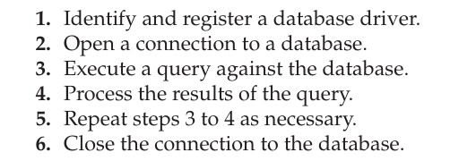{width="3.5625in" height="1.2708333333333333in"}

 

A Java Web Application

-   This a sample JSP application whose purpose is to capture user registration information and store the data in a database. Let us assume that the name of the page is registration.jsp.

> 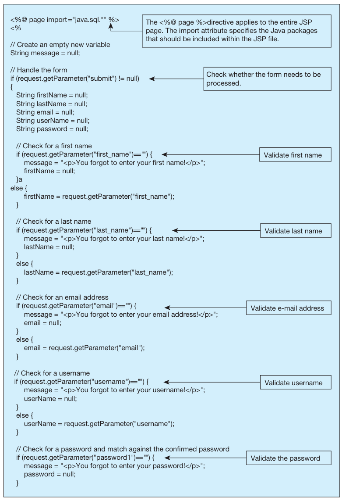{width="5.854166666666667in" height="8.5625in"}

 

> 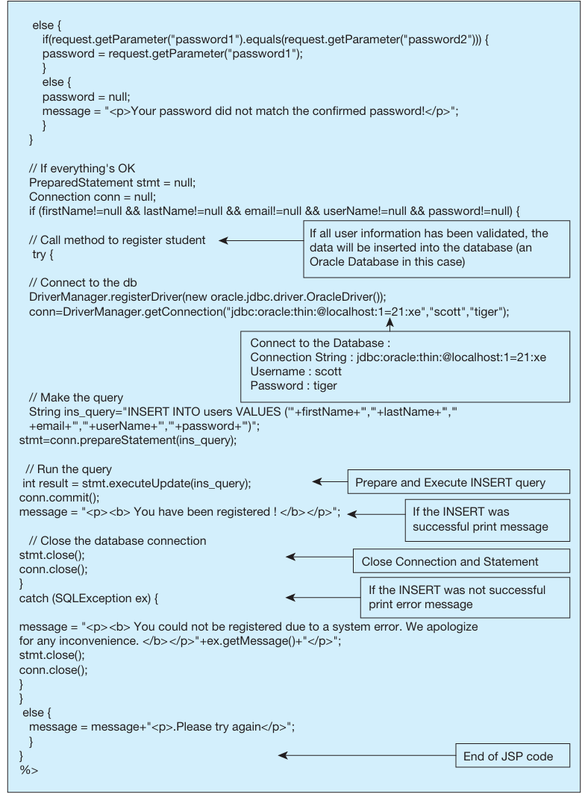{width="5.833333333333333in" height="7.947916666666667in"}

 

> 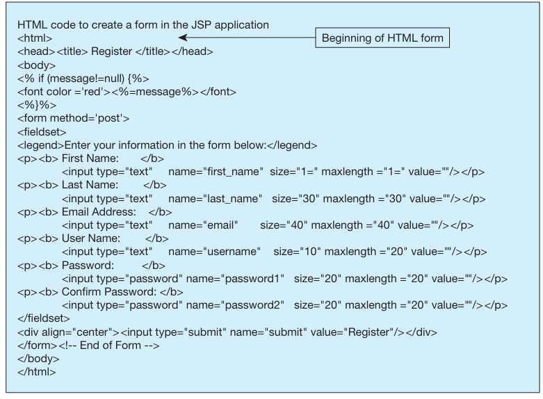{width="5.84375in" height="4.291666666666667in"}

 

 

-   This is simple java file that retrieves data from the database:

> 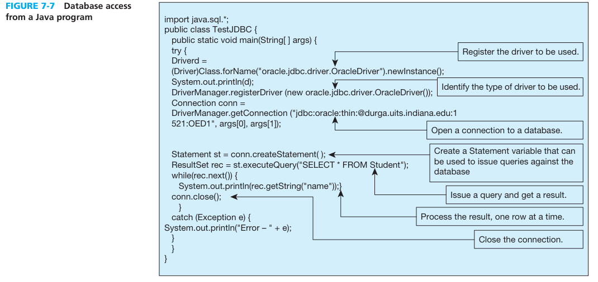{width="6.28125in" height="2.96875in"}
>
>  
>
> Turn data from database into java variable
>
> 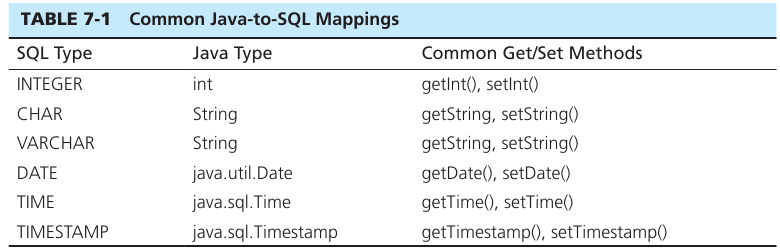{width="6.260416666666667in" height="1.9895833333333333in"}
>
>  

-   The JSP example presented above has several drawbacks associated with it. First, the HTML code, Java code, and SQL code are all mixed in together. Because the same person is unlikely to possess expertise in all three areas, creating large applications using this paradigm will be challenging.

    -   To overcome this problem, most Web applications are designed using a concept known as the Model-View-Controller (MVC).

    -   Using this architecture, the presentation logic (view), the business logic (controller/model), and the database logic (model) are separated.

    -   We will use MVC architecture and frameworks in the Python example below.

 

A Python Web Application (also showcasing MVC framework)

-   Python has gained more traction and popularity than any other languages in the developer community due to the availability of many excellent frameworks, such as Django, Flask, Pyramid, Tornado, Bottle, Diesel, Pecan, and Falcon, to name a few.

-   These frameworks provide a collection of packages or modules that allow developers to write Web applications or services without having to handle low-level details.

-   This example uses Django, which is a Python Web framework.

 

-   Figure 7-8 shows the system architecture for a three-tier application built using Python. ------------>

    -   The third-party application that resides on the client is likely going to be HTML based.

    -   The Model, View, and Serializer classes are written using Python and reside on the application server.

    -   The database resides on the database server.

    -   The figure also shows that the data exchange between View classes and the application are done using a standard format, in our case JavaScript Object Notation (JSON).

    -   Notice that the view class used the model class and serialization class to be able to run its operation

        -   The operations being grabbing from database, turning data into json data for the front end 3rd party application to read from, calling functions from the model class, etc.

 

-   Figure 7-10 shows the HTML/Javascript code that can be used to retrieve and display data from the sample database on a Web page

> 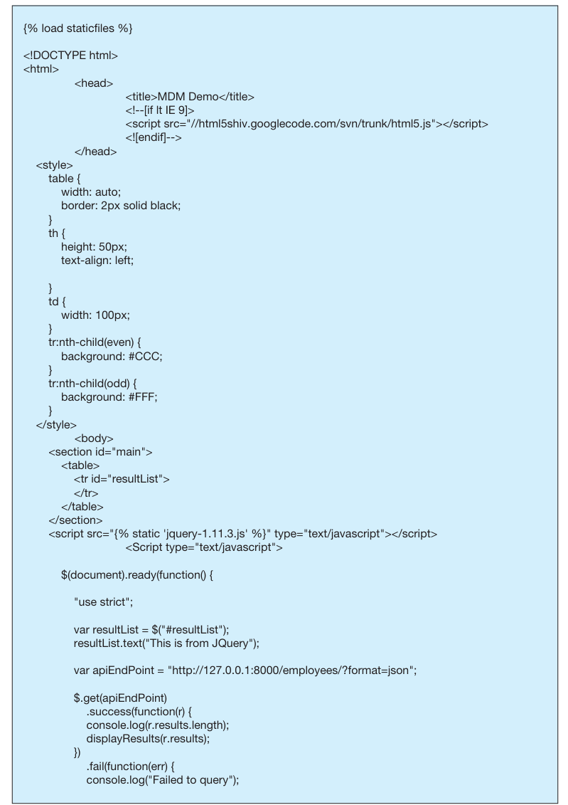{width="4.958333333333333in" height="7.03125in"}
>
>  

-   We will now examine how the above call is processed in the application server and how it retrieves data from the database.

    -   The first step is to specify which database to use. This is specified in Django in the settings.py file (Figure 7-13). Similar to the JSP application, The 'ENGINE' specifies the database driver/middleware to use, and the 'NAME' specifies a path to the actual database.

> 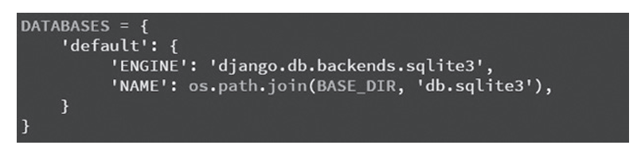{width="4.71875in" height="1.1875in"}

-   The next step is for us to specify a model class for each table in the database we are likely to use in the application. Each row retrieved from the database will be stored in an instance of this model class.

    -   This is essentially like creating a replication of a table in our database as a class so that we can create objects out of them. The models we create will of course have attributes that are the same as the columns in the table alongside their type.

    -   Figure 7-14 shows the model class Employee (stored in models.py), which corresponds to an employee table in the database. Notice how each attribute in the model class, such as FirstName, corresponds to the name of a column in the table.

        -   This mapping is what allows the Django framework to identify which fields to retrieve from the Employee table.

    -   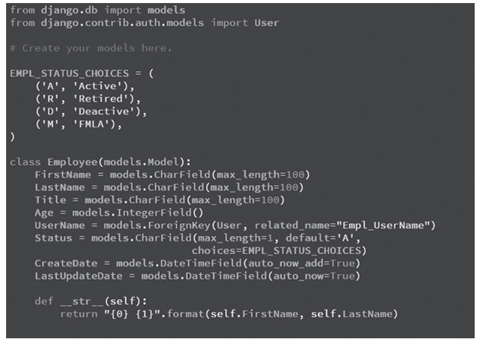{width="5.3125in" height="3.8125in"}

    -   Once the model class has been defined, it can be then be used in a View class as a surrogate for the data in the database.

-   The code in the View class is what is called from the client application. Thus, each View class is designed to perform a specific function and has a well-defined input and output.

    -   This is the "point man" as it is what runs the show on the backend. It uses both the model class and serialization class to do the actual work that needs to be done

    -   The Python code for the View class---EmployeeViewSet (stored in the views.py file)---to perform this function is shown in Figure 7-15

    -   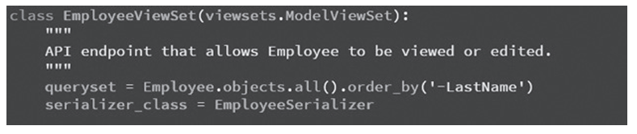{width="6.489583333333333in" height="1.375in"}

        -   Essentially, it says to retrieve all objects in the table that correspond to the Employee model class and return the data sorted by LastName in descending order.

        -   The Django framework takes care of opening the database connection, issuing the appropriate SQL query and populating the results into a set of instances (objects) of type Employee model class.

-   The second line in the EmployeeViewSet class is used to serialize (using the EmployeeSerializer; Figure 7-16) the instances in the variable queryset so that it can be sent over in a format that the client browser can process, in our case in JSON format.

    -   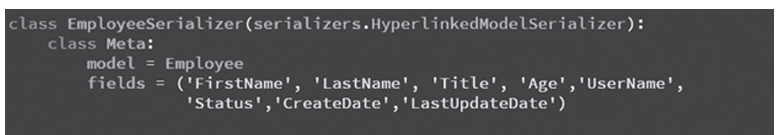{width="6.552083333333333in" height="1.1354166666666667in"}

    -   The value of the model variable indicates to the serializer that each object that is being serialized is of type Employee.

    -   The value of the fields variable indicates which fields from the model you want to serialize. The end result of this serialization is the JSON-formatted data

Note:

-   if the Web server determines that the request from the client can be satisfied without passing the request on to the application server, it will process the request and then return the appropriately formatted information to the client machine.

    -   Static

    -   This decision is most often based on the file suffix.

-   However, if the request has a suffix that requires application server intervention, the information flow shown in Figure 7-5b is invoked.

 

This is what this code does:

• Displays the registration form

• Processes a user's filled-in form and checks it for common errors, such as missing items and matching password fields

• If there is an error, redisplays the entire form, with an error message in red

• If there is no error, enters the user's information into a database and sends the user to a "success" screen

 

 

Things to note about this java code:

-   All Java code is found between <% and %> is not displayed in the browser.

    -   This is the part of the code that has nothing to do with the UI it is purely for the logical purposes like validating input, accessing database, etc

-   The only items displayed in the browser are the ones enclosed in HTML tags which we will see futher down the program

-   The code shows that once the connection is made and stored in the conn variable, the actual SQL query to be issued is constructed as a string variable name ins_query. The conn.prepareStatement and conn.executeQuery commands are then used by the driver to issue the query to the database (in this case insert a record). The conn.commit() statement asks the database to make this change permanent.

 

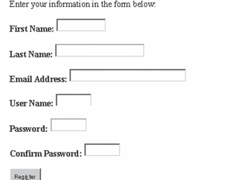{width="4.1875in" height="3.1875in"}

Note: This is html code that lives inside of the .jsp file (java file) which is what displays the actual shit to the screen for the user to click and input into

 

Note:

-   Notice that after the connection is opened--- unlike the INSERT query shown above---running a SQL SELECT query requires us to capture the data inside an object that can appropriately handle the tabular data returned.

    -   JDBC provides two key mechanisms for this: the ResultSet and RowSet objects.

    -   The ResultSet object has a mechanism, called the cursor, that points to its current row of data. When the ResultSet object is first initialized, the cursor is positioned before the first row. This is why we need to first call the next() method before retrieving data.

        -   The ResultSet object is used to loop through and process each row of data and retrieve the column values that we want to access.

            -   In this case, we access the value in the name column using the rec.getString method, which is a part of the JDBC API.

 

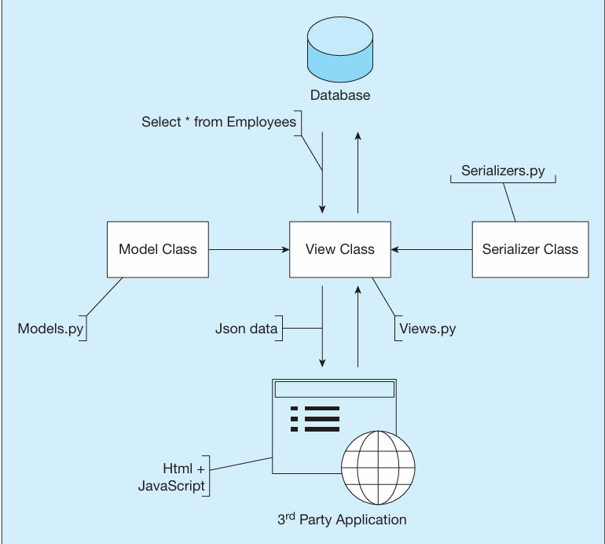{width="4.270833333333333in" height="3.84375in"}

 

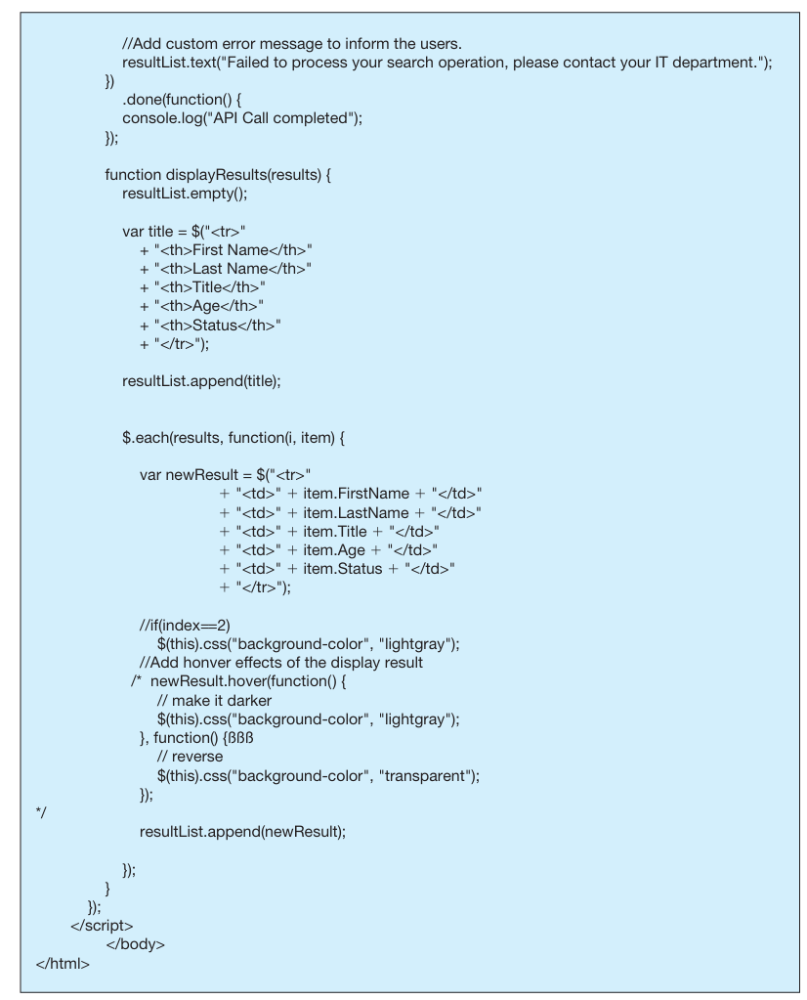{width="5.65625in" height="7.0in"}

The Web server routes this URL to the application server (running Django/Python), which in turn returns a JSON formatted result as shown.

-   This would be the json file that is returned back to the frontend (3rd party application)

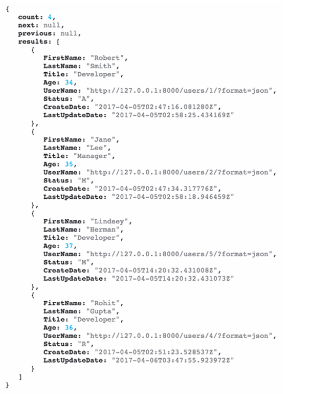{width="3.7916666666666665in" height="4.78125in"}

 

This would be the ouput of the 3rd party application once it retrieves data from the backend and all is said and done

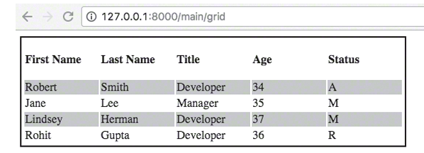{width="4.854166666666667in" height="1.75in"}

