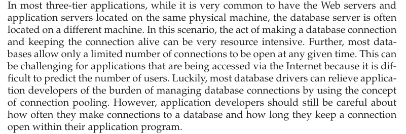

# KEY CONSIDERATIONS IN THREE-TIER APPLICATIONS -   Advantages:

> {width="5.708333333333333in" height="1.0520833333333333in"}

-   Pros and cons

> {width="5.78125in" height="0.875in"}

-   Showing how to create a procedure in Oracle sql

> {width="4.510416666666667in" height="4.895833333333333in"}

-   Showing how to call that procedure in Java

> {width="4.604166666666667in" height="2.6458333333333335in"}

 

**Transactions**: I think this is when you have multiple calls being made to update in some way a record in your table and you need to be able to handle it like if multiple people want to buy the same ring from amazon

-   Given that there might be thousands of users simultaneously trying to access and/or update a database through a Web application at any given point time (think Amazon.com or eBay), application developers need to be well versed in the concepts of database transactions and need to use them appropriately when developing applications.

-   Sample java code snipper for a sql transaction

> {width="5.489583333333333in" height="2.375in"}
>
>  

**Database Connections**

{width="6.052083333333333in" height="2.0in"}

 

**Key Benefits of Three-Tier Applications**

{width="6.010416666666667in" height="4.583333333333333in"}

 

