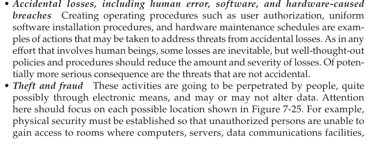

# MANAGING DATA SECURITY IN AN APPLICATION CONTEXT Data administration is often responsible for developing overall policies and procedures to protect databases. Database administration is typically responsible for administering database security on a daily basis.

 

Threats to Data Security

-   The following threats must be addressed in a com prehensive data security plan:

> {width="5.78125in" height="2.2395833333333335in"}
>
>  
>
> {width="5.78125in" height="4.979166666666667in"}

-   Two critical areas that strongly support data security are client/ server security and Web application security. We address these two topics next before outlining approaches aimed more directly at data security.]

 

Establishing Client/Server Security

-   Database security is only as good as the security of the whole computing environment. Physical security, logical security, and change control security must be established across all components of the client/server environment, including the servers, the client workstations, the network and its related components, and the users.

-   Server security

> {width="5.083333333333333in" height="1.84375in"}

-   Network security

> {width="5.072916666666667in" height="1.6770833333333333in"}

-   Application Security Issues in Three-Tier Client/Server Environments

    -   In a three-tier environment, the dynamic creation of a Web page from a data base requires access to the database, and if the database is not properly protected, it is vulnerable to inappropriate access by any user.

    -   Also of interest is privacy. Companies are able to collect information about those who access their Web sites. If they are conducting e-commerce activities, selling products over the Web, they can collect information about their customers that has value to other businesses.

        -   If a company sells customer information without those customers' knowledge or if a customer believes that may happen, the company might be violating ethical and privacy standards and, depending on the context, also be acting in a way that is in violation of the law.

    -   Protecting and securing static web pages or alike info

> {width="5.1875in" height="1.84375in"}

-   Protecting and securing dynamic web pages

> {width="5.197916666666667in" height="1.1666666666666667in"}
>
>  
>
> {width="5.197916666666667in" height="0.3125in"}

-   User authentication security

> {width="5.229166666666667in" height="3.6041666666666665in"}
>
>  

-   Data Privacy

    -   Goes into things about data privacy but all common knowledge stuff

    -   Page 362

Note that dynamic pages have direct access to database thus more need for security

