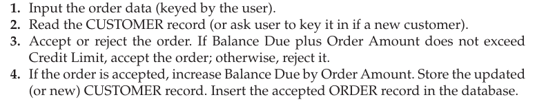
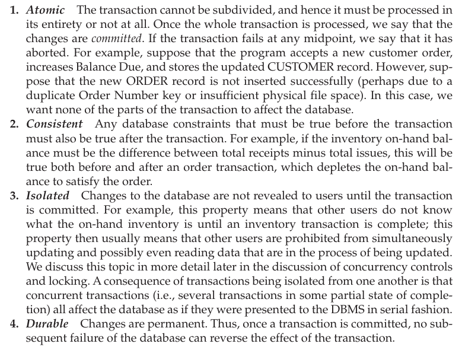
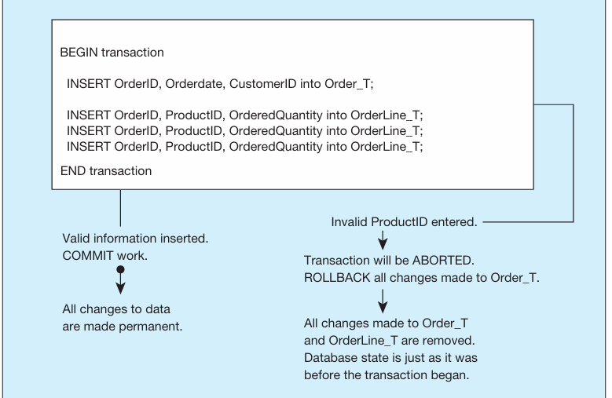

# TRANSACTION INTEGRITY -   Normally, a business transaction requires several actions against the database.

    -   For example, consider the transaction Enter Customer Order. When a new customer order is entered, an application program might perform the following steps:

> {width="5.583333333333333in" height="1.0625in"}

-   From a database perspective, a transaction is a complete set of closely-related update commands that must all be done (or none of them done) for the database to remain valid.

-   When processing transactions, a DBMS must ensure that the transactions have four well-accepted characteristics, called the ACID properties:

> {width="5.260416666666667in" height="3.9479166666666665in"}

-   To maintain transaction integrity, DBMS provide facilities for the user or application program to define transaction boundaries (i.e., the logical beginning and end of a transaction), to commit the work of a transaction as a permanent change to the database, and to abort a transaction on purpose and correctly if necessary.

    -   In SQL, the BEGIN TRANSACTION statement is placed in front of the first SQL command within the trans action, and the END TRANSACTION or COMMIT command is placed at the end of the transaction.

        -   BEGIN TRANSACTION creates a log file and starts recording all changes (insertions, deletions, and updates) to the database in this file.

        -   END TRANSACTION or COMMIT takes the contents of the log file and applies them to the database, thus making the changes permanent, and then empties the log file.

        -   Any number of SQL commands may come in between these two commands; these are the database processing steps that perform some well-defined business activity, as explained earlier.

        -   If a command such as ROLLBACK is processed after a BEGIN TRANSACTION is executed and before a COMMIT is executed, the DBMS aborts the transaction and undoes the effects of the SQL statements processed so far within the transaction boundaries.

-   Example

> {width="4.78125in" height="3.1041666666666665in"}

-   When an order is entered into the Pine Valley database, all of the items ordered should be entered at the same time. Thus, either all OrderLine_T rows from this form are to be entered, along with all the information in Order_T, or none of them should be entered.

-   Here, the business transaction consists of the complete order, not the individual items that are ordered.

-   Alternatively, an application is likely be programmed to execute a ROLLBACK when the DBMS generates an error message per forming an UPDATE or INSERT command in the middle of the transaction.

-   The DBMS thus commits (makes durable) changes for successful transactions (those that reach the COMMIT statement) and effectively rejects changes from transactions that are aborted (those that encounter a ROLLBACK).

<!-- -->

-   Some relational DBMSs also have an AUTOCOMMIT (ON/OFF) command that specifies whether changes are made permanent after each data modification command (ON) or only when work is explicitly made permanent (OFF) by the COMMIT com mand. Note that SET AUTOCOMMIT is an interactive command; therefore, a given user session can be dynamically controlled for appropriate integrity measures.

>  

-   Suggestions when organizing transactions

    -   If possible, collect all user input before executing a database transaction. Also, to minimize the length of a transaction, check for possible errors, such as duplicate keys or insufficient account balance, as early in the transaction as possible so that portions of the database can be released as soon as possible for other users if the transaction is going to be aborted.

        -   This is because when you are in the middle of a transaction that is executing other users will have to wait to see if that transaction fails or they move on while that transaction is happening.

